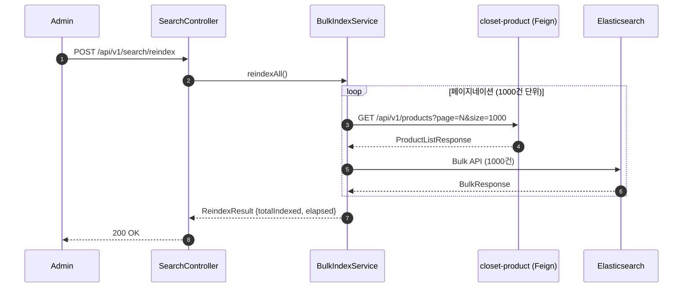
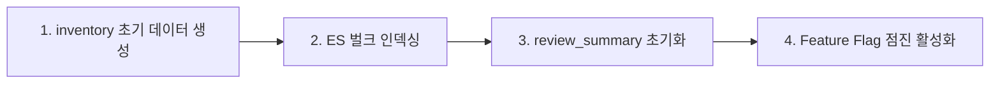

# [CP-11] 벌크 인덱싱 API + Phase 1 데이터 마이그레이션

## 메타

| 항목 | 값 |
|------|-----|
| 크기 | S (1-2일) |
| 스프린트 | 5 |
| 서비스 | closet-search |
| 레이어 | Controller/Service |
| 의존 | CP-10 (ES 인덱스) |
| Feature Flag | 없음 |
| PM 결정 | PD-28, PD-49 |

## 작업 내용

기존 Phase 1의 상품 데이터를 ES에 벌크 인덱싱하는 API와 Phase 1 데이터 마이그레이션 전체 절차를 구현한다. 10만건 기준 5분 이내 완료가 목표이다.

### 설계 의도

- Phase 1 -> Phase 2 전환 시 기존 상�� 데이터의 검색 인덱스 일괄 생성
- ADMIN 권한 전용 API로 운영 시 수동 트리거
- ES Bulk API 사용으로 성능 최적화

## 다이어그램

### 벌크 인덱싱 흐름

### 마이그레이션 플로우

## 수정 파일 목록

| 파일 | 작업 | 설명 |
|------|------|------|
| `closet-search/src/.../service/BulkIndexService.kt` | 신규 | 벌크 인덱싱 서비스 |
| `closet-search/src/.../controller/SearchAdminController.kt` | 신규 | POST /reindex API |
| `closet-search/src/.../client/ProductServiceClient.kt` | 신규 | Feign Client |

## 영향 범위

- closet-search: 신규 API
- closet-product: 상품 목록 API 호출 (기존 API 활용)

## 테스트 케이스

### 정상 케이스

| # | 시나리오 | 검증 |
|---|---------|------|
| 1 | 벌크 인덱싱 시 모든 상품이 ES에 인덱싱 | ES count 일치 |
| 2 | 1000건 단위 페이지네이션 처리 | 메모리 안정성 |
| 3 | 10만건 5분 이내 완료 | 성능 기준 (PD-28) |

### 예외 케이스

| # | 시나리오 | 검증 |
|---|---------|------|
| 1 | 일부 문서 인덱싱 실패 시 나머지 계속 처리 | 부분 실패 허용 |
| 2 | ADMIN 권한 아닌 경우 403 | 권한 체크 |

## AC

- [ ] POST /api/v1/search/reindex ADMIN 전용 API
- [ ] ES Bulk API로 1000건 단위 처리
- [ ] 10만건 5분 이내 성능 목표
- [ ] 처리 결과 (성공/실패 건수, 소요 시간) 반환
- [ ] 통합 테스트 통과

## 체크리스트

- [ ] Bulk API: _bulk endpoint 사용
- [ ] 페이지네이션: page/size 파라미터
- [ ] ADMIN 권한: @RoleRequired(ADMIN)
- [ ] Kotest BehaviorSpec 테스트
