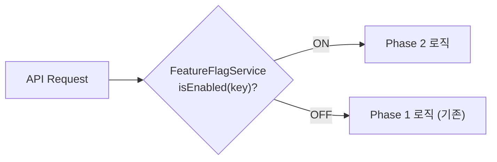
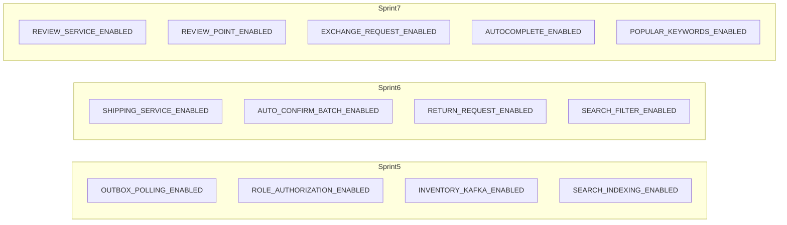

# [CP-12] Feature Flag 기반 점진 활성화 설정

## 메타

| 항목 | 값 |
|------|-----|
| 크기 | S (1-2일) |
| 스프린트 | 5 |
| 서비스 | closet-common, 각 서비스 |
| 레이어 | Infra/Common |
| 의존 | 없음 |
| Feature Flag | 전체 Flag 정의 |
| PM 결정 | PD-49 |

## 작업 내용

Phase 2 기능의 점진 활성화를 위한 Feature Flag를 `SimpleRuntimeConfig` + `FeatureFlagService` + `BooleanFeatureKey` 패턴으로 구현한다. Sprint 8 Canary 배포(5% -> 25% -> 50% -> 100%)를 DB 기반 런타임 on/off로 지원한다.

### 설계 의도

- 배포 없이 런타임 on/off: DB 값 변경으로 즉시 반영
- 서비스별 독립 제어: 재고, 배송, 검색, 리뷰를 개별적으로 활성화/비활성화 가능
- 롤백 안전성: Feature Flag OFF로 즉시 Phase 1 플로우로 복귀 (레벨 1 롤백)

## 다이어그램

### Feature Flag 적용 패턴

### 전체 Flag 목록

## 수정 파일 목록

| 파일 | 작업 | 설명 |
|------|------|------|
| `closet-common/src/.../featureflag/Phase2FeatureKey.kt` | 신규 | Phase 2 Feature Flag enum |
| `closet-common/src/main/resources/db/migration/V22__insert_phase2_feature_flags.sql` | 신규 | 초기값 INSERT (모두 OFF) |

## 영향 범위

- 기존 SimpleRuntimeConfig + FeatureFlagService 인프라 활용
- 각 서비스의 Controller/Service 레이어에서 Flag 체크 로직 추가 (각 티켓에서 구현)

## 테스트 케이스

### 정상 케이스

| # | 시나리오 | 검증 |
|---|---------|------|
| 1 | Phase 2 Feature Flag 13개가 모두 OFF로 초기화 | DB 확인 |
| 2 | Flag ON 변경 시 다음 요청부터 즉시 반영 | 런타임 전환 |
| 3 | Flag OFF 시 Phase 1 플로우로 복귀 | 기존 로직 동작 |

### 예외 케이스

| # | 시나리오 | 검증 |
|---|---------|------|
| 1 | 존재하지 않는 Flag 키 조회 시 false 반환 | 안전한 기본값 |

## AC

- [ ] Phase2FeatureKey enum에 13개 Flag 정의
- [ ] Flyway INSERT 스크립트로 초기값 OFF
- [ ] 기존 FeatureFlagService로 런타임 on/off 동작 확인
- [ ] 단위 테스트 통과

## 체크리스트

- [ ] BooleanFeatureKey 패턴 준수
- [ ] 각 Flag에 COMMENT 설명 추가
- [ ] Kotest BehaviorSpec 테스트
