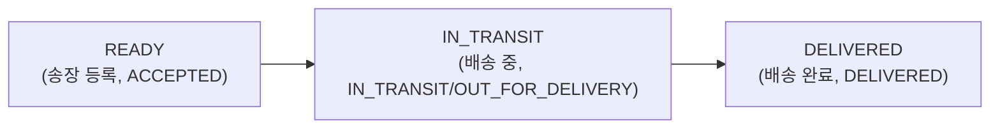
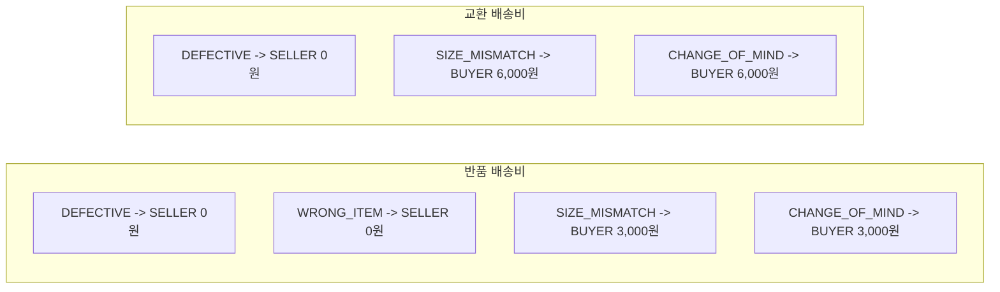

# [CP-13] Shipment 도메인 + 상태 머신 + Repository

## 메타

| 항목 | 값 |
|------|-----|
| 크기 | M (3-5일) |
| 스프린트 | 6 |
| 서비스 | closet-shipping |
| 레이어 | Domain/Repository |
| 의존 | 없음 |
| Feature Flag | `SHIPPING_SERVICE_ENABLED` |
| PM 결정 | PD-05, PD-10, PD-15 |

## 작업 내용

closet-shipping 서비스를 신규 생성하고, 핵심 도메인 엔티티(Shipment, ShippingTrackingLog, ShippingFeePolicy)와 상태 머신(ShippingStatus, ReturnStatus, ExchangeStatus)을 구현한다. enum에 상태 전이 규칙을 캡슐화하는 기존 컨벤션을 준수한다.

### 설계 의도

- Shipment: orderId UNIQUE, 배송 3단계 상태 (READY -> IN_TRANSIT -> DELIVERED)
- ShippingTrackingLog: Mock 서버 원본 상태(ACCEPTED, OUT_FOR_DELIVERY 등)를 그대로 보존
- ShippingFeePolicy: 사유별/유형별 배송비 매트릭스 DB 관리 (PD-15)
- 상태 전이 규칙: canTransitionTo/validateTransitionTo 패턴으로 캡슐화

## 다이어그램

### 배송 상태 머신

### 배송비 정책 매트릭스

## 수정 파일 목록

| 파일 | 작업 | 설명 |
|------|------|------|
| `closet-shipping/src/.../domain/Shipment.kt` | 신규 | 배송 엔티티 |
| `closet-shipping/src/.../domain/ShippingStatus.kt` | 신규 | READY/IN_TRANSIT/DELIVERED + fromCarrierStatus 매핑 |
| `closet-shipping/src/.../domain/ShippingTrackingLog.kt` | 신규 | 배송 추적 이력 |
| `closet-shipping/src/.../domain/ShippingFeePolicy.kt` | 신규 | 배송비 정책 |
| `closet-shipping/src/.../domain/ReturnReason.kt` | 신규 | DEFECTIVE, WRONG_ITEM, SIZE_MISMATCH, CHANGE_OF_MIND |
| `closet-shipping/src/.../repository/ShipmentRepository.kt` | 신규 | JPA Repository |
| `closet-shipping/src/.../repository/ShippingTrackingLogRepository.kt` | 신규 | JPA Repository |
| `closet-shipping/src/.../repository/ShippingFeePolicyRepository.kt` | 신규 | JPA Repository |
| `closet-shipping/src/main/resources/db/migration/V1__init_shipping.sql` | 신규 | shipping, shipping_tracking_log DDL |
| `closet-shipping/src/main/resources/db/migration/V3__add_shipping_fee_policy.sql` | 신규 | shipping_fee_policy DDL + 초기 데이터 |
| `closet-shipping/src/main/resources/application.yml` | 신규 | 서비스 설정 (port:8088) |
| `closet-shipping/build.gradle.kts` | 신규 | JPA, MySQL, Redis, Kafka 의존성 |
| `settings.gradle.kts` | 수정 | closet-shipping 모듈 등록 |

## 영향 범위

- closet-shipping 신규 서비스 생성 (포트 8088)
- settings.gradle.kts 모듈 등록
- docker-compose.yml 서비스 추가

## 테스트 케이스

### 정상 케이스

| # | 시나리오 | 검증 |
|---|---------|------|
| 1 | ShippingStatus: READY -> IN_TRANSIT 전이 가능 | canTransitionTo = true |
| 2 | ShippingStatus: IN_TRANSIT -> DELIVERED 전이 가능 | canTransitionTo = true |
| 3 | fromCarrierStatus("ACCEPTED") == READY | 매핑 정확성 |
| 4 | fromCarrierStatus("OUT_FOR_DELIVERY") == IN_TRANSIT | 매핑 정확성 |
| 5 | ShippingFeePolicy: RETURN + CHANGE_OF_MIND = BUYER 3,000원 | 정책 조회 |
| 6 | ShippingFeePolicy: EXCHANGE + CHANGE_OF_MIND = BUYER 6,000원 | 정책 조회 |
| 7 | Shipment: orderId UNIQUE 제약 | 중복 생성 방지 |

### 예외 케이스

| # | 시나리오 | 검증 |
|---|---------|------|
| 1 | ShippingStatus: DELIVERED -> READY 전이 불가 | canTransitionTo = false |
| 2 | fromCarrierStatus("UNKNOWN") 시 예외 | IllegalArgumentException |
| 3 | validateTransitionTo 실패 시 예외 메시지 | "배송 상태를 X에서 Y(으)로 변경할 수 없습니다" |

## AC

- [ ] closet-shipping 서비스 생성 (port:8088)
- [ ] Shipment 엔티티 + ShippingTrackingLog + ShippingFeePolicy
- [ ] ShippingStatus: canTransitionTo/validateTransitionTo/fromCarrierStatus
- [ ] 배송비 정책 초기 데이터 (반품 4건 + 교환 4건)
- [ ] Flyway DDL (COMMENT, DATETIME(6), FK 미사용)
- [ ] settings.gradle.kts 모듈 등록
- [ ] 단위 테스트 + Repository 테스트 통과

## 체크리스트

- [ ] Shipment: orderId UNIQUE, carrier VARCHAR(20), trackingNumber VARCHAR(30)
- [ ] ShippingTrackingLog: carrierStatus(원본) + mappedStatus(매핑된 상태) 이중 저장
- [ ] ShippingFeePolicy: type(RETURN/EXCHANGE) + reason + payer(BUYER/SELLER) + fee
- [ ] DDL: FK 미사용, TINYINT(1) for boolean, COMMENT 필수
- [ ] Kotest BehaviorSpec 테스트
