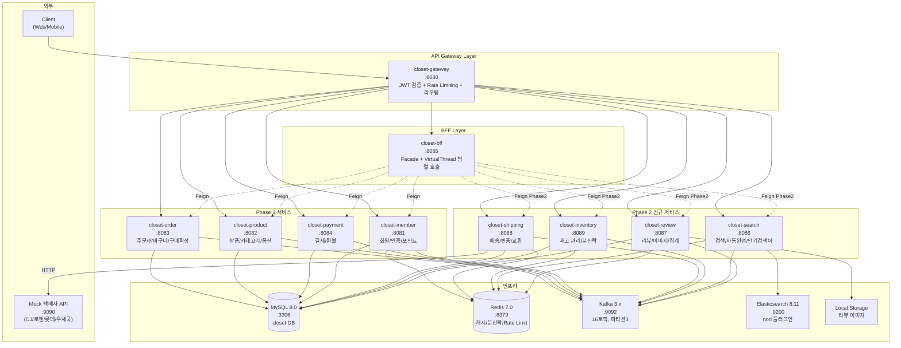
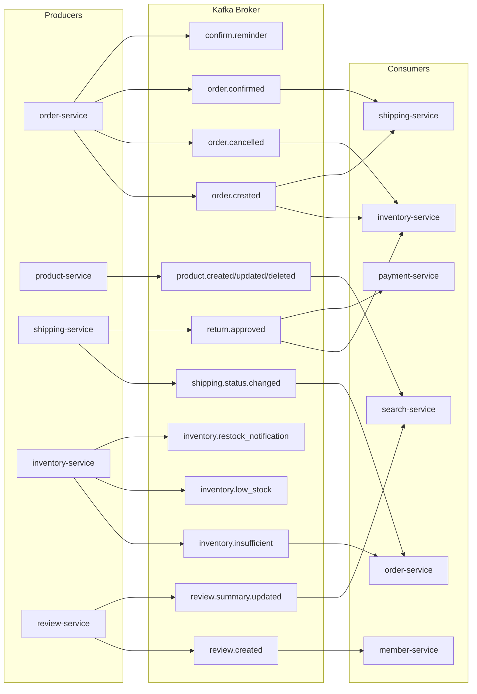
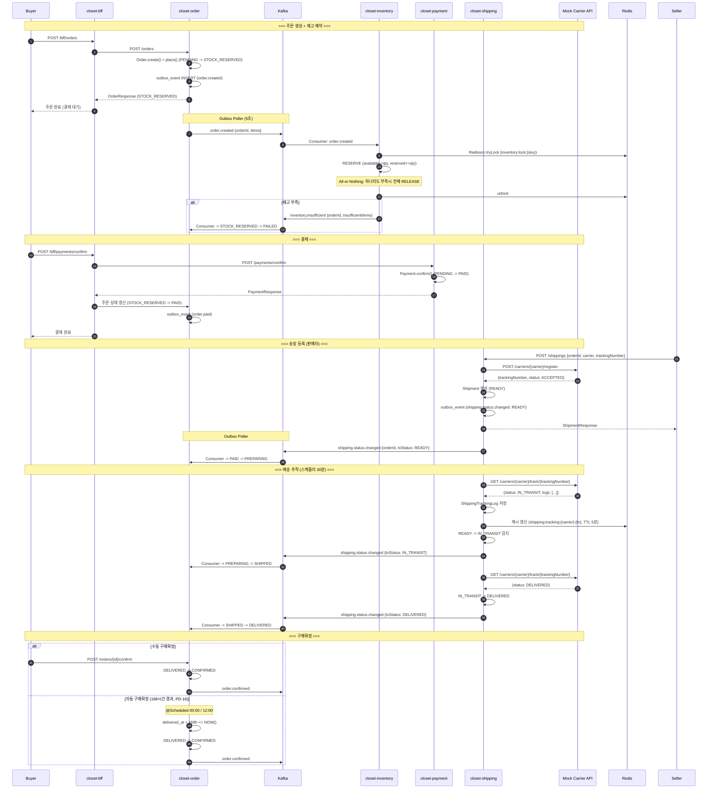
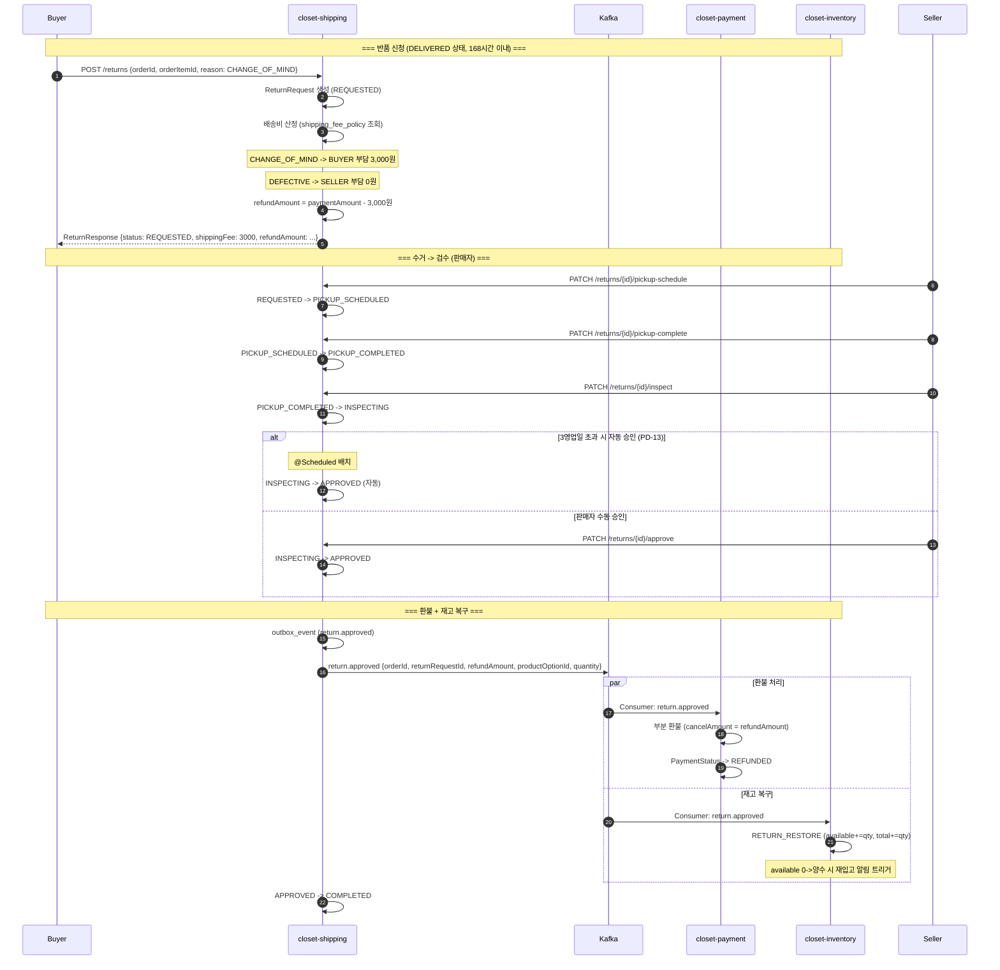

# Phase 2 아키텍처 설계서

> 작성일: 2026-04-04
> 입력: gap_analysis.md, pm_decisions.md, 기술실현성.md, infra_design.md, 기존 코드 분석
> 범위: 배송(closet-shipping), 재고(closet-inventory), 검색(closet-search), 리뷰(closet-review) + 기존 서비스 수정

---

## 1. 전체 아키텍처

### 1.1 Component Diagram



### 1.2 이벤트 흐름 개요



---

## 2. 서비스별 설계

### 2.1 closet-shipping (배송 서비스)

> 포트: 8088 | DB: MySQL (closet) | 의존: Redis, Kafka, Mock Carrier API

#### 2.1.1 도메인 모델

```
Shipment (배송)
├── id: Long (PK)
├── orderId: Long (UNIQUE)
├── sellerId: Long
├── memberId: Long
├── carrier: String (VARCHAR 20) -- CJ, LOGEN, LOTTE, EPOST
├── trackingNumber: String (VARCHAR 30)
├── status: ShippingStatus (VARCHAR 20) -- READY, IN_TRANSIT, DELIVERED
├── receiverName: String
├── receiverPhone: String
├── zipCode: String
├── address: String
├── detailAddress: String
├── shippedAt: LocalDateTime?
├── deliveredAt: LocalDateTime?
├── createdAt: LocalDateTime
└── updatedAt: LocalDateTime

ShippingTrackingLog (배송 추적 이력)
├── id: Long (PK)
├── shippingId: Long (INDEX)
├── carrierStatus: String -- Mock 서버 원본 상태 (ACCEPTED, IN_TRANSIT, OUT_FOR_DELIVERY, DELIVERED)
├── mappedStatus: ShippingStatus -- 매핑된 상위 상태
├── location: String?
├── description: String?
├── trackedAt: LocalDateTime
└── createdAt: LocalDateTime

ReturnRequest (반품 요청)
├── id: Long (PK)
├── orderId: Long (INDEX)
├── orderItemId: Long
├── memberId: Long
├── sellerId: Long
├── reason: ReturnReason -- DEFECTIVE, WRONG_ITEM, SIZE_MISMATCH, CHANGE_OF_MIND
├── reasonDetail: String?
├── status: ReturnStatus (VARCHAR 30)
├── shippingFee: Money -- shipping_fee_policy 테이블 기반 산정
├── shippingFeePayer: String -- BUYER / SELLER
├── refundAmount: Money -- 결제금액 - 반품배송비(BUYER 부담시)
├── pickupTrackingNumber: String?
├── inspectedAt: LocalDateTime?
├── completedAt: LocalDateTime?
├── createdAt: LocalDateTime
└── updatedAt: LocalDateTime

ExchangeRequest (교환 요청)
├── id: Long (PK)
├── orderId: Long (INDEX)
├── orderItemId: Long
├── memberId: Long
├── sellerId: Long
├── originalOptionId: Long -- 기존 옵션
├── exchangeOptionId: Long -- 교환 대상 옵션 (동일 가격만 허용, PD-14)
├── reason: ExchangeReason -- DEFECTIVE, WRONG_ITEM, SIZE_MISMATCH, CHANGE_OF_MIND
├── reasonDetail: String?
├── status: ExchangeStatus (VARCHAR 30)
├── shippingFee: Money -- 왕복 6,000원
├── shippingFeePayer: String
├── pickupTrackingNumber: String?
├── reshippingTrackingNumber: String?
├── completedAt: LocalDateTime?
├── createdAt: LocalDateTime
└── updatedAt: LocalDateTime

ShippingFeePolicy (배송비 정책, PD-15)
├── id: Long (PK)
├── type: String -- RETURN / EXCHANGE
├── reason: String -- DEFECTIVE, WRONG_ITEM, SIZE_MISMATCH, CHANGE_OF_MIND
├── payer: String -- BUYER / SELLER
├── fee: Money
├── isActive: Boolean
├── createdAt: LocalDateTime
└── updatedAt: LocalDateTime
```

#### 2.1.2 상태 머신

**ShippingStatus** -- PRD 3단계 + Mock 서버 매핑 (PD-10)

```kotlin
enum class ShippingStatus {
    READY,       // 송장 등록 완료, 택배사 인수 대기 (Mock: ACCEPTED)
    IN_TRANSIT,  // 배송 중 (Mock: IN_TRANSIT, OUT_FOR_DELIVERY)
    DELIVERED;   // 배송 완료 (Mock: DELIVERED)

    fun canTransitionTo(target: ShippingStatus): Boolean {
        return when (this) {
            READY -> target == IN_TRANSIT
            IN_TRANSIT -> target == DELIVERED
            DELIVERED -> false
        }
    }

    fun validateTransitionTo(target: ShippingStatus) {
        require(canTransitionTo(target)) {
            "배송 상태를 ${this.name}에서 ${target.name}(으)로 변경할 수 없습니다"
        }
    }

    companion object {
        /** Mock 택배사 상태 -> ShippingStatus 매핑 */
        fun fromCarrierStatus(carrierStatus: String): ShippingStatus {
            return when (carrierStatus) {
                "ACCEPTED" -> READY
                "IN_TRANSIT", "OUT_FOR_DELIVERY" -> IN_TRANSIT
                "DELIVERED" -> DELIVERED
                else -> throw IllegalArgumentException("Unknown carrier status: $carrierStatus")
            }
        }
    }
}
```

**ReturnStatus** -- 반품 상태 머신 (PD-13: 3영업일 검수, 초과시 자동 승인)

```kotlin
enum class ReturnStatus {
    REQUESTED,          // 반품 신청
    PICKUP_SCHEDULED,   // 수거 예약
    PICKUP_COMPLETED,   // 수거 완료
    INSPECTING,         // 검수 중
    APPROVED,           // 반품 승인 -> 환불 + 재고 복구
    REJECTED,           // 반품 거절
    COMPLETED;          // 환불 완료

    fun canTransitionTo(target: ReturnStatus): Boolean {
        return when (this) {
            REQUESTED -> target in setOf(PICKUP_SCHEDULED, REJECTED)
            PICKUP_SCHEDULED -> target in setOf(PICKUP_COMPLETED, REJECTED)
            PICKUP_COMPLETED -> target == INSPECTING
            INSPECTING -> target in setOf(APPROVED, REJECTED)
            APPROVED -> target == COMPLETED
            REJECTED -> false
            COMPLETED -> false
        }
    }

    fun validateTransitionTo(target: ReturnStatus) {
        require(canTransitionTo(target)) {
            "반품 상태를 ${this.name}에서 ${target.name}(으)로 변경할 수 없습니다"
        }
    }

    fun isTerminal(): Boolean = this in setOf(COMPLETED, REJECTED)
}
```

**ExchangeStatus** -- 교환 상태 머신

```kotlin
enum class ExchangeStatus {
    REQUESTED,          // 교환 신청 + 새 옵션 재고 선점(RESERVE)
    PICKUP_SCHEDULED,   // 수거 예약
    PICKUP_COMPLETED,   // 수거 완료 -> 기존 옵션 재고 복구(RELEASE)
    RESHIPPING,         // 새 상품 재발송
    COMPLETED,          // 교환 완료
    REJECTED;           // 교환 거절 -> 선점 재고 복구(RELEASE)

    fun canTransitionTo(target: ExchangeStatus): Boolean {
        return when (this) {
            REQUESTED -> target in setOf(PICKUP_SCHEDULED, REJECTED)
            PICKUP_SCHEDULED -> target in setOf(PICKUP_COMPLETED, REJECTED)
            PICKUP_COMPLETED -> target in setOf(RESHIPPING, REJECTED)
            RESHIPPING -> target == COMPLETED
            COMPLETED -> false
            REJECTED -> false
        }
    }

    fun validateTransitionTo(target: ExchangeStatus) {
        require(canTransitionTo(target)) {
            "교환 상태를 ${this.name}에서 ${target.name}(으)로 변경할 수 없습니다"
        }
    }

    fun isTerminal(): Boolean = this in setOf(COMPLETED, REJECTED)
}
```

#### 2.1.3 API 목록

| Method | Path | 설명 | 권한 |
|--------|------|------|------|
| `POST` | `/api/v1/shippings` | 송장 등록 (배송 생성) | SELLER |
| `GET` | `/api/v1/shippings/{id}` | 배송 상세 조회 | ALL |
| `GET` | `/api/v1/shippings?orderId={orderId}` | orderId 기반 배송 조회 (PD-44) | ALL |
| `GET` | `/api/v1/shippings/{id}/tracking` | 배송 추적 (Redis 캐시 5분 TTL, PD-41) | ALL |
| `POST` | `/api/v1/returns` | 반품 신청 | BUYER |
| `GET` | `/api/v1/returns/{id}` | 반품 상세 조회 | ALL |
| `GET` | `/api/v1/returns?orderId={orderId}` | 주문별 반품 조회 | ALL |
| `PATCH` | `/api/v1/returns/{id}/pickup-schedule` | 수거 예약 | SELLER |
| `PATCH` | `/api/v1/returns/{id}/pickup-complete` | 수거 완료 | SELLER |
| `PATCH` | `/api/v1/returns/{id}/inspect` | 검수 시작 | SELLER |
| `PATCH` | `/api/v1/returns/{id}/approve` | 반품 승인 | SELLER |
| `PATCH` | `/api/v1/returns/{id}/reject` | 반품 거절 | SELLER |
| `POST` | `/api/v1/exchanges` | 교환 신청 | BUYER |
| `GET` | `/api/v1/exchanges/{id}` | 교환 상세 조회 | ALL |
| `PATCH` | `/api/v1/exchanges/{id}/pickup-schedule` | 수거 예약 | SELLER |
| `PATCH` | `/api/v1/exchanges/{id}/pickup-complete` | 수거 완료 | SELLER |
| `PATCH` | `/api/v1/exchanges/{id}/reship` | 재발송 | SELLER |
| `PATCH` | `/api/v1/exchanges/{id}/complete` | 교환 완료 | SELLER |
| `PATCH` | `/api/v1/exchanges/{id}/reject` | 교환 거절 | SELLER |

#### 2.1.4 Kafka 이벤트

**발행 (Producer)**:

| 토픽 | 트리거 | 파티션 키 | 페이로드 |
|------|--------|----------|---------|
| `shipping.status.changed` | 배송 상태 변경 시 | orderId | `{ orderId, shippingId, fromStatus, toStatus, carrier, trackingNumber, timestamp }` |
| `return.approved` | 반품 승인 시 | orderId | `{ orderId, returnRequestId, orderItemId, productOptionId, quantity, refundAmount, shippingFee, timestamp }` |

**수신 (Consumer)**:

| 토픽 | 처리 내용 | Consumer Group |
|------|----------|---------------|
| `order.created` | 배송 준비 정보 사전 저장 (수신인, 주소 등) | `shipping-service` |
| `order.confirmed` | 배송 건 최종 완료 처리 | `shipping-service` |

#### 2.1.5 Mock 택배사 연동 -- CarrierAdapter Strategy 패턴 (PD-02)

```kotlin
/** 택배사 어댑터 인터페이스 (Strategy) */
interface CarrierAdapter {
    fun getCarrierCode(): String
    fun registerShipment(request: ShipmentRegistrationRequest): ShipmentRegistrationResponse
    fun trackShipment(trackingNumber: String): TrackingResponse
    fun validateTrackingNumber(trackingNumber: String): Boolean
}

/** CJ대한통운 어댑터 */
class CjCarrierAdapter(private val restTemplate: RestTemplate) : CarrierAdapter {
    override fun getCarrierCode() = "CJ"
    override fun registerShipment(request: ShipmentRegistrationRequest): ShipmentRegistrationResponse {
        // POST {mockApiBaseUrl}/api/carriers/cj/register
    }
    override fun trackShipment(trackingNumber: String): TrackingResponse {
        // GET {mockApiBaseUrl}/api/carriers/cj/track/{trackingNumber}
    }
    override fun validateTrackingNumber(trackingNumber: String): Boolean {
        return trackingNumber.matches(Regex("[A-Z]{0,4}[0-9]{10,15}")) // PD-08
    }
}

/** 택배사 어댑터 팩토리 */
@Component
class CarrierAdapterFactory(private val adapters: List<CarrierAdapter>) {
    fun getAdapter(carrierCode: String): CarrierAdapter {
        return adapters.find { it.getCarrierCode() == carrierCode }
            ?: throw BusinessException(ErrorCode.UNSUPPORTED_CARRIER, "지원하지 않는 택배사: $carrierCode")
    }
}
```

**배송 추적 스케줄러**: 30분 간격으로 `READY`, `IN_TRANSIT` 상태 배송 건을 폴링하여 택배사 API로 상태 갱신. 상태 변경 감지 시 `shipping.status.changed` Kafka 이벤트 발행 + Redis 캐시 갱신.

---

### 2.2 closet-inventory (재고 서비스)

> 포트: 8089 | DB: MySQL (closet) | 의존: Redis (Redisson), Kafka

#### 2.2.1 도메인 모델

```
Inventory (재고 -- 3단 구조, PD-06/PD-18)
├── id: Long (PK)
├── productId: Long
├── productOptionId: Long (UNIQUE with productId)
├── sku: String (UNIQUE, VARCHAR 50)
├── totalQuantity: Int         -- 전체 수량
├── availableQuantity: Int     -- 가용 수량 (주문 가능)
├── reservedQuantity: Int      -- 예약 수량 (결제 대기)
├── safetyStock: Int           -- 안전재고 (카테고리별 기본값, PD-20)
├── version: Long              -- @Version 낙관적 락
├── createdAt: LocalDateTime
└── updatedAt: LocalDateTime

InventoryHistory (재고 변경 이력)
├── id: Long (PK)
├── inventoryId: Long (INDEX)
├── changeType: ChangeType     -- RESERVE, DEDUCT, RELEASE, INBOUND, RETURN_RESTORE, ADJUSTMENT
├── quantity: Int               -- 변동 수량 (양수)
├── beforeAvailable: Int
├── afterAvailable: Int
├── beforeReserved: Int
├── afterReserved: Int
├── referenceId: Long?          -- orderId 또는 returnRequestId 등
├── referenceType: String?      -- ORDER, RETURN, INBOUND, ADJUSTMENT
├── createdAt: LocalDateTime
└── updatedAt: LocalDateTime

RestockNotification (재입고 알림, PD-21)
├── id: Long (PK)
├── productId: Long
├── productOptionId: Long (INDEX)
├── memberId: Long
├── status: RestockNotificationStatus -- WAITING, NOTIFIED, EXPIRED
├── notifiedAt: LocalDateTime?
├── expiredAt: LocalDateTime          -- 등록일 + 90일 (PD-21)
├── createdAt: LocalDateTime
└── updatedAt: LocalDateTime
```

#### 2.2.2 RESERVE -> DEDUCT -> RELEASE 패턴 (PD-18)

```
주문 생성 시 (order.created 이벤트):
  available -= quantity
  reserved  += quantity
  -> RESERVE 이력 기록

결제 완료 시 (order.paid 이벤트 또는 동기 API):
  reserved  -= quantity
  -> DEDUCT 이력 기록
  * total은 변경하지 않음 (출고 시 total 차감은 Phase 2.5 WMS)

결제 실패/취소/TTL 만료 시 (order.cancelled 이벤트):
  reserved  -= quantity
  available += quantity
  -> RELEASE 이력 기록

반품 승인 시 (return.approved 이벤트):
  available += quantity
  total     += quantity
  -> RETURN_RESTORE 이력 기록

입고 시 (INBOUND API, PD-42):
  total     += quantity
  available += quantity
  -> INBOUND 이력 기록
  * available > 0 && 기존 available == 0 이면 재입고 알림 트리거
```

**15분 TTL 주문 만료** (기존 Order.place()에서 `reservationExpiresAt = now + 15분` 설정):
- 배치 또는 스케줄러가 `reservationExpiresAt < now && status == STOCK_RESERVED` 건을 탐색하여 자동 취소 + RELEASE

#### 2.2.3 Redisson 분산 락 설계 (PD-22: 100 TPS 목표, P99 200ms)

```kotlin
@Service
class InventoryLockService(
    private val redissonClient: RedissonClient,
    private val inventoryRepository: InventoryRepository,
    private val inventoryHistoryRepository: InventoryHistoryRepository,
) {
    companion object {
        private const val LOCK_KEY_PREFIX = "inventory:lock:"
        private const val WAIT_TIME = 3L    // 락 획득 대기 (초)
        private const val LEASE_TIME = -1L  // Watch Dog 자동 갱신
    }

    /**
     * SKU 단위 분산 락 + @Version 낙관적 락 이중 잠금
     * 1. Redisson tryLock (SKU별 세밀한 잠금으로 병렬성 확보)
     * 2. JPA @Version으로 DB 레벨 최종 방어
     */
    fun reserveStock(sku: String, quantity: Int, orderId: Long): InventoryResult {
        val lock = redissonClient.getLock("$LOCK_KEY_PREFIX$sku")
        val acquired = lock.tryLock(WAIT_TIME, LEASE_TIME, TimeUnit.SECONDS)

        if (!acquired) {
            throw BusinessException(ErrorCode.LOCK_ACQUISITION_FAILED,
                "재고 락 획득 실패: sku=$sku")
        }

        try {
            val inventory = inventoryRepository.findBySku(sku)
                ?: throw BusinessException(ErrorCode.ENTITY_NOT_FOUND, "재고 없음: sku=$sku")

            inventory.reserve(quantity)  // available -= qty, reserved += qty
            inventoryRepository.save(inventory)

            inventoryHistoryRepository.save(
                InventoryHistory.create(
                    inventoryId = inventory.id,
                    changeType = ChangeType.RESERVE,
                    quantity = quantity,
                    referenceId = orderId,
                    referenceType = "ORDER",
                )
            )

            // 안전재고 이하 체크
            if (inventory.availableQuantity <= inventory.safetyStock) {
                // Kafka: inventory.low_stock 이벤트 발행
            }
            // 품절 체크
            if (inventory.availableQuantity == 0) {
                // Kafka: inventory.out_of_stock 이벤트 발행
            }

            return InventoryResult.success(inventory)
        } finally {
            if (lock.isHeldByCurrentThread) {
                lock.unlock()
            }
        }
    }
}
```

**불변 조건(Invariant)**:
- `totalQuantity == availableQuantity + reservedQuantity` (항상 성립)
- `availableQuantity >= 0`
- `reservedQuantity >= 0`

#### 2.2.4 API 목록

| Method | Path | 설명 | 권한 |
|--------|------|------|------|
| `GET` | `/api/v1/inventories/{id}` | 재고 상세 조회 | ALL |
| `GET` | `/api/v1/inventories?productOptionId={id}` | 옵션별 재고 조회 | ALL |
| `GET` | `/api/v1/inventories?sku={sku}` | SKU별 재고 조회 | ALL |
| `POST` | `/api/v1/inventories/{id}/reserve` | 재고 예약 (내부 API) | INTERNAL |
| `POST` | `/api/v1/inventories/{id}/deduct` | 재고 확정 차감 (내부 API) | INTERNAL |
| `POST` | `/api/v1/inventories/{id}/release` | 재고 예약 해제 (내부 API) | INTERNAL |
| `POST` | `/api/v1/inventories/{id}/inbound` | 재고 입고 (PD-42) | SELLER |
| `PATCH` | `/api/v1/inventories/{id}/safety-stock` | 안전재고 설정 | SELLER |
| `GET` | `/api/v1/inventories/{id}/history` | 재고 변경 이력 조회 | SELLER |
| `POST` | `/api/v1/restock-notifications` | 재입고 알림 신청 | BUYER |
| `DELETE` | `/api/v1/restock-notifications/{id}` | 재입고 알림 취소 | BUYER |
| `GET` | `/api/v1/restock-notifications?memberId={id}` | 내 재입고 알림 목록 | BUYER |

#### 2.2.5 Kafka 이벤트

**수신 (Consumer)**:

| 토픽 | 처리 내용 | Consumer Group |
|------|----------|---------------|
| `order.created` | 주문 항목별 재고 RESERVE. All-or-Nothing(PD-19): 하나라도 부족 시 전체 RELEASE + `inventory.insufficient` 발행 | `inventory-service` |
| `order.cancelled` | 재고 RELEASE (reserved -> available 복구) | `inventory-service` |
| `return.approved` | 재고 RETURN_RESTORE (available + total 증가) | `inventory-service` |

**발행 (Producer)**:

| 토픽 | 트리거 | 페이로드 |
|------|--------|---------|
| `inventory.insufficient` | 재고 부족으로 예약 실패 시 | `{ orderId, insufficientItems: [{ sku, requested, available }] }` |
| `inventory.low_stock` | 안전재고 이하 도달 시 (24h 중복 방지, Redis) | `{ sku, productId, available, safetyStock }` |
| `inventory.out_of_stock` | 가용 재고 0 도달 시 | `{ sku, productId }` |
| `inventory.restock_notification` | 재입고(available 0->양수) 시 알림 대기자에게 | `{ productId, optionId, memberIds: [...] }` |

#### 2.2.6 Outbox 패턴 적용 (PD-04, PD-51)

```
재고 차감 트랜잭션:
  1. BEGIN TX
  2. inventory UPDATE (available -= qty, reserved += qty)
  3. inventory_history INSERT
  4. outbox_event INSERT (topic='order.stock.reserved', payload=...)
  5. COMMIT TX

별도 Outbox Poller (5초 간격):
  1. SELECT * FROM outbox_event WHERE status='PENDING' ORDER BY created_at LIMIT 100
  2. KafkaTemplate.send(topic, key, payload)
  3. UPDATE outbox_event SET status='PUBLISHED', published_at=NOW()
```

---

### 2.3 closet-search (검색 서비스)

> 포트: 8086 | 의존: Elasticsearch 8.11 (nori), Redis, Kafka

#### 2.3.1 ES 인덱스 매핑 (closet-products)

```json
{
  "settings": {
    "number_of_shards": 1,
    "number_of_replicas": 0,
    "refresh_interval": "1s",
    "analysis": {
      "analyzer": {
        "nori_analyzer": {
          "type": "custom",
          "tokenizer": "nori_tokenizer",
          "filter": ["nori_readingform", "lowercase", "nori_part_of_speech_filter"]
        },
        "nori_search_analyzer": {
          "type": "custom",
          "tokenizer": "nori_tokenizer",
          "filter": ["nori_readingform", "lowercase", "synonym_filter"]
        },
        "autocomplete_index_analyzer": {
          "type": "custom",
          "tokenizer": "autocomplete_tokenizer",
          "filter": ["lowercase"]
        },
        "autocomplete_search_analyzer": {
          "type": "custom",
          "tokenizer": "standard",
          "filter": ["lowercase"]
        }
      },
      "tokenizer": {
        "nori_tokenizer": {
          "type": "nori_tokenizer",
          "decompound_mode": "mixed"
        },
        "autocomplete_tokenizer": {
          "type": "edge_ngram",
          "min_gram": 2,
          "max_gram": 20,
          "token_chars": ["letter", "digit"]
        }
      },
      "filter": {
        "nori_part_of_speech_filter": {
          "type": "nori_part_of_speech",
          "stoptags": ["E", "IC", "J", "MAG", "MAJ", "MM", "SP", "SSC", "SSO",
                       "SC", "SE", "XPN", "XSA", "XSN", "XSV", "UNA", "NA", "VSV"]
        },
        "synonym_filter": {
          "type": "synonym",
          "synonyms": [
            "바지,팬츠,pants", "상의,탑,top", "원피스,드레스,dress",
            "맨투맨,스웨트셔츠,sweatshirt", "후드,후디,hoodie",
            "반팔,반소매", "긴팔,장소매", "청바지,데님,denim,진",
            "운동화,스니커즈,sneakers", "가방,백,bag"
          ]
        }
      }
    }
  },
  "mappings": {
    "properties": {
      "productId":     { "type": "long" },
      "name": {
        "type": "text",
        "analyzer": "nori_analyzer",
        "search_analyzer": "nori_search_analyzer",
        "fields": {
          "keyword": { "type": "keyword" },
          "autocomplete": {
            "type": "text",
            "analyzer": "autocomplete_index_analyzer",
            "search_analyzer": "autocomplete_search_analyzer"
          }
        }
      },
      "brand": {
        "type": "text",
        "analyzer": "nori_analyzer",
        "fields": {
          "keyword": { "type": "keyword" },
          "autocomplete": {
            "type": "text",
            "analyzer": "autocomplete_index_analyzer",
            "search_analyzer": "autocomplete_search_analyzer"
          }
        }
      },
      "category":      { "type": "keyword" },
      "subCategory":   { "type": "keyword" },
      "price":         { "type": "integer" },
      "salePrice":     { "type": "integer" },
      "discountRate":  { "type": "float" },
      "colors":        { "type": "keyword" },
      "sizes":         { "type": "keyword" },
      "tags":          { "type": "keyword" },
      "description":   { "type": "text", "analyzer": "nori_analyzer" },
      "imageUrl":      { "type": "keyword", "index": false },
      "salesCount":    { "type": "integer" },
      "reviewCount":   { "type": "integer" },
      "avgRating":     { "type": "float" },
      "popularityScore": { "type": "float" },
      "status":        { "type": "keyword" },
      "sellerId":      { "type": "long" },
      "createdAt":     { "type": "date", "format": "yyyy-MM-dd'T'HH:mm:ss||yyyy-MM-dd'T'HH:mm:ss.SSSSSS||epoch_millis" },
      "updatedAt":     { "type": "date", "format": "yyyy-MM-dd'T'HH:mm:ss||yyyy-MM-dd'T'HH:mm:ss.SSSSSS||epoch_millis" }
    }
  }
}
```

#### 2.3.2 검색 설계

**상품 검색** (`GET /api/v1/search/products`):
- 쿼리: `multi_match` (name, brand, description, tags)
- 필터: category, brand, price range, color, size, status
- 정렬: RELEVANCE(기본), PRICE_ASC, PRICE_DESC, NEWEST, POPULAR, REVIEW_COUNT
- 오타 교정: `fuzziness=AUTO` (PD-26)
- 페이징: from/size (최대 10,000건)

**인기순 정렬** (PD-23, Sprint 7 고도화):
```
popularityScore = salesCount * 0.4 + reviewCount * 0.3 + avgRating * 0.2 + viewCount * 0.1
```
- ES `function_score` 쿼리로 실시간 계산
- 30일 sliding window 기반 산정

**자동완성** (`GET /api/v1/search/autocomplete?q={keyword}`):
- `edge_ngram` 토크나이저 활용, name.autocomplete + brand.autocomplete 필드 검색
- P99 50ms 이내 (PD-27)
- 최대 10건 반환

**인기 검색어** (`GET /api/v1/search/popular-keywords`):
- Redis Sorted Set `search:popular_keywords` (score = timestamp)
- 실시간 sliding window 1시간 (PD-25)
- 매 조회 시 `ZREMRANGEBYSCORE`로 1시간 이전 데이터 정리
- 상위 10건 반환

**최근 검색어** (`GET /api/v1/search/recent-keywords`):
- Redis List `search:recent:{memberId}` (PD-48)
- 최대 20개 보관, TTL 30일
- 검색 시 LPUSH + LTRIM

**유의어 관리** (PD-24):
- DB `search_synonym` 테이블 + 관리자 CRUD API
- 변경 시 ES synonym filter 리로드 (close/open index)
- Redis `search:synonym:version` 키로 변경 감지

#### 2.3.3 API 목록

| Method | Path | 설명 | 권한 |
|--------|------|------|------|
| `GET` | `/api/v1/search/products` | 상품 검색 (필터/정렬/페이징) | ALL |
| `GET` | `/api/v1/search/autocomplete?q={keyword}` | 자동완성 (P99 50ms) | ALL |
| `GET` | `/api/v1/search/popular-keywords` | 인기 검색어 TOP 10 | ALL |
| `GET` | `/api/v1/search/recent-keywords` | 최근 검색어 (로그인 필수) | BUYER |
| `DELETE` | `/api/v1/search/recent-keywords` | 최근 검색어 전체 삭제 | BUYER |
| `DELETE` | `/api/v1/search/recent-keywords/{keyword}` | 최근 검색어 개별 삭제 | BUYER |
| `POST` | `/api/v1/search/reindex` | 벌크 리인덱싱 (10만건/5분, PD-28) | ADMIN |
| `GET` | `/api/v1/admin/search/synonyms` | 유의어 목록 | ADMIN |
| `POST` | `/api/v1/admin/search/synonyms` | 유의어 등록 | ADMIN |
| `PUT` | `/api/v1/admin/search/synonyms/{id}` | 유의어 수정 | ADMIN |
| `DELETE` | `/api/v1/admin/search/synonyms/{id}` | 유의어 삭제 | ADMIN |

#### 2.3.4 Kafka Consumer

| 토픽 | 처리 내용 | Consumer Group |
|------|----------|---------------|
| `product.created` | ES 인덱싱 (신규 문서 생성) | `search-service` |
| `product.updated` | ES 업데이트 (기존 문서 갱신) | `search-service` |
| `product.deleted` | ES 삭제 (문서 제거) | `search-service` |
| `review.summary.updated` | ES 부분 업데이트 (reviewCount, avgRating, popularityScore) | `search-service` |

**인덱싱 파이프라인**: product-service -> outbox -> Kafka -> search-service -> processed_event 멱등성 체크 -> ES Index API. 실패 시 DLQ 3회 재시도 (1분/5분/30분, PD-31).

---

### 2.4 closet-review (리뷰 서비스)

> 포트: 8087 | DB: MySQL (closet) | 의존: Redis, Kafka, Local Storage

#### 2.4.1 도메인 모델

```
Review (리뷰)
├── id: Long (PK)
├── productId: Long (INDEX)
├── memberId: Long (INDEX)
├── orderId: Long
├── orderItemId: Long (UNIQUE -- 주문 항목당 1개 리뷰)
├── content: String (TEXT, 최대 2,000자)
├── rating: Int (TINYINT UNSIGNED NOT NULL, 1~5, PD-38)
├── hasPhoto: Boolean (TINYINT(1))
├── status: ReviewStatus -- ACTIVE, HIDDEN (PD-35), DELETED
├── editCount: Int (DEFAULT 0, 최대 3회, PD-32)
├── pointAwarded: Int -- 지급된 포인트
├── createdAt: LocalDateTime
└── updatedAt: LocalDateTime

ReviewImage (리뷰 이미지)
├── id: Long (PK)
├── reviewId: Long (INDEX)
├── originalUrl: String -- 원본 이미지 로컬 경로
├── thumbnailUrl: String -- 400x400 썸네일 경로 (PD-33, Thumbnailator)
├── displayOrder: Int
├── fileSize: Int -- bytes (최대 5MB/장, PD-34)
├── createdAt: LocalDateTime
└── updatedAt: LocalDateTime

ReviewEditHistory (수정 이력, PD-32)
├── id: Long (PK)
├── reviewId: Long (INDEX)
├── previousContent: String (TEXT)
├── previousImageUrls: String (TEXT, JSON)
├── editedAt: LocalDateTime
└── createdAt: LocalDateTime

ReviewSummary (리뷰 집계 -- 상품별)
├── id: Long (PK)
├── productId: Long (UNIQUE)
├── totalCount: Int
├── averageRating: BigDecimal (DECIMAL 3,2)
├── rating1Count: Int
├── rating2Count: Int
├── rating3Count: Int
├── rating4Count: Int
├── rating5Count: Int
├── photoReviewCount: Int
├── createdAt: LocalDateTime
└── updatedAt: LocalDateTime

ReviewSizeInfo (사이즈 후기 -- 리뷰당 1개)
├── id: Long (PK)
├── reviewId: Long (UNIQUE)
├── height: Int?          -- cm
├── weight: Int?          -- kg
├── normalSize: String?   -- 평소 사이즈
├── purchasedSize: String -- 구매 사이즈
├── fitType: FitType      -- SMALL, PERFECT, LARGE
├── createdAt: LocalDateTime
└── updatedAt: LocalDateTime

Enums:
- ReviewStatus: ACTIVE, HIDDEN, DELETED
- FitType: SMALL, PERFECT, LARGE
```

#### 2.4.2 이미지 리사이즈 (Thumbnailator, PD-33)

```kotlin
@Service
class ReviewImageService(
    @Value("\${review.image.storage-path}") private val storagePath: String,
) {
    companion object {
        private const val THUMBNAIL_SIZE = 400
        private const val MAX_FILE_SIZE = 5 * 1024 * 1024  // 5MB per image (PD-34)
        private const val MAX_TOTAL_SIZE = 30 * 1024 * 1024 // 30MB per request (PD-34)
        private const val MAX_IMAGES = 10
    }

    /**
     * 동기 처리: 원본 저장 + 400x400 썸네일 생성
     * Phase 2는 로컬 스토리지 (PD-33), Phase 3에서 S3 전환
     */
    fun uploadImages(reviewId: Long, files: List<MultipartFile>): List<ReviewImage> {
        require(files.size <= MAX_IMAGES) { "이미지는 최대 ${MAX_IMAGES}개까지 업로드 가능합니다" }

        val totalSize = files.sumOf { it.size }
        require(totalSize <= MAX_TOTAL_SIZE) { "전체 파일 크기는 30MB 이하여야 합니다" }

        return files.mapIndexed { index, file ->
            require(file.size <= MAX_FILE_SIZE) { "파일 크기는 5MB 이하여야 합니다" }

            val originalPath = saveOriginal(reviewId, file, index)
            val thumbnailPath = generateThumbnail(originalPath, reviewId, index)

            ReviewImage(
                reviewId = reviewId,
                originalUrl = originalPath,
                thumbnailUrl = thumbnailPath,
                displayOrder = index,
                fileSize = file.size.toInt(),
            )
        }
    }

    private fun generateThumbnail(originalPath: String, reviewId: Long, index: Int): String {
        val thumbnailPath = "$storagePath/thumbnails/${reviewId}_${index}.jpg"
        Thumbnails.of(File(originalPath))
            .size(THUMBNAIL_SIZE, THUMBNAIL_SIZE)
            .outputFormat("jpg")
            .toFile(File(thumbnailPath))
        return thumbnailPath
    }
}
```

#### 2.4.3 포인트 적립 연동

리뷰 생성 시:
1. 일일 한도 체크: Redis `review:daily_point:{memberId}` (PD-37, 일 5,000P, KST 00:00 리셋)
2. 포인트 산정: 텍스트 리뷰 100P, 포토 리뷰 300P
3. 한도 내이면 `review.created` Kafka 이벤트 발행 -> member-service Consumer에서 포인트 적립
4. 리뷰 삭제 시 포인트 회수. 잔액 부족 시 마이너스 잔액 허용 (PD-36, 다음 적립에서 상계)

#### 2.4.4 API 목록

| Method | Path | 설명 | 권한 |
|--------|------|------|------|
| `POST` | `/api/v1/reviews` | 리뷰 작성 (이미지 + 사이즈 후기) | BUYER |
| `GET` | `/api/v1/reviews/{id}` | 리뷰 상세 조회 | ALL |
| `GET` | `/api/v1/reviews?productId={id}` | 상품별 리뷰 목록 (페이징/정렬) | ALL |
| `GET` | `/api/v1/reviews?memberId={id}` | 내 리뷰 목록 | BUYER |
| `PUT` | `/api/v1/reviews/{id}` | 리뷰 수정 (텍스트+이미지, 별점 불가, 최대 3회, PD-32) | BUYER |
| `DELETE` | `/api/v1/reviews/{id}` | 리뷰 삭제 + 포인트 회수 | BUYER |
| `GET` | `/api/v1/reviews/summary?productId={id}` | 리뷰 집계 (캐시 1시간) | ALL |
| `PATCH` | `/api/v1/admin/reviews/{id}/hide` | 리뷰 블라인드 (PD-35) | ADMIN |

#### 2.4.5 Kafka 이벤트

**발행 (Producer)**:

| 토픽 | 트리거 | 페이로드 |
|------|--------|---------|
| `review.created` | 리뷰 작성 완료 | `{ reviewId, productId, memberId, rating, hasPhoto, pointAmount }` |
| `review.summary.updated` | ReviewSummary 갱신 후 | `{ productId, totalCount, avgRating, photoReviewCount }` |

**수신 (Consumer)**: 없음 (리뷰는 구매확정 상태 확인을 동기 API로 처리)

---

## 3. 기존 서비스 수정사항

### 3.1 closet-order 수정

#### OrderStatus enum 확장

```kotlin
enum class OrderStatus {
    PENDING,
    STOCK_RESERVED,
    PAID,
    PREPARING,
    SHIPPED,
    DELIVERED,
    CONFIRMED,
    CANCELLED,
    FAILED;

    fun canTransitionTo(target: OrderStatus): Boolean {
        return when (this) {
            PENDING -> target in setOf(STOCK_RESERVED, CANCELLED, FAILED)
            STOCK_RESERVED -> target in setOf(PAID, CANCELLED, FAILED)
            PAID -> target in setOf(PREPARING, CANCELLED)
            PREPARING -> target in setOf(SHIPPED, CANCELLED)
            SHIPPED -> target == DELIVERED
            DELIVERED -> target in setOf(CONFIRMED, RETURN_REQUESTED, EXCHANGE_REQUESTED) // Phase 2 추가
            CONFIRMED -> false
            CANCELLED -> false
            FAILED -> false
        }
    }
    // ... (기존 패턴 유지)
}
```

**주의**: `RETURN_REQUESTED`, `EXCHANGE_REQUESTED`는 주문 레벨 상태이지만, 부분 반품/교환을 위해 `OrderItemStatus`에도 `EXCHANGE_REQUESTED`, `EXCHANGE_COMPLETED`를 추가한다 (기존 `RETURN_REQUESTED`, `RETURNED` 패턴 동일).

#### OrderItemStatus 확장

```kotlin
enum class OrderItemStatus {
    ORDERED,
    PREPARING,
    SHIPPED,
    DELIVERED,
    CANCELLED,
    RETURN_REQUESTED,    // 기존
    RETURNED,            // 기존
    EXCHANGE_REQUESTED,  // Phase 2 추가
    EXCHANGE_COMPLETED,  // Phase 2 추가
}
```

#### ApplicationEvent -> Outbox 전환 (PD-51)

기존 인프로세스 `ApplicationEventPublisher` 패턴을 유지하면서 Outbox 테이블 삽입을 추가한다.

```kotlin
// 기존: eventPublisher.publishEvent(OrderCreatedEvent(...))
// 변경: eventPublisher.publishEvent(OrderCreatedEvent(...)) + outboxRepository.save(...)

@TransactionalEventListener(phase = TransactionPhase.BEFORE_COMMIT)
fun handleOrderCreated(event: OrderCreatedEvent) {
    outboxEventRepository.save(
        OutboxEvent.create(
            aggregateType = "ORDER",
            aggregateId = event.orderId,
            eventType = "order.created",
            topic = "order.created",
            payload = objectMapper.writeValueAsString(event),
        )
    )
}
```

#### 신규 API

| Method | Path | 설명 |
|--------|------|------|
| `POST` | `/api/v1/orders/{id}/confirm` | 수동 구매확정 |

#### 자동 구매확정 배치 (PD-17)

```kotlin
@Scheduled(cron = "0 0 0,12 * * *") // 매일 00:00, 12:00 (2회)
fun autoConfirmDeliveredOrders() {
    // Redis 배치 락: order:auto_confirm:lock (10분 TTL)
    // 조건: delivered_at <= NOW() - 168h
    //   AND status NOT IN ('RETURN_REQUESTED', 'EXCHANGE_REQUESTED')
    // 페이지네이션 chunk 처리
    // order.confirmed Kafka 이벤트 발행
}
```

#### D-1 사전 알림 배치 (PD-45)

```kotlin
@Scheduled(cron = "0 0 9 * * *") // 매일 09:00
fun sendConfirmReminderNotification() {
    // 조건: delivered_at BETWEEN (NOW() - 144h) AND (NOW() - 168h)
    //   AND status NOT IN ('RETURN_REQUESTED', 'EXCHANGE_REQUESTED', 'CONFIRMED')
    // confirm.reminder Kafka 이벤트 발행 (실제 알림은 Phase 3)
}
```

#### Kafka Consumer 추가

| 토픽 | 처리 내용 | Consumer Group |
|------|----------|---------------|
| `shipping.status.changed` | 주문 상태 동기화 (PREPARING, SHIPPED, DELIVERED) | `order-service` |
| `inventory.insufficient` | 주문 실패 처리 (STOCK_RESERVED -> FAILED) | `order-service` |

---

### 3.2 closet-payment 수정

#### 부분 환불 API 추가 (PD-12)

```kotlin
// 신규 메서드
fun refund(paymentId: Long, refundAmount: Money, reason: String): Payment {
    val payment = paymentRepository.findById(paymentId).orElseThrow { ... }
    require(payment.status == PaymentStatus.PAID) { "환불 가능 상태가 아닙니다" }
    require(refundAmount <= payment.finalAmount) { "환불 금액이 결제 금액을 초과합니다" }

    // PG 부분 취소 API 호출 (Toss Payments cancelAmount)
    payment.refund(refundAmount)
    return paymentRepository.save(payment)
}
```

| Method | Path | 설명 |
|--------|------|------|
| `POST` | `/api/v1/payments/{id}/refund` | 부분 환불 (반품 배송비 공제 후 환불) |

#### Payment 엔티티 확장

```kotlin
// 기존 Payment에 추가
@Embedded
@AttributeOverride(name = "amount", column = Column(name = "refund_amount", columnDefinition = "DECIMAL(15,2)"))
var refundAmount: Money = Money.ZERO

fun refund(amount: Money) {
    require(this.status == PaymentStatus.PAID) { "PAID 상태에서만 환불 가능합니다" }
    this.refundAmount = amount
    this.status = PaymentStatus.REFUNDED
}
```

#### Kafka Consumer 추가

| 토픽 | 처리 내용 | Consumer Group |
|------|----------|---------------|
| `return.approved` | 환불 처리 (refundAmount = 결제금액 - 반품배송비) | `payment-service` |

---

### 3.3 closet-product 수정

#### Kafka 이벤트 발행 추가 (PD-43)

기존 `ApplicationEventPublisher`만 사용하던 product-service에 Outbox 패턴을 추가한다.

```kotlin
@TransactionalEventListener(phase = TransactionPhase.BEFORE_COMMIT)
fun handleProductCreated(event: ProductCreatedEvent) {
    outboxEventRepository.save(
        OutboxEvent.create(
            aggregateType = "PRODUCT",
            aggregateId = event.productId,
            eventType = "product.created",
            topic = "product.created",
            payload = objectMapper.writeValueAsString(event),
        )
    )
}
// product.updated, product.deleted 동일 패턴
```

발행 토픽: `product.created`, `product.updated`, `product.deleted`

---

### 3.4 closet-member 수정

#### Kafka Consumer 추가

| 토픽 | 처리 내용 | Consumer Group |
|------|----------|---------------|
| `review.created` | 포인트 적립 (텍스트 100P, 포토 300P). processed_event 멱등성 체크 | `member-service` |

---

### 3.5 closet-bff 수정

#### 신규 Feign Client 4개

```kotlin
@FeignClient(name = "shipping-service", url = "\${service.shipping.url}")
interface ShippingServiceClient {
    @GetMapping("/shippings")
    fun getShippingByOrderId(@RequestParam orderId: Long): ApiResponse<ShipmentResponse>

    @GetMapping("/shippings/{id}/tracking")
    fun getTracking(@PathVariable id: Long): ApiResponse<TrackingDetailResponse>

    @GetMapping("/returns")
    fun getReturnsByOrderId(@RequestParam orderId: Long): ApiResponse<List<ReturnResponse>>

    @GetMapping("/exchanges")
    fun getExchangesByOrderId(@RequestParam orderId: Long): ApiResponse<List<ExchangeResponse>>
}

@FeignClient(name = "inventory-service", url = "\${service.inventory.url}")
interface InventoryServiceClient {
    @GetMapping("/inventories")
    fun getInventoryByOptionId(@RequestParam productOptionId: Long): ApiResponse<InventoryResponse>
}

@FeignClient(name = "search-service", url = "\${service.search.url}")
interface SearchServiceClient {
    @GetMapping("/search/products")
    fun searchProducts(@SpringQueryMap params: ProductSearchParams): ApiResponse<PageResponse<ProductSearchResponse>>

    @GetMapping("/search/autocomplete")
    fun autocomplete(@RequestParam q: String): ApiResponse<List<String>>

    @GetMapping("/search/popular-keywords")
    fun getPopularKeywords(): ApiResponse<List<String>>
}

@FeignClient(name = "review-service", url = "\${service.review.url}")
interface ReviewServiceClient {
    @GetMapping("/reviews/summary")
    fun getReviewSummary(@RequestParam productId: Long): ApiResponse<ReviewSummaryResponse>

    @GetMapping("/reviews")
    fun getReviewsByProductId(@RequestParam productId: Long, @RequestParam page: Int, @RequestParam size: Int): ApiResponse<PageResponse<ReviewResponse>>
}
```

#### 신규 Facade 5개

| Facade | 설명 | 병렬 호출 대상 |
|--------|------|--------------|
| `ShippingBffFacade` | 주문 배송 상세 (주문 + 결제 + 배송 + 추적) | order, payment, shipping |
| `ReturnBffFacade` | 반품 상세 (반품 + 주문 + 결제) | return, order, payment |
| `SearchBffFacade` | 검색 결과 (검색 + 인기검색어 + 최근검색어) | search |
| `ProductDetailBffFacade` | 상품 상세 Phase 2 확장 (상품 + 리뷰집계 + 재고) | product, review, inventory |
| `ReviewBffFacade` | 리뷰 목록 (리뷰 + 상품 정보) | review, product |

#### 기존 OrderBffFacade 수정

```kotlin
fun getOrderDetail(orderId: Long): OrderDetailBffResponse {
    val orderFuture = CompletableFuture.supplyAsync({ orderClient.getOrder(orderId) }, executor)
    val paymentFuture = CompletableFuture.supplyAsync({ runCatching { paymentClient.getPaymentByOrderId(orderId) }.getOrNull() }, executor)
    val shipmentFuture = CompletableFuture.supplyAsync({ runCatching { shippingClient.getShippingByOrderId(orderId) }.getOrNull() }, executor) // Phase 2: null 제거

    CompletableFuture.allOf(orderFuture, paymentFuture, shipmentFuture).join()

    return OrderDetailBffResponse(
        order = orderFuture.get().data!!,
        payment = paymentFuture.get()?.data,
        shipment = shipmentFuture.get()?.data, // Phase 2: 실 데이터
    )
}
```

---

## 4. 이벤트 흐름 (Sequence Diagram)

### 4.1 주문 -> 재고 예약 -> 결제 -> 출고 -> 배송 추적 -> 구매확정



### 4.2 반품 -> 수거 -> 검수 -> 환불 -> 재고 복구



---

## 5. 채택/미채택 패턴 표

| # | 패턴 | 채택 여부 | 근거 | 의사결정 |
|---|------|----------|------|---------|
| 1 | **Transactional Outbox** | **채택** | 분산 트랜잭션 정합성 보장. ApplicationEvent -> Kafka 전환 시 DB-Kafka 원자성 필수 | PD-04, PD-51 |
| 2 | **processed_event 멱등성** | **채택** | Consumer 중복 수신 방어. SELECT -> INSERT(UNIQUE) -> 비즈니스 로직 -> COMMIT | PD-04 |
| 3 | **Redisson 분산 락 + @Version 낙관적 락** | **채택** | 이중 잠금으로 동시성 완벽 방어. SKU 단위 세밀 잠금으로 병렬성 확보 | PD-22 |
| 4 | **CarrierAdapter Strategy 패턴** | **채택** | 택배사별 API 차이를 어댑터로 추상화. 신규 택배사 추가 시 어댑터만 구현 | PD-02 |
| 5 | **재고 3단 구조 (total/available/reserved)** | **채택** | RESERVE -> DEDUCT -> RELEASE 패턴에 필수. 기존 Flyway 스키마와 일치 | PD-06, PD-18 |
| 6 | **BFF Facade + VirtualThread 병렬 호출** | **채택** | 기존 closet-bff 패턴 그대로 확장. CompletableFuture + VirtualThreadPerTaskExecutor | 기존 패턴 |
| 7 | **enum 상태 전이 규칙 캡슐화** | **채택** | canTransitionTo/validateTransitionTo 패턴. 기존 OrderStatus 패턴과 동일하게 Shipping/Return/Exchange Status에 적용 | 기존 패턴 |
| 8 | **Redis Sorted Set 인기검색어** | **채택** | 실시간 sliding window. score=timestamp, ZREMRANGEBYSCORE로 만료 정리 | PD-25 |
| 9 | **ES nori + edge_ngram 자동완성** | **채택** | 한글 형태소 분석(nori) + 자동완성(edge_ngram) 분리. P99 50ms 목표 달성 가능 | PD-27 |
| 10 | **Thumbnailator 동기 이미지 리사이즈** | **채택** | TPS 5 req/s 수준에서 Lambda 오버엔지니어링. 서비스 내 동기 처리가 간결 | PD-33 |
| 11 | **shipping_fee_policy DB 관리** | **채택** | 배송비 하드코딩 대신 사유별/유형별 매트릭스 테이블. 운영 변경 시 DDL 없이 UPDATE | PD-15 |
| 12 | **All-or-Nothing 재고 정책** | **채택** | 부분 처리는 CS 복잡도 과도. 부족 SKU 정보를 에러 응답에 포함하여 재주문 유도 | PD-19 |
| 13 | **Saga/Choreography 패턴 (Kafka)** | **채택** | 서비스 간 보상 트랜잭션을 이벤트 기반으로 처리. Orchestrator 없이 각 서비스가 이벤트 반응 | PD-04 |
| 14 | **DLQ + 지수 백오프 재시도** | **채택** | 최대 3회 (1분/5분/30분). 최종 실패 시 수동 큐 | PD-31 |
| -- | --- | --- | --- | --- |
| 15 | **WMS (입고/피킹/출고/실사)** | **미채택 -> Phase 2.5** | 85파일 규모를 8주에 포함하면 일정 초과. Sprint 9-11에서 별도 구현 | PD-01 |
| 16 | **Debezium CDC** | **미채택** | Outbox Poller로 충분. CDC 인프라 추가는 단일 인스턴스 환경에서 오버엔지니어링 | PD-51 벤치마킹만 |
| 17 | **교환 차액 정산** | **미채택 -> Phase 3** | 동일 가격 옵션만 교환 허용. 차액 발생 시 반품 후 재주문 안내 | PD-14 |
| 18 | **별점 수정 허용** | **미채택** | 집계 재계산 복잡도 높음. 텍스트/이미지만 수정 가능, 별점 고정 | PD-32 |
| 19 | **AWS Lambda 이미지 리사이즈** | **미채택** | Phase 2 학습 프로젝트에서 Lambda 인프라 추가는 과도 | PD-33 |
| 20 | **S3 이미지 저장** | **미채택 -> Phase 3** | Phase 2는 로컬 스토리지. S3 + CloudFront Signed URL은 Phase 3 | PD-52 |
| 21 | **SIZE_MISMATCH 2분리 (BUYER/SELLER)** | **미채택** | Phase 2 단순화. SIZE_MISMATCH = BUYER 단일 처리. 분쟁은 CS로 | PD-11 |
| 22 | **리뷰 신고 기능** | **미채택 -> Phase 3** | Phase 2는 관리자 블라인드(HIDDEN)만. 유저 신고/자동 블라인드는 Phase 3 | PD-35 |
| 23 | **판매자 리뷰 답변** | **미채택 -> Phase 3** | review 테이블에 seller_reply 컬럼만 미리 설계 | PD-47 |
| 24 | **알림 발송 (이메일/SMS/푸시)** | **미채택 -> Phase 3** | Phase 2는 Kafka 이벤트 발행까지만. 이벤트 스키마 확정이 Phase 2 범위 | PD-46 |
| 25 | **스마트택배 통합 API** | **미채택** | 개별 택배사 API 직접 호출 + CarrierAdapter 패턴이 학습 목적에 부합 | PD-02 |

---

## 부록 A: 서비스 포트 할당 (최종, PD-05)

| 서비스 | 포트 | Phase |
|--------|------|-------|
| closet-gateway | 8080 | 1 |
| closet-member | 8081 | 1 |
| closet-product | 8082 | 1 |
| closet-order | 8083 | 1 |
| closet-payment | 8084 | 1 |
| closet-bff | 8085 | 1 |
| closet-search | 8086 | **2** |
| closet-review | 8087 | **2** |
| closet-shipping | 8088 | **2** |
| closet-inventory | 8089 | **2** |
| mock-carrier-api | 9090 | 2 |

## 부록 B: Kafka 토픽 요약 (16개)

| 토픽 | 파티션 | Producer | Consumer |
|------|--------|----------|----------|
| `order.created` | 3 | order | inventory, shipping |
| `order.cancelled` | 3 | order | inventory |
| `order.confirmed` | 3 | order(배치) | shipping |
| `product.created` | 3 | product | search |
| `product.updated` | 3 | product | search |
| `product.deleted` | 3 | product | search |
| `shipping.status.changed` | 3 | shipping | order |
| `return.approved` | 3 | shipping | inventory, payment |
| `inventory.insufficient` | 1 | inventory | order |
| `inventory.low_stock` | 1 | inventory | (notification Phase 3) |
| `inventory.out_of_stock` | 1 | inventory | (notification Phase 3) |
| `inventory.restock_notification` | 3 | inventory | (notification Phase 3) |
| `review.created` | 3 | review | member |
| `review.summary.updated` | 3 | review | search |
| `confirm.reminder` | 3 | order(배치) | (notification Phase 3) |
| `order.paid` | 3 | order | inventory |

## 부록 C: Redis 키 패턴 요약

| 키 패턴 | TTL | 서비스 |
|---------|-----|--------|
| `inventory:lock:{sku}` | 3s (leaseTime) | inventory |
| `shipping:tracking:{carrier}:{trackingNumber}` | 300s | shipping |
| `search:popular_keywords` | 영구 | search |
| `search:recent:{memberId}` | 30d | search |
| `review:summary:{productId}` | 3600s | review |
| `review:daily_point:{memberId}` | 86400s | review |
| `inventory:low_stock_alert:{sku}` | 86400s | inventory |
| `inventory:restock:{productId}:{optionId}` | 영구 | inventory |
| `search:rate_limit:ip:{ip}` | 60s | gateway |
| `search:rate_limit:user:{memberId}` | 60s | gateway |
| `order:auto_confirm:lock` | 600s | order |
| `search:synonym:version` | 영구 | search |

## 부록 D: DB 테이블 요약 (신규 11개 + outbox/processed 2개)

| 서비스 | 테이블 | Flyway |
|--------|--------|--------|
| shipping | `shipping` | V1__init_shipping.sql |
| shipping | `shipping_tracking_log` | V1__init_shipping.sql |
| shipping | `return_request` | V2__add_return_exchange.sql |
| shipping | `exchange_request` | V2__add_return_exchange.sql |
| shipping | `shipping_fee_policy` | V3__add_shipping_fee_policy.sql |
| inventory | `inventory` | V1__init_inventory.sql |
| inventory | `inventory_history` | V1__init_inventory.sql |
| inventory | `restock_notification` | V2__add_restock_notification.sql |
| review | `review` | V1__init_review.sql |
| review | `review_image` | V1__init_review.sql |
| review | `review_edit_history` | V1__init_review.sql |
| review | `review_summary` | V1__init_review.sql |
| review | `review_size_info` | V1__init_review.sql |
| 공통 | `outbox_event` | 각 서비스별 |
| 공통 | `processed_event` | 각 서비스별 |
