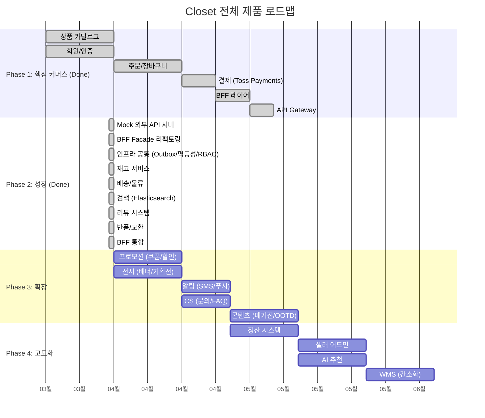

# Closet 의류 이커머스 — 전체 제품 로드맵

> 최종 업데이트: 2026-04-04 (Phase 2 BE 전체 구현 완료)
> 벤치마킹: 무신사, 올리브영 물류시스템 (SpringCamp 2025)

## 전체 타임라인

---

## Phase 1: 핵심 커머스 기반 ✅ Done

| 서비스 | 핵심 기능 | 상태 |
|--------|----------|------|
| closet-product | 상품 CRUD, 카테고리, 브랜드, 옵션(사이즈/색상), SKU | ✅ |
| closet-member | 회원가입, JWT 인증, 배송지 관리 | ✅ |
| closet-order | 장바구니, 주문 생성/취소, 상태 머신 | ✅ |
| closet-payment | Toss Payments 연동, 결제 확인/취소 | ✅ |
| closet-bff | Facade 패턴, Feign Client, 병렬 호출 | ✅ |
| closet-gateway | API Gateway, 라우팅, JWT 필터 | ✅ |

---

## Phase 2: 성장 ✅ Done

> 30 BE 티켓 (CP-01~CP-30), Sprint 5~7, ~235 파일, ~14,320 LOC

| 서비스 | 핵심 기능 | 상태 | PR | 벤치마킹 |
|--------|----------|------|-----|---------|
| closet-common (인프라) | Outbox 패턴, 멱등성, RBAC, Feature Flag | ✅ | #73 | 올리브영 Outbox |
| closet-external-api | Mock PG 4개 + 택배사 4개 (MySQL 저장) | ✅ | #68 | - |
| BFF Facade 리팩토링 | Controller→Facade→Client 패턴 통일 | ✅ | #68 | - |
| closet-inventory | 3단 재고, Redisson 분산락, All-or-Nothing, Kafka Consumer | ✅ | #75 | 올리브영 Inventory API |
| closet-shipping | 송장 등록, 배송 추적, 택배사 어댑터, 반품/교환, 배송비 정책 | ✅ | #77 | 올리브영 WMS |
| closet-search | nori 검색, 필터/정렬, 인기/최근/금지 키워드, Feature Flag | ✅ | #76 | 무신사 검색 UX |
| closet-review | 별점, 포토 리뷰, 사이즈 후기, 이미지 리사이즈, 관리자 블라인드 | ✅ | #78 | 무신사 리뷰 시스템 |
| closet-bff (통합) | Shipping/Review/Search Facade + FeignClient | ✅ | #78 | - |

### Mock 외부 API 상세 (Done)

**PG사 4개:**
- Toss Payments (`/toss/v1/payments`) — confirm, cancel, 조회
- Kakao Pay (`/kakaopay/online/v1/payment`) — ready, approve, cancel, 조회
- Naver Pay (`/naverpay/payments`) — reserve, apply, cancel, history
- Danal (`/danal/payments`) — ready, approve, cancel, 조회

**택배사 4개:**
- CJ 대한통운 (`/carrier/cj/api/v1`) — 접수, 추적, advance
- 로젠 (`/carrier/logen/api/v1`) — 접수, 추적, advance
- 롯데글로벌 (`/carrier/lotte/api/v1`) — 접수, 추적, advance
- 우체국 (`/carrier/epost/api/v1`) — 접수, 추적, advance

---

## Phase 3: 확장 🚧 In Progress

> DDD BC 기반 모듈 재편: shipping→fulfillment(+CS), display+content 병합 (14개 모듈)

| 모듈 | 핵심 기능 | 벤치마킹 | 상태 |
|------|----------|---------|------|
| closet-promotion | 쿠폰(Redis 선착순), 할인 엔진, 타임세일, 적립금 | 무신사 쿠폰 | 🚧 |
| closet-display | 배너, 기획전, 랭킹, 스타일 매거진, OOTD 스냅 | 무신사 스냅 | 🚧 |
| closet-notification | SMS/푸시/이메일(Strategy), 재입고 구독 | - | 🚧 |
| closet-fulfillment (+CS) | 1:1 문의, FAQ, 반품/교환 접수 통합 | - | 🚧 |

---

## Phase 4: 셀러 생태계

| 모듈 | 핵심 기능 | 벤치마킹 |
|------|----------|---------|
| closet-seller | 브랜드 입점, 셀러 어드민, 상품 등록 관리 | 무신사 셀러 시스템 |
| closet-settlement | 브랜드/셀러 정산, 수수료, 정산 주기, 세금계산서 | - |
| 엑셀 업로드 (WMS) | 대량 상품 등록, 검증 리포트, 비동기 처리 | - |
| 엑셀 다운로드 | 주문/정산/재고 데이터 다운로드, 스트리밍 | - |
| AI 추천 | 코디/스타일링 추천, 개인화 | - |

---

## Phase 5: 구독 & 퀵배송

| 모듈 | 핵심 기능 | 벤치마킹 |
|------|----------|---------|
| **closet-subscription** | **의류 구독/대여** — 월정액 구독, 대여→반납 사이클, 세탁/수선 관리, 추천 알고리즘 | 에어클로젯(JP), 프로젝트앤 |
| closet-delivery | 오프라인 매장→집 퀵배송 — 라이더 매칭, 실시간 위치 추적, 매장 재고 연동, 배달비 계산 | 올리브영 오늘드림, 쿠팡이츠 |

---

## Phase 6: 커뮤니티

| 모듈 | 핵심 기능 | 벤치마킹 |
|------|----------|---------|
| closet-community | 의류 커뮤니티 — 스타일 토론, 코디 Q&A, 브랜드 리뷰 | 무신사 커뮤니티 |
| closet-meetup | 패션 모임 — 오프라인 밋업, 플리마켓, 스타일링 클래스 | 당근 동네 모임 |

---

## 기술 인프라 현황

| 인프라 | 상태 | 비고 |
|--------|------|------|
| MySQL 8.0 | ✅ | 각 서비스 독립 DB |
| Redis 7.0 | ✅ | 캐시, 세션 |
| Apache Kafka | ✅ | Outbox Poller, 13개 Consumer 구현 |
| Elasticsearch | ✅ | nori 분석기, 상품 검색/자동완성 구현 |
| Redisson | ✅ | 분산락 (재고 동시성) |
| Prometheus + Grafana | ✅ | docker-compose |
| TestContainers | ✅ | 통합 테스트 |
| Flyway | ✅ | 스키마 마이그레이션 |

## 벤치마킹 참조

- [올리브영 물류 시스템의 진화 | 테크블로그](https://oliveyoung.tech/2025-08-01/logistics-system/)
- [SpringCamp 2025 "올리브영 물류시스템 개선기"](https://www.youtube.com/watch?v=Tlh-8msdOM8)
- 무신사 — 카테고리 구조, 검색 UX, 리뷰 시스템, 스냅
