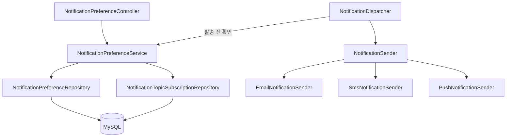
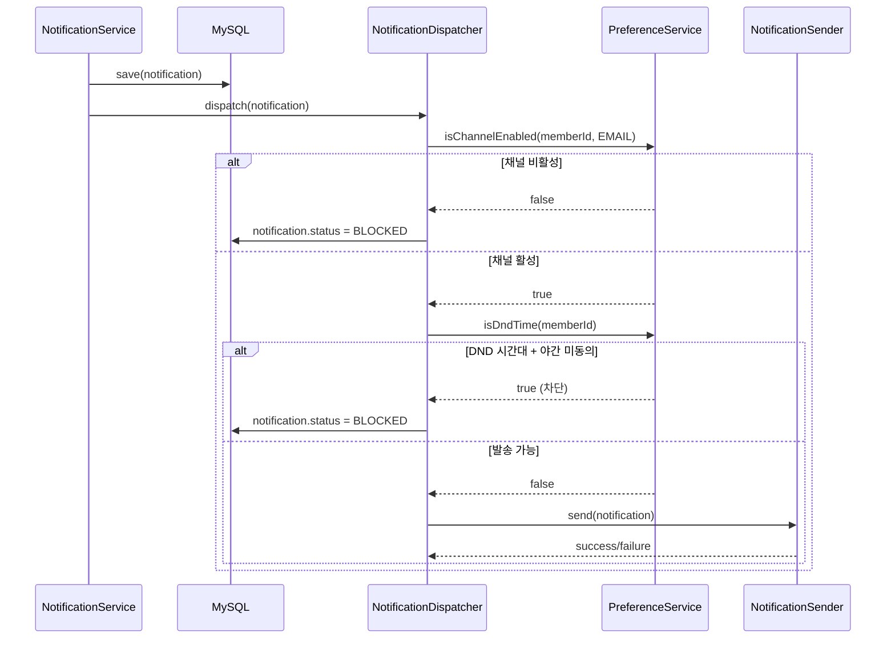
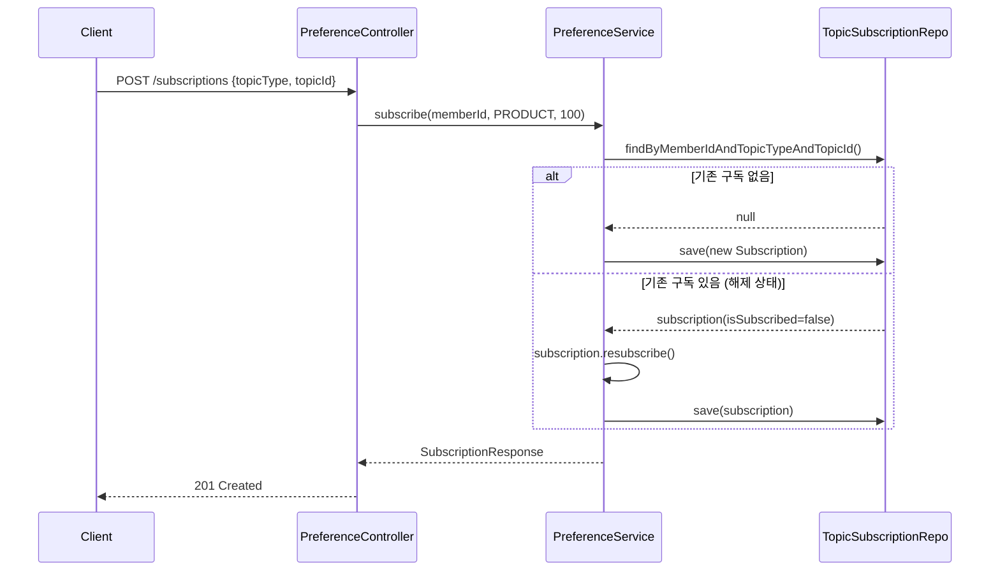
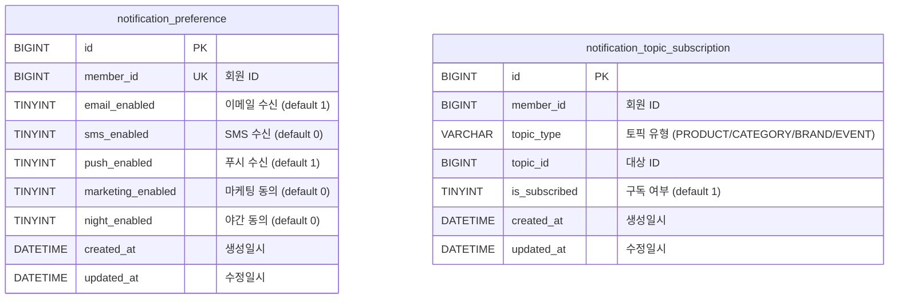

# TDD: 알림 설정 시스템 (Notification Preference)

---

## Background

closet-notification 모듈에 회원별 알림 수신 설정과 토픽 구독 기능이 필요하다. 현재 채널 디스패치(Strategy 패턴)는 구현되었으나, 발송 전 회원 동의 여부를 확인하지 않고 무조건 발송하는 상태이다. 정보통신망법상 마케팅 알림은 별도 동의가 필요하며, 야간(21:00~08:00) 발송도 제한된다.

---

## Terminology

| 용어 | 설명 |
|------|------|
| Preference | 회원별 알림 수신 설정 (채널 on/off, 마케팅 동의, 야간 동의) |
| Topic Subscription | 특정 대상(상품/카테고리/브랜드/이벤트)에 대한 알림 구독 |
| DND (Do Not Disturb) | 야간 방해금지 시간대 (21:00~08:00), nightEnabled=false 시 차단 |
| Channel | 알림 발송 채널 (EMAIL, SMS, PUSH) |
| BLOCKED | 설정에 의해 차단된 알림 상태 (DB에 이력은 남으나 실제 발송 안 됨) |

---

## Define Problem

1. **채널 동의 없이 발송**: SMS 미동의 회원에게 SMS 발송 가능한 상태
2. **마케팅 알림 무분별 발송**: 정보통신망법 위반 가능
3. **야간 알림 제한 없음**: 21:00~08:00 사이 알림 차단 기능 부재
4. **토픽 구독 관리 없음**: 특정 상품/브랜드에 대한 알림만 받을 수 없음

---

## Possible Solutions

### Option A: NotificationPreference 엔티티 (채택)
- 회원별 1:1 설정 엔티티
- 채널/마케팅/야간 각각 Boolean 필드
- Dispatcher에서 발송 전 확인
- **장점**: 단순, 확장 용이, 쿼리 빠름
- **단점**: 채널 추가 시 컬럼 추가 필요

### Option B: JSON 설정 필드
- 하나의 JSON 컬럼에 모든 설정 저장
- **장점**: 스키마 변경 없이 설정 추가
- **단점**: 하네스 규칙 위반 (DB JSON 컬럼 사용 금지), 인덱싱 불가

### Option C: Key-Value 테이블
- (memberId, settingKey, settingValue) 구조
- **장점**: 무제한 설정 확장
- **단점**: 조회 시 N개 row 읽기, 타입 안전성 없음

---

## Detail Design

### AS-IS

```
NotificationService.send()
  → DB 저장
  → NotificationDispatcher.dispatch()
    → sender.send()  // 무조건 발송, 동의 확인 없음
```

### TO-BE

```
NotificationService.send()
  → DB 저장
  → NotificationDispatcher.dispatch()
    → PreferenceService.isChannelEnabled(memberId, channel) 확인
    → PreferenceService.isDndTime(memberId) 확인
    → 차단 시 → notification.status = BLOCKED (발송 안 함)
    → 통과 시 → sender.send()
```

### Component Diagram



### Sequence Diagram — 알림 발송 + Preference 확인



### Sequence Diagram — 토픽 구독



---

## ERD



---

## Security Information

- 마케팅 알림 동의는 정보통신망법 준수 필수 (opt-in 방식)
- SMS 수신 동의는 KISA 가이드라인 준수
- 야간 시간대(21:00~08:00) 광고성 알림 제한 (전기통신사업법 시행령)
- 동의 변경 이력은 Notification 테이블의 BLOCKED 레코드로 추적 가능

---

## Milestone

| 단계 | 내용 | 상태 |
|------|------|------|
| 1 | ADR-009 작성 (설계 결정 기록) | ✅ |
| 2 | TDD 문서 작성 (본 문서) | ✅ |
| 3 | 도메인 엔티티 (NotificationPreference, TopicSubscription) | ✅ |
| 4 | Repository + QueryDSL | ✅ |
| 5 | PreferenceService + Dispatcher 통합 | ✅ |
| 6 | Controller + API | ✅ |
| 7 | DB Migration (V2) | ✅ |
| 8 | 단위 테스트 46개 | ✅ |
| 9 | 로드맵 + DDD 리뷰 문서 업데이트 | ✅ |

---

## Testing Plan

### 단위 테스트 (MockK)

| 대상 | 테스트 수 | 검증 항목 |
|------|----------|----------|
| NotificationPreference | 18 | 기본 설정, 채널 on/off, 마케팅/야간 동의, DND 판단 |
| NotificationTopicSubscription | 6 | 구독 생성, 해제, 재활성화 |
| NotificationPreferenceService | 14 | getOrCreate, isChannelEnabled, isDndTime, subscribe/unsubscribe |
| NotificationDispatcher + Preference | 4 | 채널 차단, DND 차단 시 BLOCKED |
| 통합 시나리오 | 4 | 전체 플로우 (설정→발송→차단 확인) |

### 통합 테스트 (Testcontainers)

- NotificationPreference CRUD + MySQL 실제 저장/조회
- TopicSubscription unique 제약 조건 검증
- Dispatcher + Preference + DB 전체 플로우

### 데이터 마이그레이션

- 기존 회원 대상 기본 Preference 레코드 생성 필요 (배포 후 배치 스크립트)
- RestockSubscription 기존 데이터는 유지 (TopicSubscription과 별도)

---

## Release Scenario

### 배포 순서

1. **DB Migration 먼저**: V2__notification_preference.sql 실행 (테이블 생성)
2. **Application 배포**: closet-notification 서비스 재시작
3. **배치 스크립트**: 기존 회원 대상 기본 Preference 레코드 INSERT

### 롤백 플랜

- Preference 테이블 DROP 시 Dispatcher는 기본값(전체 허용)으로 동작 → 무중단
- Controller 비활성화는 Feature Toggle로 가능
- 롤백 SQL: `DROP TABLE IF EXISTS notification_topic_subscription; DROP TABLE IF EXISTS notification_preference;`

---

## Project Information

- **모듈**: closet-notification
- **관련 ADR**: ADR-009 Notification Strategy 패턴
- **PR**: #95 (feature/notification-strategy-pattern)
- **티켓**: CP-77

---

## Document History

| 날짜 | 변경 내용 | 작성자 |
|------|----------|--------|
| 2026-04-09 | 초안 작성 | BE |
