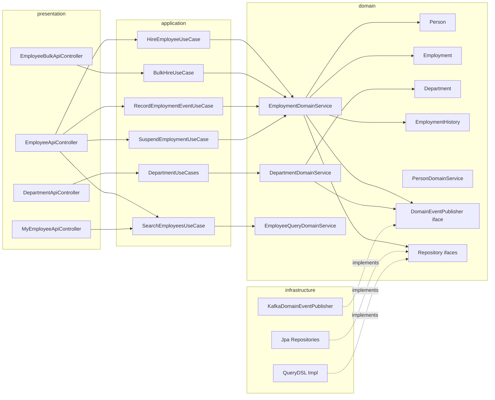
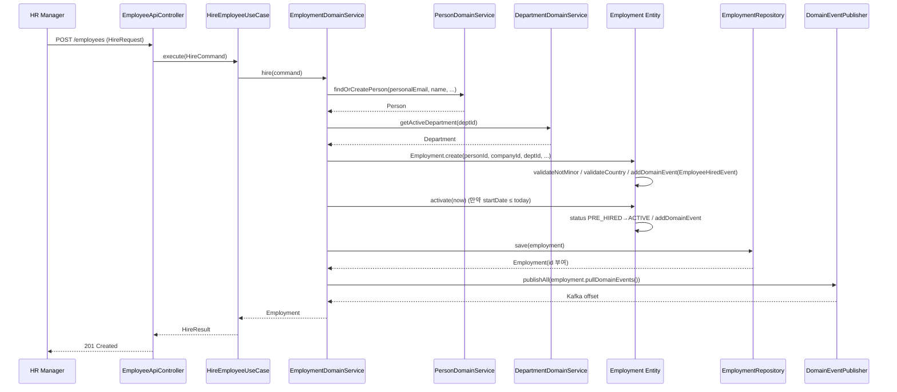
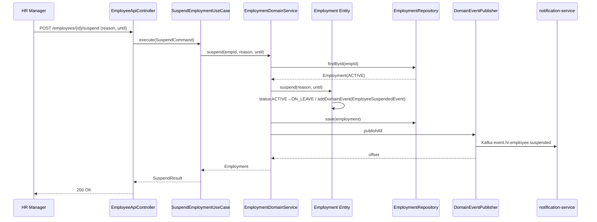

# TDD-001 — employee-service 기술 설계

**일자**: 2026-05-16
**작성자**: 메인 세션 (오케스트레이터)
**범위**: hr-platform MVP M1 · employee-service 단일 도메인
**관련 문서**: PRD §5.1·5.2·6.1·9.2·11.2 · ADR-001 · ADR-002

## Background

hr-platform은 한국 SMB(50~300인) 대상 AI-Ready HR SaaS로, **직원 데이터를 SSOT(Single Source of Truth)** 로 외부 API에 공개하는 첫 한국 HR 플랫폼을 지향합니다. PRD §1.4 목표 중 "MVP 5개월 내 10개사·800명 / HR 운영 < 4시간 / 외부 API 공개"는 employee-service의 안정성·확장성에 직접 의존합니다.

현재 상태(2026-05-16):
- 6개 서비스 디렉토리만 존재, `src/` 모두 비어 있음 (코드 0줄)
- 루트 Gradle 멀티모듈 설정 없음 → 빌드 불가
- `docs/adr`·`docs/tdd`·`docs/tickets` 부재
- 사전 리뷰(Step 0)에서 식별된 누락 명세: Employment 상태 머신·일괄 등록 API·발령 이력 조회 API·휴직/복직 API·비상연락처·부서장 변경·suspended/resumed/department.changed 이벤트

본 TDD는 위 누락을 보강한 employee-service 설계를 정의합니다. 구현 단계는 후속 `/feature` 호출에서 wave 스케줄러로 진행합니다.

## Overview

- **무엇**: hr-platform의 첫 도메인 서비스인 employee-service를 Hexagonal 4-layer · Rich Domain Model로 구현.
- **왜**: 모든 후행 도메인(attendance·leave·payroll·performance·notification)의 SSOT. 모델·이벤트 계약이 잘못되면 5개월 MVP 전체가 흔들림.
- **어떻게**: Gradle 멀티모듈 부트스트랩 → 공통 모듈(core, common-kafka) → 도메인 패키지 4종(person·employment·department·history) → UseCase·Controller·Kafka Publisher 순서로 wave 스폰. 16개 티켓 · 7 wave · 평균 너비 2.43 · 최대 너비 4.

## Terminology

| 용어 | 정의 |
|------|------|
| **SSOT** | Single Source of Truth. 다른 도메인이 직접 DB 조회 없이 이 서비스의 API·이벤트만 참조해야 한다는 데이터 권위 원칙. |
| **Person** | 불변 신원. 회사·고용과 무관한 자연인. |
| **Employment** | 고용 인스턴스. Person·Company 페어. 상태·정책·조직·보상 보유. |
| **Department** | 조직 단위. Materialized Path 트리. |
| **EmploymentHistory** | 발령 이력. Append-only. 이벤트 유형별 부분 스냅샷 보존. |
| **Materialized Path** | 트리 경로를 `/1/12/35/` 식 단일 문자열로 저장하는 트리 모델. |
| **Rich Domain Model** | 비즈니스 로직(검증·상태 전이·계산)을 Entity 메서드에 캡슐화한 모델. 반대말 Anemic Domain Model. |
| **DAG** | Directed Acyclic Graph. 티켓 간 의존 관계. wave 스케줄러 입력. |
| **Wave** | 같은 의존 깊이의 티켓 묶음. wave 안 티켓은 한 메시지에 병렬 스폰. |

## Define Problem

### AS-IS

- hr-platform 빌드 자체가 불가능 (멀티모듈 미설정, Gradle root 파일 없음).
- 7개 서비스 디렉토리는 있으나 `src/` 모두 0 바이트 — 도메인 코드·테스트·DDL 어떤 산출물도 없음.
- 사전 리뷰에서 PRD 자체 누락이 다수 발견:
  - Employment 상태 머신 미정의
  - CSV 일괄 등록·발령 이력 조회·휴직/복직·비상연락처 API 누락
  - suspended/resumed/department.changed 이벤트 누락
  - 권한 자동 범위 필터링 정책 부재
  - Department.path 형식·EmploymentHistory JSON 스키마 모호

### TO-BE

- Gradle 8.14 + Kotlin 2.0 + Spring Boot 3.4 멀티모듈 부트스트랩.
- 공통 모듈 2개 (`core`, `common-kafka`) 가 7개 서비스에 공유.
- employee-service가 4-layer Hexagonal (`presentation`/`application`/`domain`/`infrastructure`) 패키지로 구성.
- Person·Employment·Department·EmploymentHistory 4 Entity가 Rich Domain Model로 캡슐화 — 비즈니스 메서드 ≥ 18개.
- 22개 API · 9종 Kafka 이벤트 · 4단계 상태 머신 정의 완료.
- 메모리 룰 8종(`be-code-convention`·`usecase-domain-service`·`querydsl`·`encapsulation`·`zoned-datetime`·`tdd-first`·`integration-test-required`·`transactional-location`) 100% 준수.
- 16개 티켓·7 wave DAG로 분해, 4인 팀 기준 평균 가동률 ≥ 60%.

## Possible Solutions

### 벤치마킹 참조 제품

| 제품명 | 카테고리 | 참조 URL | 참조 패턴 |
|---|---|---|---|
| **BambooHR** | Global HR SMB | bamboohr.com/api | 단일 Employee 모델 + Job·Compensation·Employment History 별도 테이블. 직원 1명 = User 1개. |
| **Workday** | Enterprise HRIS | workday.com/learn | "Business Process" 메타데이터 + Position/Worker 분리 + Effective-Dated Entity (역사 보존). |
| **Rippling** | Unified Workforce | rippling.com/api | Employment Type별 다른 권한 매트릭스. Department는 Cost Center로 별도 분리. |
| **Deel** | Global Payroll | developer.deel.com | Person + Contract(국가별·통화별) 모델. 한 사람이 여러 국가 계약 동시 보유 가능. |
| **Greeting ATS** (사내) | 채용 ATS | greeting-ats 레포 | Anemic Service 패턴 마이그레이션 학습 → 처음부터 Rich Domain Model로 시작. |

### 방안 비교

#### 방안 1 — Single User Entity (BambooHR 스타일)

- 설명: 한 사람·한 회사·한 고용으로 가정. User 테이블에 모든 정보 통합.
- 채택 사유: 가장 단순. 학습 곡선 ↓.
- 미채택 사유: PRD 1.2 글로벌 확장(다국적 직원·복수 고용) 차단. 인수합병 시 데이터 재구조화 비용 폭증.

#### 방안 2 — Person + Employment 분리 (Workday·Deel 스타일) — **채택**

- 설명: Person(불변 신원) 1 : N Employment(회사·고용 인스턴스). 한 사람이 여러 회사에서 일하거나 다국적 고용 가능.
- 채택 사유:
  - PRD 1.2 · 13. 가정·위험 §15.1 "다국적 직원 모델 사전 대비"와 정확히 일치.
  - Phase 2 일본·미국 확장 시 Person 재사용 + 새 Employment 생성으로 마이그레이션 부담 최소.
  - audit 5년 보관 요구(§10.2)를 EmploymentHistory로 자연스럽게 만족.
- 미채택 대안 대비: 방안 1 대비 쿼리 복잡도 +20%지만, 글로벌 확장·M&A 대응 ROI가 우월.

#### 방안 3 — Event Sourcing Aggregate Root

- 설명: Employment를 Event Sourcing 패턴으로 EventStore에서 재구성. CQRS Read Model 분리.
- 미채택 사유: 5개월 MVP에 학습·인프라(EventStoreDB·Snapshot Strategy·재구성) 비용 과다. 방안 2의 EmploymentHistory append-only로 사실상 같은 효과를 더 낮은 비용으로 달성.

#### 방안 4 — Department 모델 비교

| 옵션 | 설명 | 채택 |
|---|---|:-:|
| Adjacency List (parentId만) | 단순. 서브트리는 N단 JOIN. | ✗ — 조직도 트리 뷰 < 500ms 미달 |
| **Materialized Path** | `path` 단일 문자열에 부모 경로 저장. LIKE `'/1/12/%'`로 서브트리 O(1). | ✓ |
| Closure Table | 별도 ancestor-descendant 테이블. 트리 조회 최고 성능. | ✗ — SMB 부서 수(~30) 규모에 과한 복잡도. 1000+ 부서 시 마이그레이션 검토. |
| Nested Set | left/right 컬럼. 트리 변경 시 다수 행 갱신. | ✗ — 부서 이동 빈번한 SMB에 부적합. |

## Detail Design

### 클래스 역할 정의

#### 도메인 모델

| 클래스명 | 역할 | 핵심 책임 |
|---|---|---|
| `Person` | Aggregate Root (불변 신원) | PII 보유, 미성년자 검증, 연락처 변경 (audit) |
| `Employment` | Aggregate Root (고용 인스턴스) | 상태 전이 7종, 부서/직책 이동, 보상 변경, 권한 범위 판정 |
| `EmploymentStatus` | Enum | PRE_HIRED/ACTIVE/ON_LEAVE/RESIGNED, `canTransitTo()` 캡슐화 |
| `EmploymentType` | Enum | REGULAR/CONTRACT/PART_TIME/INTERN |
| `Department` | Aggregate Root (조직) | Materialized Path 트리, 부서장 할당, 유효기간 |
| `EmploymentHistory` | Value-like Entity (불변 이력) | append-only 로그, JSON oldValue/newValue, effectiveDate 정렬 |
| `EmploymentHistoryEventType` | Enum | HIRE/PROMOTION/DEPT_CHANGE/SALARY_CHANGE/SUSPEND/RESUME/RESIGN |
| `DomainEvent` | Marker | core 모듈, 모든 도메인 이벤트의 base |
| `EmployeeHiredEvent`, `EmployeeResignedEvent`, `EmployeeSuspendedEvent`, `EmployeeResumedEvent`, `EmployeePromotedEvent`, `EmployeeTransferredEvent`, `EmployeeSalaryChangedEvent`, `DepartmentChangedEvent`, `DepartmentHeadChangedEvent` | DomainEvent 구현 | Kafka 페이로드와 1:1 매핑, employmentId·companyId·timestamp 필수 |

#### 서비스 클래스

| 클래스명 | 역할 | 입력 → 출력 | 의존 |
|---|---|---|---|
| `PersonDomainService` | Person 조회·생성·연락처 변경 | command → Person | `PersonRepository` |
| `EmploymentDomainService` | 입사/발령/퇴사/휴직 오케스트레이션 | command → Employment | `EmploymentRepository`, `PersonDomainService`, `DepartmentDomainService`, `DomainEventPublisher` |
| `DepartmentDomainService` | 부서 CRUD·트리 이동·부서장 변경 | command → Department | `DepartmentRepository`, `EmploymentRepository`(부서장 검증), `DomainEventPublisher` |
| `EmploymentHistoryDomainService` | 발령 이력 조회·시점 재구성 | employmentId, date → List<EmploymentHistory> | `EmploymentHistoryRepository` |
| `EmployeeQueryDomainService` | 권한 자동 범위 필터링 (TEAM_LEAD/HR_MANAGER) | viewer + criteria → page | `EmploymentRepository`, `DepartmentRepository` |

#### UseCase 클래스 (application)

| 클래스명 | 트랜잭션 | 호출 DomainService | execute() 책임 |
|---|:-:|---|---|
| `HireEmployeeUseCase` | ✓ | EmploymentDomainService | 입사 등록 (Person + Employment + History + Event) |
| `BulkHireUseCase` | ✓ | EmploymentDomainService | CSV 일괄 등록 (전부 성공 or 전부 롤백) |
| `RecordEmploymentEventUseCase` | ✓ | EmploymentDomainService | 발령 (승진/부서이동/연봉변경) |
| `BulkRecordEmploymentEventsUseCase` | ✓ | EmploymentDomainService | 발령 일괄 |
| `CancelEmploymentEventUseCase` | ✓ | EmploymentDomainService | 발령 취소 (오기재 정정, 직전 1건만 허용) |
| `SuspendEmploymentUseCase` | ✓ | EmploymentDomainService | 휴직 (ON_LEAVE 전이) |
| `ResumeEmploymentUseCase` | ✓ | EmploymentDomainService | 복직 (ACTIVE 복귀) |
| `ResignEmploymentUseCase` | ✓ | EmploymentDomainService | 퇴사 (RESIGNED 전이 + 권한 회수 이벤트) |
| `UpdatePersonalInfoUseCase` | ✓ | PersonDomainService | 본인 정보 수정 (개인 영역 한정) |
| `UpdateEmergencyContactsUseCase` | ✓ | PersonDomainService | 비상연락처 수정 |
| `SearchEmployeesUseCase` | (read-only) | EmployeeQueryDomainService | 직원 목록 (필터 + 페이지 + 권한 범위) |
| `GetEmployeeUseCase` | (read-only) | EmployeeQueryDomainService | 직원 상세 (권한 검증) |
| `GetEmploymentHistoryUseCase` | (read-only) | EmploymentHistoryDomainService | 발령 이력 조회 |
| `CreateDepartmentUseCase` | ✓ | DepartmentDomainService | 부서 생성 |
| `MoveDepartmentUseCase` | ✓ | DepartmentDomainService | 부서 이동 (path 재계산 + 자식 일괄 갱신) |
| `AssignDepartmentHeadUseCase` | ✓ | DepartmentDomainService | 부서장 변경 |

#### Presentation (Controller)

| 클래스명 | 책임 |
|---|---|
| `EmployeeApiController` | `/employees/*` 라우팅, Request→Command 변환, JWT subject → Employment 추출 (auth-service 인증 후) |
| `DepartmentApiController` | `/departments/*` 라우팅 |
| `EmployeeBulkApiController` | `/employees/bulk` CSV 멀티파트 처리 |
| `MyEmployeeApiController` | `/employees/me` 본인 영역 (권한 우회 X, employmentId 자동 주입) |

#### Infrastructure

| 클래스명 | 책임 |
|---|---|
| `PersonJpaRepository`, `PersonRepositoryImpl` | JpaRepository + QueryDSL Custom |
| `EmploymentJpaRepository`, `EmploymentRepositoryImpl` | 동일 |
| `DepartmentJpaRepository`, `DepartmentRepositoryImpl` | path LIKE 서브트리 쿼리 포함 |
| `EmploymentHistoryJpaRepository`, `EmploymentHistoryRepositoryImpl` | append-only, effectiveDate desc 정렬 |
| `KafkaDomainEventPublisher` | `DomainEventPublisher` 구현. `event.hr.employee` 토픽으로 발행. ZonedDateTime ISO-8601 UTC 직렬화. |

### AS-IS / TO-BE 비교

| 항목 | AS-IS | TO-BE |
|------|------|------|
| 빌드 | 불가 (Gradle root 없음) | `./gradlew :employee-service:build` 성공 |
| 도메인 코드 | 0 줄 | Entity 4종 + DomainService 5종 + UseCase 16종 + Controller 4종 |
| API | 0개 | 22개 (PRD 11 + 보강 11) |
| Kafka 이벤트 | 0종 | 9종 (PRD 5 + 보강 4) |
| 상태 머신 | 미정의 | PRE_HIRED/ACTIVE/ON_LEAVE/RESIGNED 4단계 + 7 전이 |
| 권한 | 미적용 | 모든 GET API에 viewer 기반 자동 범위 필터 |
| 테스트 | 0 | 단위(domain·application) + 통합(infra·presentation) + 시나리오(X1/X4) |

### Component Diagram



### Sequence Diagram — 입사 등록 (golden path)



### Sequence Diagram — 휴직 (suspend, 누락 보강 시나리오)



## ERD

```mermaid
erDiagram
    PERSON ||--o{ EMPLOYMENT : has
    DEPARTMENT ||--o{ EMPLOYMENT : holds
    DEPARTMENT ||--o| EMPLOYMENT : "headed by"
    EMPLOYMENT ||--o{ EMPLOYMENT_HISTORY : records
    DEPARTMENT ||--o{ DEPARTMENT : "parent of"

    PERSON {
        bigint id PK
        varchar name
        varchar personal_email "PII, AES-256"
        varchar phone_number "PII, AES-256"
        date birth_date
        varchar nationality "ISO 3166-1 alpha-2"
        varchar gender "MALE/FEMALE/OTHER/UNDISCLOSED"
        json emergency_contacts "[{name, relation, phone}]"
        timestamp_tz created_at "ZonedDateTime UTC"
        timestamp_tz updated_at
    }

    EMPLOYMENT {
        bigint id PK
        bigint person_id FK_ref "참조용, FK 미사용"
        bigint company_id
        varchar employee_number "사번"
        varchar employment_type "REGULAR/CONTRACT/PART_TIME/INTERN"
        varchar status "PRE_HIRED/ACTIVE/ON_LEAVE/RESIGNED"
        date start_date
        date end_date "nullable, 계약직"
        varchar country "ISO 3166-1"
        varchar currency "ISO 4217"
        varchar timezone "IANA TZ"
        bigint position_id
        bigint department_id
        bigint manager_employment_id
        bigint work_schedule_policy_id
        bigint leave_policy_id
        bigint base_salary "정수 minorUnits"
        varchar compensation_currency
        json additional_compensation
        timestamp_tz created_at
        timestamp_tz updated_at
    }

    DEPARTMENT {
        bigint id PK
        bigint company_id
        varchar name
        varchar code
        bigint parent_id "self-ref"
        varchar path "/1/12/35/"
        bigint head_employment_id
        int order_no
        date effective_from
        date effective_to "nullable"
        timestamp_tz created_at
        timestamp_tz updated_at
    }

    EMPLOYMENT_HISTORY {
        bigint id PK
        bigint employment_id
        varchar event_type "HIRE/PROMOTION/DEPT_CHANGE/SALARY_CHANGE/SUSPEND/RESUME/RESIGN"
        json old_value "부분 스냅샷"
        json new_value
        date effective_date
        bigint created_by_employment_id
        varchar note
        timestamp_tz created_at
    }
```

> DDL 전문(컬럼 길이·인덱스·NOT NULL·COMMENT)은 티켓 DB-01 작업 범위. 본 TDD는 개념 모델만 제시. 메모리 룰 `tdd_prd_separation` 준수.

## Testing Plan

### 테스트 레이어 정의

| 레이어 | 대상 | 타입 | 도구 | 커버리지 목표 |
|---|---|---|---|---|
| domain | Entity (Person/Employment/Department/EmploymentHistory) + DomainService 5종 | 단위 | Kotest BehaviorSpec + MockK | 95% |
| application | UseCase 16종 | 단위 | Kotest + MockK (DomainService 모킹) | 95% |
| infrastructure | RepositoryImpl + KafkaDomainEventPublisher | 통합 | Kotest + Testcontainers (MySQL 8.0 + Kafka) | 90% |
| presentation | Controller 4종 | 통합 | Kotest + WebTestClient + Testcontainers | 90% |
| scenario | E2E 시나리오 | 시나리오 통합 | Kotest + Testcontainers | 100% (X1, X4) |

### TDD 사이클 (메모리 룰 `tdd_first`)

각 wave 스폰 시 서브에이전트에게 강제:
1. RED — 실패하는 Kotest BehaviorSpec 작성
2. GREEN — 최소 구현으로 통과
3. detekt 정적분석 통과

테스트 코드 없는 PR은 hook이 차단 (settings.json `push-test.sh`).

### 핵심 시나리오 (PRD §12.6 횡단)

| 시나리오 | 기대 | 담당 티켓 |
|---|---|---|
| X1 — 직원이 퇴사 처리됨 | Employment.status=RESIGNED + 같은 트랜잭션에 EmploymentHistory(RESIGN) + employee.resigned 이벤트 발행 + 권한 회수는 auth-service가 이벤트 구독 | BE-12 |
| X4 — 엑셀 100명 일괄 입력 | 전부 성공 or 전부 롤백 (`@Transactional`) + 결과 리포트 (성공/실패 수) + Kafka 100건 일괄 발행 | BE-12 |
| 부서 이동 (드래그&드롭) | Department.parentId 변경 + path 재계산 + 자식 path 일괄 UPDATE + department.changed 이벤트 | BE-12 |
| 부서장 휴직 | Department.head_employment_id null 갱신 + department.head_changed 이벤트 + HR 알림 (notification-service 구독) | BE-12 |
| TEAM_LEAD 권한 위반 | 다른 팀 직원 조회 → 403 Forbidden | BE-11 단위 + BE-12 시나리오 |

### 비기능 검증

| 항목 | 목표 (PRD §10.1) | 검증 방법 |
|---|---|---|
| 직원 검색 (1만명) | < 500ms | 시나리오 테스트 + JMH 마이크로벤치 |
| 일반 GET API p95 | < 300ms | 통합 테스트 + Grafana k6 |
| 동시 입사 등록 100건 | 트랜잭션 격리 보장 | Testcontainers 동시성 테스트 |

## Release Scenario

### 배포 순서 (Wave 의존)

```
Wave 1: BS-01 (infra-bootstrap)
       └─ 머지 후 dev에 빌드 가능 상태 확보
Wave 2: DB-01 (Flyway) + KF-01 (Kafka 토픽) + CM-01 (공통 모듈)
       ├─ DB 마이그레이션 dev → staging 순차
       └─ Kafka 토픽 생성 (12 파티션, 보존 7일)
Wave 3: BE-01~04 (Entity + Repository 4종)
Wave 4: BE-05~07 (DomainService + EventPublisher)
Wave 5: BE-08~10 (UseCase 묶음)
Wave 6: BE-11 (Controller, 공통 파일 단독)
Wave 7: BE-12 (통합 + 시나리오 테스트, 최종 게이트)
```

### 마이그레이션 선/후 조건

- **DB-01 선행 조건**: BS-01 완료, MySQL 8.0 dev 인스턴스 준비, Flyway baseline 설정.
- **DB-01 후행 검증**: `SHOW CREATE TABLE` 4개 테이블 (`person`, `employment`, `department`, `employment_history`) + 인덱스 검증.
- **KF-01 선행 조건**: BS-01 완료, Kafka cluster dev 접속 정보, Terraform state 백업.
- **KF-01 후행 검증**: `kafka-topics --list | grep event.hr.employee` 1건.
- **BE-11 머지 전 조건**: BE-08/09/10 머지 완료, 단위 테스트 100% green.
- **BE-12 머지 전 조건**: X1·X4 시나리오 테스트 통과, p95 SLO 만족.

### 롤백 플랜

| 단계 | 롤백 방법 |
|---|---|
| BS-01 | 디렉토리·파일 git revert. 영향 없음 (코드 없음). |
| DB-01 | Flyway `undo`로 마이그레이션 역행. 빈 테이블이라 데이터 손실 없음. |
| KF-01 | Terraform `destroy` 단독 적용. 토픽 빈 상태에서 안전. |
| BE-01~12 | PR revert + 재배포. dev에서만 진행하므로 prod 영향 없음. |

### 컴플라이언스 / 데이터 보호

- PII 컬럼(`personal_email`, `phone_number`, `birth_date`) AES-256-GCM 컬럼 단위 암호화 (PRD §10.2).
- audit log 5년 보관 (EmploymentHistory + Kafka 토픽 보존 정책 별도).
- 개인정보보호법 준수 — 수집·이용·보관·파기 정책 문서화 (legal review 별도 트랙).

## Project Information

| 항목 | 내용 |
|---|---|
| 시작 | 2026-06-01 (M1 시작) |
| 1차 GA | 2026-07-31 (M1 종료, attendance/leave 진입 직전) |
| 담당 BE | (배정 후 채움) — 4인 팀 가정 |
| 담당 DBA | (배정 후 채움) — DB-01 작업 |
| 담당 Platform | (배정 후 채움) — KF-01 작업 |
| 티켓 트래커 | hr-platform/docs/tickets/HR-M1-EMPLOYEE-TICKETS.md |
| 위키 동기화 | doc-sync 스킬, 본 TDD를 별도 호출에서 위키 게시 |
| 의존 ADR | ADR-001(멀티모듈), ADR-002(SSOT 모델) |

## Document History

| 날짜 | 변경 내용 | 작성자 |
|---|---|---|
| 2026-05-16 | 초안 작성 — PRD 사전 리뷰 누락 보강 반영 (Employment 상태 머신·일괄 API·휴직/복직·비상연락처) | 메인 세션 |
