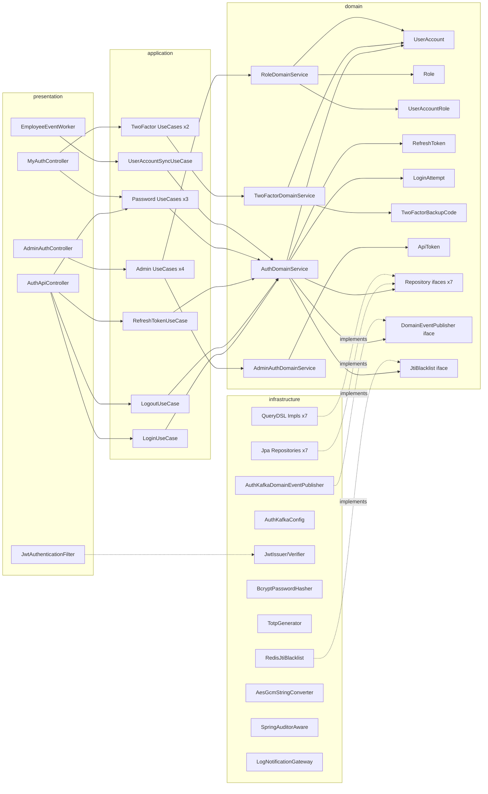
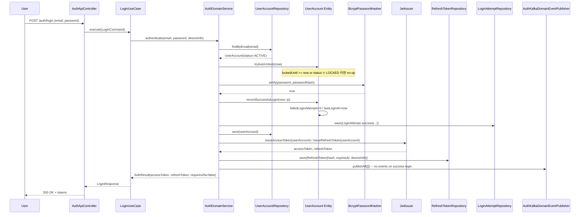
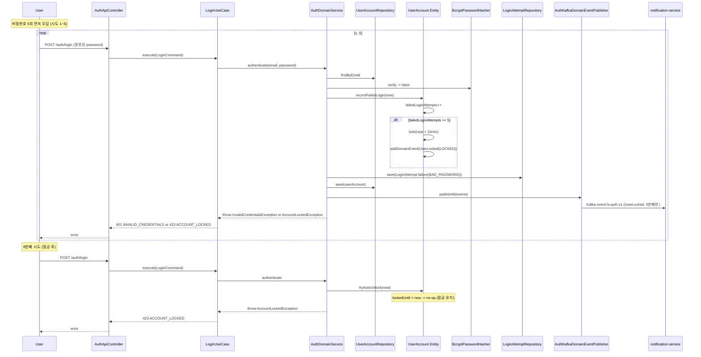
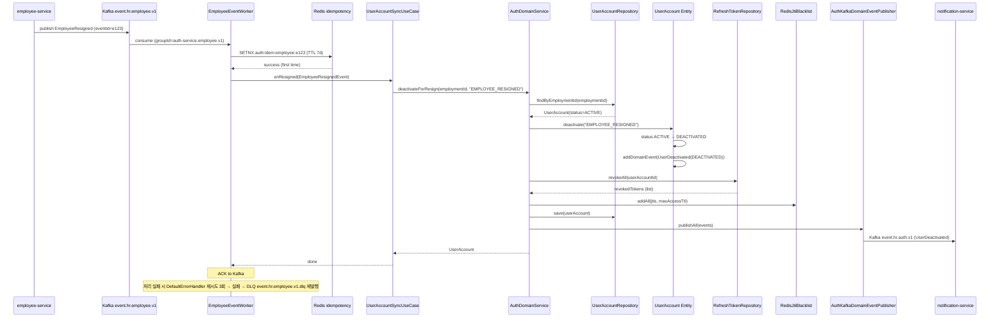
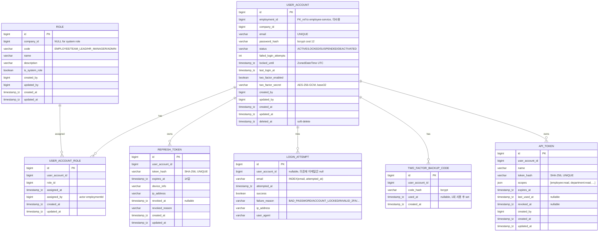

# TDD-002 — auth-service 기술 설계

**일자**: 2026-05-18
**작성자**: 메인 세션 (오케스트레이터)
**범위**: hr-platform MVP M1 · auth-service 단일 도메인
**관련 문서**: PRD §5.1·5.2·9.1·10.2·11.1 · ADR-001 · ADR-002 · ADR-003

## Background

hr-platform MVP M1 두 번째 도메인인 auth-service를 신설합니다. employee-service M1(Person·Employment·Department·EmploymentHistory + KafkaDomainEventPublisher + `event.hr.employee.v1` 토픽)이 main에 머지된 상태에서, auth-service는 **모든 hr-platform API의 인증·인가 SSOT** 로 다음을 책임집니다:

- 15개 REST API (공개 5 + 본인 6 + 관리자 4)
- 7개 Entity (UserAccount · Role · UserAccountRole · RefreshToken · LoginAttempt · TwoFactorBackupCode · ApiToken)
- 11종 DomainEvent → 신규 토픽 `event.hr.auth.v1`
- employee 4종 이벤트 (Hired/Resigned/Suspended/Resumed) 구독 → UserAccount 자동 동기화
- JWT(jjwt 0.12.6) + bcrypt(cost 12) + TOTP(RFC 6238) + Redis(jti blacklist · idempotency)

PRD가 main에 커밋되지 않아 분실된 상태로 `auth-prd-reconstructed.md`(메모리 컨텍스트 재구성)를 reference로 사용합니다. TPM 분석(`tpm-analysis.md` 17 티켓)과 검수(`tpm-review.md` NEEDS_REVISION → p0 1건 + p1 3건 보강 후 PASS) 결과를 본 TDD에 모두 반영합니다.

현재 상태(2026-05-18):
- `hr-platform/auth-service/` 디렉토리 비어 있음 (코드 0줄)
- employee-service M1 코드·토픽·테이블 main에 머지 완료
- ADR-001(멀티모듈) · ADR-002(employee SSOT) · ADR-003(auth 아키텍처) 모두 채택
- `docs/tickets/HR-M1-AUTH-TICKETS.md` 본 TDD와 함께 작성

본 TDD는 위 명세를 코드 작성 직전 수준으로 정밀화합니다. 구현은 후속 `/feature` 호출에서 wave 스폰으로 진행합니다.

## Overview

- **무엇**: hr-platform의 두 번째 도메인 서비스인 auth-service를 Hexagonal 4-layer · Rich Domain Model로 구현
- **왜**: PRD §5.1 인증·인가 책임 분리 (employee는 PII만, auth는 로그인·권한·세션). 5,000 req/s 출근 피크 + SOC2 Type 2 audit 5년 보관 요구
- **어떻게**: auth-service 모듈 부트스트랩 → 7 Entity + Repository → 4 DomainService → 13 UseCase → 3 Controller + Security Filter → EmployeeEventWorker → E2E 시나리오. 19개 티켓 · 8 wave · 평균 너비 2.375 · 최대 너비 5
- **PRD 누락 보강** (메모리 재구성 시점에 명시):
  - 보강 5개 API (password/change, users/{id}/unlock, sessions/logout-all, api-tokens POST·DELETE)
  - 11종 DomainEvent (PRD 명시 0종 → action+state 규약 11종)
  - 토픽 라우팅 분리 (P0-1)
  - employee status → UserAccount status 매핑 (P1-1)
  - Kafka Consumer 인프라 신설 (P1-2)
  - SpringAuditorAware 복제 (P1-3)

## Terminology

| 용어 | 정의 |
|------|------|
| **UserAccount** | auth의 SSOT. 한 employmentId당 하나. 비밀번호·2FA·세션 상태 보유. |
| **Role** | 회사별 역할 (EMPLOYEE/TEAM_LEAD/HR_MANAGER/ADMIN 4종 시스템 + 회사별 custom 가능). |
| **UserAccountRole** | UserAccount ↔ Role M:N 매핑. assignedBy(actor employmentId) audit. |
| **JWT** | JSON Web Token. access 30분 / refresh 14일. HS256 서명. |
| **jti** | JWT ID. 토큰 무효화 식별자. Redis blacklist `auth:jti:blacklist:{jti}`. |
| **TOTP** | Time-based One-Time Password. RFC 6238. 30초 윈도우, ±1 step. |
| **2FA Backup Code** | 2FA 미접근 시 1회용 복구 코드 5개. bcrypt hash 저장, 사용 후 `usedAt` 기록. |
| **ApiToken** | 외부 API용 토큰. `hrp_` prefix + random 32바이트. scopes JSON 보유. |
| **LoginAttempt** | 로그인 시도 이력. append-only. 잠금 카운터 + audit. |
| **Idempotency Key** | Kafka 중복 메시지 처리 키. Redis SETNX `auth:idem:employee:{eventId}` TTL 7일. |
| **DLQ** | Dead Letter Queue. 처리 실패 시 재발행 토픽 (retention 30d). |
| **Lazy Auto-Unlock** | 별도 스케줄러 없이 `authenticate()` 시점에 `lockedUntil < now`이면 즉시 unlock. |
| **DAG** | Directed Acyclic Graph. 티켓 의존 관계. wave 스폰 입력. |
| **Wave** | 같은 의존 깊이의 티켓 묶음. wave 안 티켓은 한 메시지에 병렬 스폰. |

## Define Problem

### AS-IS

- `hr-platform/auth-service/` 디렉토리는 존재하나 `src/` 비어 있음 (코드 0줄, 빌드 자체 불가능 — `settings.gradle.kts`에 `:auth-service` 미포함).
- hr-platform 전 API가 인증·인가 0 상태 — employee API의 `X-Employment-Id` 헤더 stub 외 보안 없음.
- employee가 발행하는 `event.hr.employee.v1` 토픽 4종 이벤트(Hired/Resigned/Suspended/Resumed)를 구독하는 서비스 0.
- PRD 누락:
  - 11종 DomainEvent 미정의 (action+state 규약 미적용)
  - 토픽 라우팅(`event.hr.auth.v1`) 미정의
  - employee status → UserAccount status 매핑 미정의
  - Kafka Consumer 인프라(group-id, DLQ, idempotency) 미정의
  - SpringAuditorAware 빈 위치 미정의 (employee 모듈에 종속)
  - JtiBlacklist interface 분리 미정의

### TO-BE

- `auth-service` 모듈 부트스트랩 (Spring Boot 3.4 + Spring Security 6.4 + Redis + jjwt 0.12.6 + Kotlin 2.0)
- 4-layer Hexagonal 패키지 (presentation · application · domain · infrastructure)
- 7 Entity (Rich Domain Model, 비즈니스 메서드 캡슐화)
- 4 DomainService (AuthDomainService · TwoFactorDomainService · RoleDomainService · AdminAuthDomainService)
- 13 UseCase (Login/Logout/Refresh/Me/PasswordReset×2/PasswordChange/2FA×2/AssignRole/Unlock/LogoutAll/ApiToken×2)
- 3 Controller (AuthApiController/MyAuthController/AdminAuthController) + JwtAuthenticationFilter
- EmployeeEventWorker (4종 이벤트 구독 + status 매핑 + idempotency + DLQ)
- AuthKafkaDomainEventPublisher (`event.hr.auth.v1` 전용 토픽 라우팅)
- 11종 DomainEvent action+state 규약 + JSON Schema 11개
- 비밀번호 5회 실패 15분 잠금 + lazy auto-unlock
- 2FA TOTP + 백업코드 5개
- ApiToken scopes 기반 외부 API 권한
- 메모리 룰 100% 준수 (be-code-convention · usecase-domain-service · querydsl · encapsulation · zoned-datetime · tdd-first · integration-test-required · transactional-location)
- 19 티켓 · 8 wave DAG · 4인 팀 평균 가동률 ≥ 60%

## Possible Solutions

### 벤치마킹 참조 제품

| 제품명 | 카테고리 | 참조 URL | 참조 패턴 |
|---|---|---|---|
| **Auth0** | IDaaS Enterprise | auth0.com/docs | Rules + Actions + Hooks 메타데이터 모델. RBAC + permissions 분리. OIDC/OAuth2 표준 |
| **Okta** | Enterprise IAM | developer.okta.com | UserType 모델 + Group 기반 권한. SAML/OIDC 표준. ApiToken scoped |
| **Keycloak** | OSS Identity Provider | keycloak.org/docs | Realm + Client + Role 3단 모델. OIDC 표준. Self-hosted |
| **Greeting authn-server** (사내) | 채용 ATS 인증 | greeting-ats/authn-server | jjwt 직접 사용 + Redis jti blacklist + bcrypt + AesGcmStringConverter. 본 설계 핵심 reference |
| **Spring Authorization Server** | Spring 공식 OAuth2 AS | spring.io/projects/spring-authorization-server | OAuth2 표준 client/scope 모델. Phase 2 외부 OAuth client 통합 시 참고 |

### 방안 비교

#### 방안 1 — jjwt 직접 사용 + Spring Security FilterChain (Greeting authn-server 스타일) — **채택**

- 설명: jjwt 0.12.6으로 JWS(HS256) 직접 발급·검증. Spring Security 6.4 FilterChain에 커스텀 `JwtAuthenticationFilter` 등록. Redis jti blacklist + bcrypt PasswordHasher. TOTP는 dev.samstevens.totp 1.7.1 라이브러리.
- 채택 사유:
  - 사내 reference (Greeting authn-server) 학습 코스트 0 — 동일 패턴 재사용
  - jjwt는 가볍고 검증 빠름 (in-memory < 1ms)
  - OAuth2 표준 미사용 — MVP는 사내 사용자 한정으로 OAuth2 client/scope 오버엔지니어링
  - Redis blacklist는 회사 표준 캐시 인프라 (employee와 공유 가능)
- 미채택 대안 대비: Spring Authorization Server 대비 학습 곡선 80% 절감, 디버깅 용이성 ↑.

#### 방안 2 — Spring Authorization Server (OAuth2 표준)

- 설명: Spring 공식 OAuth2 AS 1.4.x로 ID/refresh 토큰 표준 발급. OIDC 호환.
- 미채택 사유: MVP 시점 OAuth2 client/scope 모델까지 필요 없음. 외부 SaaS 통합은 Phase 1.5 회사 SSO 이후. 학습·디버깅 비용 과다.

#### 방안 3 — Keycloak 도입 (Self-hosted IdP)

- 설명: Keycloak 컨테이너 도입 → realm 관리 + OIDC client. hr-platform은 Resource Server 역할만.
- 미채택 사유: 운영 부담(별도 인프라·DB·업그레이드 정책) + 학습 비용. 5개월 MVP에 inappropriate.

#### 방안 4 — Auth0/Okta SaaS 위탁

- 설명: Auth0/Okta 등 IDaaS 위탁, hr-platform은 토큰 검증만.
- 미채택 사유: PRD §10.2 audit log 5년 보관 + employmentId-UserAccount 1:1 매핑 자체 관리 요구. SaaS 비용 + 데이터 주권 이슈.

#### 방안 5 — JWT 발급 시 RSA(RS256) vs HMAC(HS256)

| 옵션 | 설명 | 채택 |
|---|---|:-:|
| **HS256 (HMAC)** | 단일 secret 키. 빠르고 단순. | ✓ MVP — 검증 비용 ↓ |
| RS256 (RSA) | 비대칭 키. 검증자에게 public key만 배포. | ✗ — MVP는 발급자·검증자 모두 auth-service 단일. Phase 2 외부 검증자 도입 시 회전. |
| ES256 (ECDSA) | RS256보다 키 크기 ↓. | ✗ — Phase 2 검토. |

#### 방안 6 — Redis 없이 DB로 jti blacklist

- 설명: `revoked_jtis` 테이블에 jti + expiresAt 저장.
- 미채택 사유: 검증 < 10ms 목표 위반 (DB I/O ms 단위). Redis는 ms 미만.

#### 방안 7 — Kafka Consumer idempotency: Redis SETNX vs DB unique constraint

- 설명: 중복 eventId 1회만 처리하는 idempotency 키 저장.
- 채택: **Redis SETNX** `auth:idem:employee:{eventId}` TTL 7일 (TPM 권고 단일 선택). DB unique 옵션은 추가 테이블·인덱스 비용.
- 미채택(DB) 사유: Redis는 기존 인프라 재사용 + ms 미만 응답. Redis 장애 시 fallback은 Phase 2.

## Detail Design

### 클래스 역할 정의

#### 도메인 모델 (7 Entity + 5 enum + 11 DomainEvent)

| 클래스명 | 역할 | 핵심 책임 |
|---|---|---|
| `UserAccount` | Aggregate Root (auth SSOT) | 상태 전이 4종 + 비밀번호 변경 + 2FA enroll/disable + 잠금/해제 + 로그인 시도 카운트 |
| `UserAccountStatus` | Enum | ACTIVE/LOCKED/SUSPENDED/DEACTIVATED + `canTransitTo()` 캡슐화 |
| `Role` | Aggregate Root (회사별 역할) | code 검증 + isSystemRole 보호 (시스템 역할 수정 불가) |
| `RoleCode` | Enum | EMPLOYEE/TEAM_LEAD/HR_MANAGER/ADMIN + display name |
| `UserAccountRole` | M:N 매핑 | assignedAt + assignedBy audit |
| `RefreshToken` | Value-like Entity | `rotate(newHash)`, `revoke(reason)`, `isExpired(now)`, `revokeAll(userAccountId)` static |
| `LoginAttempt` | Value-like Entity (append-only) | static factory `success(...)` / `failure(...)`. UPDATE 금지 |
| `TwoFactorBackupCode` | Value-like Entity | `use(now)` — 1회 사용 후 usedAt 기록. setter 노출 금지 |
| `ApiToken` | Aggregate Root | `revoke(actor)`, `recordUse(now)`, `isExpired(now)`, scopes JSON |
| `DomainEvent` | Marker (core 모듈) | 모든 도메인 이벤트의 base |
| `UserCreated/Locked/Unlocked/Suspended/Reactivated/Deactivated` | DomainEvent | 상태 전이 6종 |
| `UserRoleAssigned/Revoked` | DomainEvent | 역할 변경 2종 |
| `UserPasswordChanged/TwoFactorEnrolled/TwoFactorDisabled` | DomainEvent | 보안 설정 변경 3종 |

#### 서비스 클래스 (4 DomainService)

| 클래스명 | 역할 | 입력 → 출력 | 의존 |
|---|---|---|---|
| `AuthDomainService` | 로그인/리프레시/로그아웃/비밀번호 검증/잠금 | command → UserAccount + tokens | `UserAccountRepository`, `RefreshTokenRepository`, `LoginAttemptRepository`, `PasswordHasher`, `JwtIssuer`, `JwtVerifier`, `JtiBlacklist`(interface), `DomainEventPublisher` |
| `TwoFactorDomainService` | 2FA TOTP enroll/verify/disable + 백업코드 발급 | command → UserAccount | `UserAccountRepository`, `TwoFactorBackupCodeRepository`, `TotpGenerator`, `PasswordHasher`(backup code hash), `DomainEventPublisher` |
| `RoleDomainService` | 역할 할당/취소 + 권한 매트릭스 검증 | command → UserAccount + Role | `UserAccountRepository`, `RoleRepository`, `UserAccountRoleRepository`, `DomainEventPublisher` |
| `AdminAuthDomainService` | 관리자 기능 (잠금 해제/세션 강제 종료/API 토큰 발급·폐기) | command → UserAccount | `UserAccountRepository`, `RefreshTokenRepository`, `ApiTokenRepository`, `JtiBlacklist`, `DomainEventPublisher` |

#### UseCase 클래스 (application, 13종)

| 클래스명 | 트랜잭션 | 호출 DomainService | execute() 책임 |
|---|:-:|---|---|
| `LoginUseCase` | ✓ | AuthDomainService | 인증 + 2FA 요구 시 challenge 토큰 반환 |
| `LogoutUseCase` | ✓ | AuthDomainService | refresh revoke + jti blacklist |
| `RefreshTokenUseCase` | ✓ | AuthDomainService | refresh 검증 + rotation |
| `MeUseCase` | (read-only) | AuthDomainService | UserAccount + Roles 반환 |
| `PasswordResetRequestUseCase` | ✓ | AuthDomainService | 1회용 토큰 + 메일 발송 |
| `PasswordResetConfirmUseCase` | ✓ | AuthDomainService | 토큰 검증 + 정책 검증 + 변경 |
| `PasswordChangeUseCase` | ✓ | AuthDomainService | 현재 PW 검증 + 새 PW 정책 + 변경 |
| `TwoFactorEnrollUseCase` | ✓ | TwoFactorDomainService | TOTP secret + QR + 백업코드 5개 반환 |
| `TwoFactorVerifyUseCase` | ✓ | TwoFactorDomainService + AuthDomainService | challenge 검증 + access/refresh 발급 |
| `AssignRoleUseCase` | ✓ | RoleDomainService | actor 권한 검증 + 할당 |
| `UnlockUserUseCase` | ✓ | AdminAuthDomainService | LOCKED → ACTIVE + UserUnlocked(MANUAL) |
| `LogoutAllSessionsUseCase` | ✓ | AdminAuthDomainService | 모든 RefreshToken revoke + jti blacklist |
| `ApiTokenIssueUseCase` | ✓ | AdminAuthDomainService | plain 1회 반환 + DB SHA-256 hash |
| `ApiTokenRevokeUseCase` | ✓ | AdminAuthDomainService | DB revokedAt + 후속 검증 차단 |
| `UserAccountSyncUseCase` | ✓ | AuthDomainService | (Worker 호출) onHired/onSuspended/onResumed/onResigned 4 메서드 |

> 13 UseCase + UserAccountSyncUseCase 1개 = 총 14개 UseCase. UseCase 13종은 외부 API용 (HTTP/Controller), 1개는 Worker용.

#### Presentation (3 Controller + Filter)

| 클래스명 | 책임 |
|---|---|
| `AuthApiController` | `/auth/login`, `/auth/logout`, `/auth/refresh`, `/auth/password-reset/request`, `/auth/password-reset/confirm` (public 5개) |
| `MyAuthController` | `/auth/me`, `/auth/password/change`, `/auth/2fa/enroll`, `/auth/2fa/verify` (본인 4개) |
| `AdminAuthController` | `/auth/roles`, `/auth/users/{id}/roles`, `/auth/users/{id}/unlock`, `/auth/users/{id}/sessions/logout-all`, `/auth/api-tokens` POST/DELETE (관리자 6개) |
| `JwtAuthenticationFilter` | Bearer 토큰 추출 → JwtVerifier or ApiToken DB 조회 → SecurityContext set, Redis blacklist 조회 |
| `SecurityConfig` | FilterChain (public path / authenticated / role-based), CORS, CSRF disable |
| `AuthPrincipal` / `AuthPrincipalArgumentResolver` | Controller 메서드 파라미터에서 인증된 사용자 추출 |
| `GlobalExceptionHandler` | ApiError 매핑 (TOKEN_EXPIRED 401, ACCOUNT_LOCKED 423, WEAK_PASSWORD 422, FORBIDDEN 403, TWO_FACTOR_REQUIRED 401) |
| `EmployeeEventWorker` | `@KafkaListener(topics="event.hr.employee.v1", groupId="auth-service.employee.v1")` 구독 + 라우팅 + Idempotency + DLQ |

#### Infrastructure (8개)

| 클래스명 | 책임 |
|---|---|
| `UserAccountJpaRepository`, `UserAccountRepositoryImpl` | JpaRepository + QueryDSL Custom (`findByEmail`, `findActiveByCompany`) |
| `RoleJpaRepository`, `RoleRepositoryImpl` | 동일 |
| `UserAccountRoleJpaRepository`, `UserAccountRoleRepositoryImpl` | 동일 |
| `RefreshTokenJpaRepository`, `RefreshTokenRepositoryImpl` | 동일 (`findActiveByUserAccountId`, `revokeAll(userAccountId)`) |
| `LoginAttemptJpaRepository`, `LoginAttemptRepositoryImpl` | append-only, `countRecentFailures(email, since)` |
| `TwoFactorBackupCodeJpaRepository`, `TwoFactorBackupCodeRepositoryImpl` | `findUnused(userAccountId)` |
| `ApiTokenJpaRepository`, `ApiTokenRepositoryImpl` | `findActiveByTokenHash(sha256)` |
| `AuthKafkaDomainEventPublisher` | `DomainEventPublisher` 구현. `event.hr.auth.v1` 토픽 라우팅. aggregateType=="UserAccount" 검증 |
| `AuthKafkaConfig` | ProducerFactory + ConsumerFactory + ContainerFactory + DefaultErrorHandler + DeadLetterPublishingRecoverer |
| `JwtIssuer`, `JwtVerifier` | jjwt 0.12.6 wrapper. HS256, access 30분 / refresh 14일 |
| `BcryptPasswordHasher` | Spring Security `BCryptPasswordEncoder` (cost 12) |
| `TotpGenerator` | dev.samstevens.totp. RFC 6238, 30초 윈도우, ±1 step |
| `RedisJtiBlacklist` | `JtiBlacklist` interface 구현. Redis SET TTL=token remaining |
| `AesGcmStringConverter` | 2FA secret 컬럼 암호화 (employee 동일 클래스 복제) |
| `SpringAuditorAware` | JPA Auditing `auditorAware` 빈 (auth-service 전용, employee와 별개) |
| `LogNotificationGateway` | `NotificationGateway` interface 임시 구현 (MVP stub) |

### AS-IS / TO-BE 비교

| 항목 | AS-IS | TO-BE |
|------|------|------|
| 빌드 | `:auth-service` 모듈 미포함 → 불가 | `./gradlew :auth-service:build` 성공 |
| 도메인 코드 | 0줄 | Entity 7종 + DomainService 4종 + UseCase 14종 + Controller 3종 |
| API | 0개 | 15개 (PRD 10 + 보강 5) |
| Kafka 이벤트 | 0종 (auth 발행) | 11종 (PRD 9 + 보강 2) |
| Kafka 구독 | 0종 | 4종 (employee.hired/resigned/suspended/resumed) |
| 상태 머신 | 미정의 | ACTIVE/LOCKED/SUSPENDED/DEACTIVATED 4단계 + 8 전이 |
| 비밀번호 | 미정의 | bcrypt cost 12, 10자 영숫특, 5회 잠금, lazy auto-unlock |
| 2FA | 미정의 | TOTP RFC 6238 + 백업코드 5개 + AES-GCM secret 저장 |
| 토큰 | 미정의 | JWT(HS256 access 30분/refresh 14일) + ApiToken(SHA-256 hash + scopes) |
| 테스트 | 0 | 5계층 (domain·application·infrastructure·presentation·scenario), 커버리지 95% |

### Component Diagram



### Sequence Diagram — 로그인 (golden path)



### Sequence Diagram — 5회 실패 잠금



### Sequence Diagram — employee.resigned → 세션 강제 종료 (X1 시나리오)



## ERD



> DDL 전문(컬럼 길이·인덱스·NOT NULL·COMMENT)은 티켓 AT-DB 작업 범위. 본 TDD는 개념 모델만 제시. 메모리 룰 `tdd_prd_separation` 준수.

## Testing Plan

### 테스트 레이어 정의

| 레이어 | 대상 | 타입 | 도구 | 커버리지 목표 |
|---|---|---|---|---|
| domain | Entity 7종 + Status enum + DomainService 4종 | 단위 | Kotest BehaviorSpec + MockK | 95% |
| application | UseCase 14종 | 단위 | Kotest + MockK (DomainService 모킹) | 95% |
| infrastructure | RepositoryImpl 7종 + AuthKafkaDomainEventPublisher + JwtIssuer/Verifier + RedisJtiBlacklist + TotpGenerator + BcryptPasswordHasher | 통합 | Kotest + Testcontainers (MySQL 8.0 + Redis 7 + Kafka) | 90% |
| presentation | Controller 3종 + EmployeeEventWorker + JwtAuthenticationFilter | 통합 | Kotest + WebTestClient + Testcontainers | 90% |
| scenario | E2E 시나리오 (PRD 인수기준 5건 + X1) | 시나리오 통합 | Kotest + Testcontainers | 100% (AC1~5 + X1) |

### TDD 사이클 (메모리 룰 `tdd_first`)

각 wave 스폰 시 서브에이전트에게 강제:
1. RED — 실패하는 Kotest BehaviorSpec 작성
2. GREEN — 최소 구현으로 통과
3. detekt 정적분석 통과

테스트 코드 없는 PR은 hook이 차단 (`push-test.sh`).

### 핵심 시나리오

| 시나리오 | 기대 | 담당 티켓 |
|---|---|---|
| AC1 — 정상 로그인 | access/refresh 발급 + 200 OK + LoginAttempt(success) | AT-E2E |
| AC2 — 5회 실패 잠금 | 6번째 시도 423 LOCKED + UserLocked 이벤트 + 알림 로그 + 15분 후 lazy auto-unlock + UserUnlocked(AUTO) | AT-E2E |
| AC3 — 2FA 로그인 | challenge 토큰 반환 → /auth/2fa/verify → access 발급 | AT-E2E |
| AC4 — 역할 변경 반영 | HR_MANAGER가 EMPLOYEE→TEAM_LEAD 부여 후 /auth/me roles 변경 + UserRoleAssigned 이벤트 | AT-E2E |
| AC5 — 만료 토큰 | 401 + body `{"code": "TOKEN_EXPIRED"}` | AT-E2E |
| X1 — employee.resigned 수신 | UserAccount.DEACTIVATED + RefreshToken 전부 revoke + jti blacklist + UserDeactivated 이벤트 발행 | AT-E2E |
| 권한 위반 | EMPLOYEE가 /auth/users/{id}/unlock 호출 시 403 | AT-CTRL 단위 + AT-E2E |
| HR_MANAGER → ADMIN 부여 차단 | ForbiddenException (RoleDomainService 비즈니스 규칙) | AT-SVC-ROLE 단위 + AT-E2E |
| API 토큰 발급 후 검증 | DELETE 후 후속 요청 401 INVALID_TOKEN | AT-E2E |
| Idempotency | 동일 eventId 2회 수신 시 UserCreated 1회만 발행 | AT-WKR 통합 |
| DLQ | 처리 실패 → 3회 재시도 → DLQ 토픽 재발행 | AT-WKR 통합 |

### 비기능 검증

| 항목 | 목표 (PRD §10.2) | 검증 방법 |
|---|---|---|
| 로그인 API p95 | < 500ms (bcrypt 포함) | 통합 테스트 + Grafana k6 |
| 토큰 검증 API | < 10ms (JWT verify only) | JMH 마이크로벤치 + JwtVerifier 단위 |
| 동시 로그인 5,000 req/s | 무중단 | 부하 테스트 (k6, Phase 1.5 별도 트랙) |
| jti blacklist 조회 | < 1ms (Redis) | RedisJtiBlacklist 단위 |
| 2FA verify | < 100ms (TOTP 계산 + DB 조회) | 통합 테스트 |

## Release Scenario

### 배포 순서 (Wave 의존)

```
Wave 1: AT-BS (auth-service 모듈 부트스트랩) + AT-KF (Kafka 토픽 + 11 JSON Schema)
       └─ 머지 후 dev에 빈 auth-service 빌드 가능 + 토픽 존재
Wave 2: AT-DB (Flyway 7 테이블)
       └─ MySQL 8.0 dev 마이그레이션
Wave 3: AT-AUDITOR (SpringAuditorAware 복제) + AT-EVT (11 DomainEvent data class)
Wave 4: AT-DOM-CORE (UserAccount + Role + UserAccountRole) + AT-DOM-TOKEN (RefreshToken + ApiToken + TwoFactorBackupCode) + AT-DOM-LOGIN (LoginAttempt)
Wave 5: AT-EVT-PUB (AuthKafkaDomainEventPublisher + AuthKafkaConfig)
Wave 6: AT-SVC-AUTH (AuthDomainService) + AT-SVC-2FA (TwoFactorDomainService) + AT-SVC-ROLE (RoleDomainService) + AT-SVC-ADMIN (AdminAuthDomainService)
Wave 7: AT-WKR (EmployeeEventWorker + Consumer 인프라) + AT-UC-AUTH (Login/Logout/Refresh/Me/Password×3) + AT-UC-2FA (Enroll/Verify) + AT-UC-ADMIN (AssignRole/Unlock/LogoutAll/ApiToken×2)
Wave 8: AT-CTRL (3 Controller + Security Filter)
Wave 9: AT-E2E (E2E 시나리오 + 비기능 검증)
```

### 마이그레이션 선/후 조건

- **AT-BS 선행 조건**: employee-service M1 머지 완료, MySQL 8.0 dev 인스턴스, Redis 7 dev 인스턴스, Kafka cluster dev 접속 정보
- **AT-BS 후행 검증**: `./gradlew :auth-service:bootRun` 시 8081 포트 기동, Redis ping 성공, Kafka 연결 healthy
- **AT-DB 후행 검증**: `SHOW CREATE TABLE` 7개 테이블 + 인덱스 + roles 시드 4종 (companyId=NULL) 검증
- **AT-KF 후행 검증**: `kafka-topics --list | grep event.hr.auth` 2건 (정방향 + DLQ), JSON Schema 11개 draft-07 통과
- **AT-CTRL 머지 전 조건**: AT-UC-* + AT-WKR 머지 완료, 단위 테스트 100% green
- **AT-E2E 머지 전 조건**: AC1~5 + X1 시나리오 통과, p95 SLO 만족

### 롤백 플랜

| 단계 | 롤백 방법 |
|---|---|
| AT-BS | settings.gradle.kts에서 `:auth-service` 제거 + git revert. 영향 없음 |
| AT-DB | Flyway `undo` 또는 `DROP DATABASE auth` (dev 한정). 빈 테이블이라 데이터 손실 없음 |
| AT-KF | Terraform `destroy` 단독 적용. 토픽 빈 상태에서 안전. 단, employee.v1 토픽은 보존 (구독 차단만) |
| AT-DOM-* ~ AT-CTRL | PR revert + 재배포. dev에서만 진행하므로 prod 영향 없음 |
| AT-WKR | `@KafkaListener` 일시 비활성 (auto-startup=false) → 메시지 lag 누적 (재개 시 처리). 회수는 별도 트랙 |

### 컴플라이언스 / 데이터 보호

- 비밀번호 bcrypt cost 12 (PRD §10.2)
- 2FA secret AES-256-GCM 컬럼 단위 암호화
- audit log 5년 보관 (LoginAttempt 테이블 + Kafka 토픽 retention 7d + 후속 archive pipeline 별도 트랙)
- SOC2 Type 2 대비 — 모든 데이터 변경 audit 6컬럼 (createdBy/createdAt/updatedBy/updatedAt + deletedAt soft-delete)
- 개인정보보호법 준수 — UserAccount는 PII 미보유 (employmentId 참조만), 비밀번호 hash와 2FA secret만 보유

## Project Information

| 항목 | 내용 |
|---|---|
| 시작 | 2026-05-19 (employee M1 머지 직후) |
| 1차 GA | 2026-06-30 (M1 종료, attendance/leave 진입 직전) |
| 담당 BE | (배정 후 채움) — 4인 팀 가정 |
| 담당 DBA | (배정 후 채움) — AT-DB 작업 |
| 담당 Platform | (배정 후 채움) — AT-KF 작업 |
| 티켓 트래커 | hr-platform/docs/tickets/HR-M1-AUTH-TICKETS.md |
| 위키 동기화 | doc-sync 스킬, 본 TDD를 별도 호출에서 위키 게시 |
| 의존 ADR | ADR-001(멀티모듈), ADR-002(employee SSOT), ADR-003(auth 아키텍처) |
| 선행 머지본 | employee-service M1 (BE-01~12 모두 main 머지 완료) |

## Document History

| 날짜 | 변경 내용 | 작성자 |
|---|---|---|
| 2026-05-18 | 초안 — TPM 분석 17 티켓 + 검수 NEEDS_REVISION 보강 4건(P0-1 publisher 분리 / P1-1 status 매핑 / P1-2 Consumer 인프라 / P1-3 AuditorAware 복제) + 잠재 위험 1건(JtiBlacklist 분리) 모두 반영. 19 티켓 8 wave DAG | 메인 세션 |
