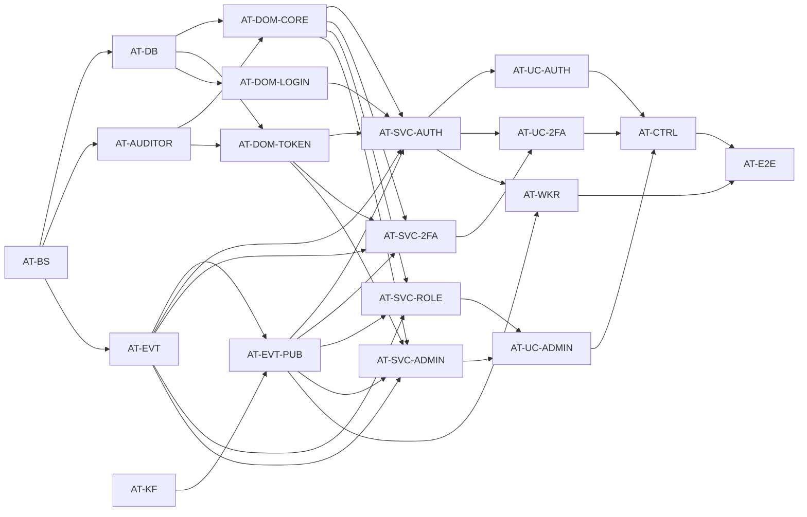

# HR-M1 auth-service 티켓 분해

**일자**: 2026-05-18
**관련 문서**: [TDD-002](../tdd/TDD-002-auth-service.md) · [ADR-001](../adr/ADR-001-hexagonal-multimodule.md) · [ADR-002](../adr/ADR-002-employee-ssot-model.md) · [ADR-003](../adr/ADR-003-auth-service-architecture.md)
**TPM 분석**: `.analysis/outputs/2026-05-18_hr-auth-service/tpm-analysis.md`
**TPM 검수**: `.analysis/outputs/2026-05-18_hr-auth-service/tpm-review.md` (NEEDS_REVISION → 보강 4건 반영 후 PASS)

## 분해 원칙 적용

본 분해는 [`.claude/rules/ticket-guide.md`](../../../.claude/rules/ticket-guide.md)의 다음 원칙을 따랐습니다:

- 1명 / 1일 / 1PR 단위, AC와 파일 목록은 작성하지 않음
- 후행 의존 카운트 ≥ 3 티켓은 분해 재검토 → 병목 5종 (AT-BS · AT-DB · AT-EVT · AT-EVT-PUB · AT-DOM-CORE) 만 의도된 병목으로 유지
- TPM 검수 보강 4건 모두 반영:
  - P0-1 → AT-EVT-PUB 신규 티켓으로 분리 (Auth 전용 KafkaDomainEventPublisher)
  - P1-1 → AT-WKR 작업 범위에 employee status 매핑 테이블 명시
  - P1-2 → AT-WKR 작업 범위에 Kafka Consumer 인프라 (ContainerFactory + DefaultErrorHandler + DLQ Recoverer + group-id) 명시
  - P1-3 → AT-AUDITOR 신규 티켓으로 분리 (SpringAuditorAware 복제)
- L 사이즈 1건(AT-UC) 분할 → 3개 (AT-UC-AUTH / AT-UC-2FA / AT-UC-ADMIN)
- Single Writer per File — 같은 wave 안 동일 파일 수정 금지
- 평균 wave 너비 2.375 · 4인 팀 가동률 평균 약 59% — wave 6 피크 4(100%) · wave 7 피크 5(125%)로 보장

## 티켓 사이즈 정의

- **S**: 약 200줄 (구현 코드 기준, 테스트 제외)
- **M**: 약 400줄
- **L**: 약 800줄 — 본 분해에서 L 티켓은 0개 (AT-UC L → 3 분할 완료)

---

## 티켓 목록

### AT-BS — auth-service 모듈 부트스트랩

- 카테고리: infra · 사이즈: M · 담당: BE
- 작업 내용 (설계 의도):
  - `settings.gradle.kts`에 `include("auth-service")` 추가
  - `auth-service/build.gradle.kts` 작성 — Spring Boot 3.4 + Spring Security 6.4 + Spring Data JPA + Spring Data Redis + QueryDSL 5.x + jjwt 0.12.6 (api/impl/jackson) + dev.samstevens.totp 1.7.1 + Kotest + MockK + Testcontainers
  - `:core` + `:common-kafka` 모듈 의존 추가, `:employee-service` 의존 **금지** (ADR-003 검증)
  - `AuthServiceApplication.kt` (`@SpringBootApplication` + `@EnableJpaAuditing(auditorAwareRef="authAuditorAware")`)
  - `application.yml` + `application-local.yml` + `application-test.yml` (profile 분리, port 8081, Redis · Kafka · JWT secret · AES key 환경변수 placeholder 전부 등록)
  - `com.hrplatform.auth` base 패키지 + `presentation/application/domain/infrastructure` 4 레이어 디렉토리
- 선행: 없음 (Wave 1 단독 병목)
- 후행 의존: AT-DB, AT-AUDITOR, AT-EVT (3개)
- 테스트 케이스: `./gradlew :auth-service:bootRun` 시 8081 포트로 빈 Application이 기동되며 SmokeTest 1건이 통과한다

---

### AT-DB — Flyway V1__create_auth_tables.sql

- 카테고리: db · 사이즈: M · 담당: DBA + BE 협업
- 작업 내용:
  - `auth-service/src/main/resources/db/migration/V1__create_auth_tables.sql` 단일 마이그레이션 (employee와 별도 디렉토리)
  - 7개 테이블 + 인덱스:
    - `user_accounts` (id, employment_id, company_id, email UNIQUE, password_hash, status, failed_login_attempts, locked_until, last_login_at, two_factor_enabled, two_factor_secret, audit 6컬럼, deleted_at)
    - `roles` (id, company_id NULLABLE, code, name, description, is_system_role, audit 6컬럼)
    - `user_account_roles` (id, user_account_id, role_id, assigned_at, assigned_by, audit, UNIQUE(user_account_id, role_id))
    - `refresh_tokens` (id, user_account_id, token_hash UNIQUE, expires_at, device_info, ip_address, revoked_at, revoked_reason, audit)
    - `login_attempts` (id, user_account_id NULLABLE, email, attempted_at, success, failure_reason, ip_address, user_agent, INDEX(email, attempted_at DESC), append-only)
    - `two_factor_backup_codes` (id, user_account_id, code_hash, used_at, audit)
    - `api_tokens` (id, user_account_id, name, token_hash UNIQUE, scopes JSON, expires_at, last_used_at, revoked_at, audit)
  - `roles` 시드 INSERT (EMPLOYEE/TEAM_LEAD/HR_MANAGER/ADMIN, is_system_role=true, company_id=NULL 글로벌 시드 — TPM Q1 결정)
  - 컬럼 길이 · NOT NULL · COMMENT 명시
  - TINYINT(1) for boolean, BIGINT for id, VARCHAR(255) for email/code, DATETIME(6) for ZonedDateTime UTC 저장
- 선행: AT-BS
- 후행 의존: AT-DOM-CORE, AT-DOM-TOKEN, AT-DOM-LOGIN
- 테스트 케이스: Testcontainers MySQL 8.0에서 V1을 적용 후 `SHOW TABLES`가 7개 + `SELECT COUNT(*) FROM roles WHERE is_system_role=true` 가 4를 반환한다

---

### AT-KF — Kafka 토픽 Terraform + 11 JSON Schema

- 카테고리: kafka · 사이즈: M · 담당: Platform
- 작업 내용:
  - `infrastructure/kafka/main.tf`에 토픽 추가:
    - `kafka_topic.event_hr_auth_v1` (파티션 12, 보존 7일, cleanup.policy=delete, lz4, ISR=2, KF-02 패턴 동일)
    - `kafka_topic.event_hr_auth_v1_dlq` (retention 30d)
  - `infrastructure/kafka/schemas/auth/` 디렉토리 + 11 JSON Schema (draft-07):
    - user.created.json, user.locked.json, user.unlocked.json, user.suspended.json, user.reactivated.json, user.deactivated.json
    - user.role_assigned.json, user.role_revoked.json
    - user.password_changed.json, user.two_factor_enrolled.json, user.two_factor_disabled.json
  - 각 schema는 envelope 구조 (eventId/eventType/eventVersion=1/occurredAt/aggregateType=UserAccount/action/state)
  - `user.unlocked.json`의 `action.details.trigger ∈ {AUTO, MANUAL}` 필수 필드 명시 (TPM 검수 권고)
  - `infrastructure/kafka/README.md` 업데이트 (auth 토픽 + 11 이벤트 목록)
- 선행: 없음 (Wave 1 단독, AT-BS와 독립)
- 후행 의존: AT-EVT-PUB
- 테스트 케이스: `terraform plan`이 두 토픽 신규 리소스만 보여주며 unintended diff 0건, JSON Schema 11개가 draft-07 검증을 통과한다

---

### AT-AUDITOR — SpringAuditorAware 복제 (auth 전용)

- 카테고리: infrastructure · 사이즈: S · 담당: BE
- 작업 내용 (TPM 검수 P1-3 보강):
  - `infrastructure/audit/SpringAuditorAware.kt` — employee의 동일 클래스를 auth 패키지에 복제
  - `@Component("authAuditorAware")` (employee의 빈명 `auditorAware`와 구분)
  - `AuthServiceApplication`의 `@EnableJpaAuditing(auditorAwareRef="authAuditorAware")` 와 연결
  - MVP 초기: SecurityContext 미연동 시 `Optional.of(0L)` 시스템 사용자
  - AT-CTRL 완료 후: `SecurityContextHolder`에서 `AuthPrincipal.userAccountId` 추출 (별도 PR로 보강 가능)
  - 단위 테스트 (Kotest BehaviorSpec) — null security context 시 0L 반환 검증
- 선행: AT-BS
- 후행 의존: AT-DOM-CORE (BaseEntity audit이 동작하려면 빈 필요)
- 테스트 케이스: SecurityContext 미설정 상태에서 `getCurrentAuditor()` 호출 시 `Optional.of(0L)` 반환한다

---

### AT-EVT — 11 DomainEvent data class

- 카테고리: domain · 사이즈: M · 담당: BE
- 작업 내용:
  - `com.hrplatform.auth.domain.event` 패키지에 11종 DomainEvent data class:
    - UserCreatedEvent (action=CREATE, status=ACTIVE)
    - UserLockedEvent (action=LOCK, status=LOCKED, details={lockedUntil, failedAttempts})
    - UserUnlockedEvent (action=UNLOCK, status=ACTIVE, details={trigger ∈ {AUTO, MANUAL}, actor?})
    - UserSuspendedEvent (action=SUSPEND, status=SUSPENDED, details={reason})
    - UserReactivatedEvent (action=REACTIVATE, status=ACTIVE)
    - UserDeactivatedEvent (action=DEACTIVATE, status=DEACTIVATED, details={reason})
    - UserRoleAssignedEvent (action=ASSIGN_ROLE, status=ACTIVE, details={roleId, roleCode, actor})
    - UserRoleRevokedEvent (action=REVOKE_ROLE, status=ACTIVE, details={roleId, actor})
    - UserPasswordChangedEvent (action=CHANGE_PASSWORD, status=ACTIVE, details={trigger ∈ {SELF_CHANGE, RESET}})
    - UserTwoFactorEnrolledEvent (action=ENROLL_2FA, status=ACTIVE)
    - UserTwoFactorDisabledEvent (action=DISABLE_2FA, status=ACTIVE)
  - 각 이벤트는 `core.DomainEvent` 추상 구현. aggregateType="UserAccount" 고정
  - `domain/event/DomainEventPublisher.kt` interface (domain layer 정의, 메서드 `publishAll(events: List<DomainEvent>)`)
  - JSON Schema 11종(AT-KF)과 1:1 매칭 검증 테스트 1종 (`DomainEventEnvelope.from(event)` → schema validate)
- 선행: AT-BS
- 후행 의존: AT-EVT-PUB, AT-SVC-AUTH, AT-SVC-2FA, AT-SVC-ROLE, AT-SVC-ADMIN
- 테스트 케이스: 11종 DomainEvent → envelope 변환 결과가 AT-KF JSON Schema 11종을 모두 통과한다

---

### AT-DOM-CORE — UserAccount + Role + UserAccountRole Entity + Repository

- 카테고리: domain · 사이즈: M · 담당: BE
- 작업 내용:
  - `domain/account/UserAccount.kt` — Rich Domain Model:
    - 메서드: `recordFailedLogin(now)`, `recordSuccessfulLogin(now, ip)`, `lock(lockedUntil)`, `unlock(actor)`, `tryAutoUnlock(now): Boolean`, `suspend(reason)`, `reactivate()`, `deactivate(reason)`, `changePassword(newHash, trigger)`, `enable2fa(secret)`, `disable2fa()`
    - 각 메서드는 상태 검증 + 도메인 이벤트 적재 (`addDomainEvent`)
    - `failedLoginAttempts >= 5` 시 자동 `lock(now+15min)` + UserLocked 적재
    - `tryAutoUnlock`: status==LOCKED && lockedUntil < now 이면 ACTIVE 전이 + UserUnlocked(trigger=AUTO) 적재
  - `domain/account/UserAccountStatus.kt` enum (ACTIVE/LOCKED/SUSPENDED/DEACTIVATED) + `canTransitTo(target: UserAccountStatus): Boolean` 캡슐화 (전이 매트릭스: DEACTIVATED → 모든 target false)
  - `domain/role/Role.kt` Entity + `RoleCode` enum (EMPLOYEE/TEAM_LEAD/HR_MANAGER/ADMIN). `isSystemRole=true` 이면 수정 메서드 throw
  - `domain/role/UserAccountRole.kt` Entity (M:N, assignedBy audit)
  - `domain/account/UserAccountRepository.kt` interface + `infrastructure/persistence/UserAccountJpaRepository.kt` + `UserAccountRepositoryImpl.kt` (QueryDSL: `findByEmail`, `findByEmploymentId`, `findActiveByCompany`)
  - `domain/role/RoleRepository.kt` + 구현 + `UserAccountRoleRepository.kt` + 구현
  - `infrastructure/crypto/AesGcmStringConverter.kt` — employee 동일 클래스 복제 (two_factor_secret 컬럼 컨버터)
  - BehaviorSpec 단위 테스트: 12종 전이/잠금/2FA enroll 시나리오 모두 통과
- 선행: AT-DB, AT-AUDITOR
- 후행 의존: AT-SVC-AUTH, AT-SVC-2FA, AT-SVC-ROLE, AT-SVC-ADMIN
- 테스트 케이스: ACTIVE UserAccount에 5회 `recordFailedLogin(now)` 호출 후 status=LOCKED + UserLockedEvent 1건이 적재되고, DEACTIVATED 상태에서 어떤 전이 메서드 호출 시도 `IllegalStateTransitionException` 발생한다

---

### AT-DOM-TOKEN — RefreshToken + ApiToken + TwoFactorBackupCode Entity + Repository

- 카테고리: domain · 사이즈: M · 담당: BE
- 작업 내용:
  - `domain/token/RefreshToken.kt` Entity — 메서드: `rotate(newHash)`, `revoke(reason)`, `isExpired(now)`. companion: `revokeAll(userAccountId)`은 Repository로 위임
  - `domain/token/ApiToken.kt` Entity — 메서드: `revoke(actor)`, `recordUse(now)`, `isExpired(now)`. scopes JSON (`@Type(JsonStringType::class)`)
  - `domain/twofactor/TwoFactorBackupCode.kt` Entity — 메서드: `use(now)` — 이미 usedAt 있으면 `BackupCodeAlreadyUsedException`. setter 노출 금지
  - `domain/token/RefreshTokenRepository.kt` + 구현 — `findActiveByUserAccountId`, `findByTokenHash`, `revokeAllByUserAccountId`
  - `domain/token/ApiTokenRepository.kt` + 구현 — `findActiveByTokenHash(sha256)`, `findByUserAccountId`
  - `domain/twofactor/TwoFactorBackupCodeRepository.kt` + 구현 — `findUnused(userAccountId)`
  - `domain/token/JtiBlacklist.kt` interface (TPM 검수 권고) — `add(jti, ttl)`, `contains(jti): Boolean`, `addAll(jtis, ttl)`
  - 단위 테스트: RefreshToken rotation 시 새 hash로 교체 + 1회용, ApiToken revoke 후 isActive=false, BackupCode 1회 사용 후 재사용 거부
- 선행: AT-DB, AT-AUDITOR
- 후행 의존: AT-SVC-AUTH, AT-SVC-2FA, AT-SVC-ADMIN
- 테스트 케이스: TwoFactorBackupCode를 동일 인스턴스로 `use(now)` 2회 호출 시 2번째에 `BackupCodeAlreadyUsedException` 발생한다

---

### AT-DOM-LOGIN — LoginAttempt Entity + Repository (append-only)

- 카테고리: domain · 사이즈: S · 담당: BE
- 작업 내용:
  - `domain/login/LoginAttempt.kt` Entity — append-only. setter 노출 금지. static factory `success(userAccountId, email, ip, userAgent)` / `failure(userAccountId, email, failureReason, ip, userAgent)`
  - `LoginFailureReason` enum (BAD_PASSWORD / ACCOUNT_LOCKED / ACCOUNT_SUSPENDED / ACCOUNT_DEACTIVATED / INVALID_2FA / EMAIL_NOT_FOUND)
  - `domain/login/LoginAttemptRepository.kt` + 구현 — `countRecentFailures(email, since: ZonedDateTime)`, `findRecentByEmail(email, limit)`
- 선행: AT-DB
- 후행 의존: AT-SVC-AUTH
- 테스트 케이스: 동일 이메일에 대해 5건 failure 저장 후 `countRecentFailures(email, 15분전)`이 5를 반환한다

---

### AT-EVT-PUB — AuthKafkaDomainEventPublisher + AuthKafkaConfig (P0-1 해결)

- 카테고리: infrastructure · 사이즈: M · 담당: BE
- 작업 내용 (TPM 검수 P0-1 + P1-2 해결):
  - `infrastructure/kafka/AuthKafkaDomainEventPublisher.kt` — `core.DomainEventPublisher` 구현
    - 토픽 키: `@Value("\${hrplatform.kafka.topics.auth:event.hr.auth.v1}")`
    - aggregateType 검증: `require(event.aggregateType == "UserAccount") { "AuthKafkaDomainEventPublisher only accepts UserAccount events" }`
    - envelope 직렬화 (Jackson ObjectMapper, employee Publisher와 동일 코드 패턴)
    - ZonedDateTime UTC ISO-8601 직렬화
  - `infrastructure/kafka/AuthKafkaConfig.kt`:
    - ProducerFactory + KafkaTemplate (acks=all, retries=Int.MAX_VALUE, idempotence=true)
    - **ConsumerFactory** (P1-2 보강) — DTO 직접 매핑 (`JsonDeserializer`, trusted.packages=`com.hrplatform.auth.presentation.consumer.dto`)
    - **ConcurrentKafkaListenerContainerFactory** (P1-2) — concurrency=3, ackMode=MANUAL_IMMEDIATE
    - **DefaultErrorHandler** (P1-2) — 재시도 3회 (백오프 1s, 2s, 4s), 실패 시 DLQ Recoverer 호출
    - **DeadLetterPublishingRecoverer** (P1-2) — `event.hr.employee.v1.dlq` 또는 `event.hr.auth.v1.dlq`로 재발행
  - `application.yml` 추가:
    - `hrplatform.kafka.topics.auth: event.hr.auth.v1`
    - `hrplatform.kafka.consumer-groups.employee-sync: auth-service.employee.v1` (TPM Q5 권장)
    - `hrplatform.kafka.dlq.auth: event.hr.auth.v1.dlq`
    - `hrplatform.kafka.dlq.employee: event.hr.employee.v1.dlq`
  - Testcontainers Kafka 통합 테스트: 11종 이벤트 각각이 정확한 JSON 페이로드로 `event.hr.auth.v1` 토픽에 발행되며 `EmployeeHiredEvent` 입력 시 `IllegalArgumentException` (aggregateType 검증)
- 선행: AT-KF, AT-EVT
- 후행 의존: AT-SVC-AUTH, AT-SVC-2FA, AT-SVC-ROLE, AT-SVC-ADMIN, AT-WKR
- 테스트 케이스: UserCreatedEvent 발행 시 `event.hr.auth.v1` 토픽에 envelope JSON이 정확히 들어가고, employee aggregateType 이벤트 전달 시 `IllegalArgumentException` 발생한다

---

### AT-SVC-AUTH — AuthDomainService

- 카테고리: domain-service · 사이즈: M · 담당: BE
- 작업 내용:
  - `domain/service/AuthDomainService.kt`:
    - `authenticate(email, password, deviceInfo)` — UserAccount 조회 → `tryAutoUnlock(now)` → 상태 검증 → bcrypt 검증 → 성공/실패 처리 → LoginAttempt save → DomainEvent 적재 → 2FA enabled 면 challenge 토큰, 아니면 access/refresh 발급
    - `refresh(refreshTokenPlain)` — hash 비교 + 만료 검증 + revoked 검증 + rotate (새 hash로 교체, 단일 사용)
    - `logout(userAccountId, refreshTokenPlain)` — refresh revoke + JtiBlacklist.add(accessJti, ttl)
    - `changePassword(userAccountId, currentPassword, newPassword)` — 현재 PW bcrypt 검증 + PasswordPolicy 검증 + 해시 갱신 + UserPasswordChanged(SELF_CHANGE) 적재
    - `resetPasswordRequest(email)` — 1회용 토큰 (SHA-256 hash + 30분 만료) 발행 + NotificationGateway 호출
    - `resetPasswordConfirm(token, newPassword)` — 토큰 검증 + PasswordPolicy 검증 + 해시 갱신 + UserPasswordChanged(RESET) 적재
    - `deactivateForResign(employmentId, reason)` — Worker용. UserAccount 조회 → deactivate + revokeAll RefreshToken + jti 일괄 blacklist + UserDeactivated 적재
    - `syncStatusForSuspend/Resume/Hire` — Worker용 4 메서드 (employee 이벤트 → status 매핑은 Worker에서 변환 후 호출)
  - 메서드 15줄 이내 강제 (be-code-convention.md)
  - `infrastructure/crypto/BcryptPasswordHasher.kt` (cost 12)
  - `infrastructure/security/JwtIssuer.kt` + `JwtVerifier.kt` (jjwt 0.12.6, HS256, access 30분/refresh 14일)
  - `infrastructure/security/RedisJtiBlacklist.kt` — `domain/token/JtiBlacklist.kt` interface 구현
  - `application/password/NotificationGateway.kt` interface (domain) + `infrastructure/notification/LogNotificationGateway.kt` (MVP stub)
  - `application/auth/PasswordPolicy.kt` value object (최소 10자 + 영숫특)
- 선행: AT-DOM-CORE, AT-DOM-TOKEN, AT-DOM-LOGIN, AT-EVT-PUB
- 후행 의존: AT-UC-AUTH, AT-WKR
- 테스트 케이스: Testcontainers(MySQL+Redis)에서 5회 연속 잘못된 password 호출 후 6번째 시도가 `AccountLockedException` + UserLockedEvent 1건이 Kafka로 발행되고, 약한 비밀번호(8자)로 changePassword 시 `WeakPasswordException` 발생한다

---

### AT-SVC-2FA — TwoFactorDomainService

- 카테고리: domain-service · 사이즈: M · 담당: BE
- 작업 내용:
  - `domain/service/TwoFactorDomainService.kt`:
    - `enroll(userAccountId)` — TotpGenerator로 32바이트 secret 생성 → AES-GCM 컬럼 컨버터로 암호화 저장 → QR provisioning URI (`otpauth://totp/...`) 반환 → 백업코드 5개 발급 (each random + bcrypt hash 저장) → 평문 백업코드 1회 반환 → UserTwoFactorEnrolledEvent 적재
    - `verify(userAccountId, code)` — TOTP 검증 (±1 step) 시도 → 실패 시 백업코드 매칭 → 매칭 백업코드는 `use(now)` 호출 → 모두 실패 시 `Invalid2faCodeException`
    - `disable(userAccountId, currentPassword, currentCode)` — password + 2fa 동시 검증 → disable + 백업코드 일괄 삭제 → UserTwoFactorDisabledEvent 적재
  - `infrastructure/crypto/TotpGenerator.kt` — dev.samstevens.totp 1.7.1 wrapper (RFC 6238, SHA-1, 30초, 6자리, ±1 step)
- 선행: AT-DOM-CORE, AT-DOM-TOKEN, AT-EVT-PUB
- 후행 의존: AT-UC-2FA
- 테스트 케이스: enroll 후 30초 윈도우 TOTP 코드로 verify 성공, 잘못된 코드는 실패, 백업코드 1회 사용 후 재사용 시 `BackupCodeAlreadyUsedException` 발생한다

---

### AT-SVC-ROLE — RoleDomainService

- 카테고리: domain-service · 사이즈: S · 담당: BE
- 작업 내용:
  - `domain/service/RoleDomainService.kt`:
    - `listRolesForCompany(companyId)` — 시스템 role 4종 + 회사 custom role 합쳐서 반환
    - `assignRole(targetUserAccountId, roleId, actor)`:
      - actor 권한 검증 (◐ 매트릭스: HR_MANAGER는 EMPLOYEE/TEAM_LEAD만, ADMIN은 모두 부여 가능)
      - 위반 시 `ForbiddenException`
      - UserAccountRole upsert + UserRoleAssignedEvent 적재
    - `revokeRole(targetUserAccountId, roleId, actor)` — 같은 권한 매트릭스 적용 + UserRoleRevokedEvent 적재
- 선행: AT-DOM-CORE, AT-EVT-PUB
- 후행 의존: AT-UC-ADMIN
- 테스트 케이스: HR_MANAGER actor가 ADMIN 역할 할당 시도 시 `ForbiddenException`, EMPLOYEE→TEAM_LEAD 할당 성공 후 UserRoleAssignedEvent 1건 적재된다

---

### AT-SVC-ADMIN — AdminAuthDomainService

- 카테고리: domain-service · 사이즈: M · 담당: BE
- 작업 내용:
  - `domain/service/AdminAuthDomainService.kt`:
    - `unlockUser(targetUserAccountId, actor)` — LOCKED → ACTIVE 전이 + UserUnlocked(trigger=MANUAL, actor) 적재
    - `logoutAllSessions(targetUserAccountId)` — RefreshToken 전부 revoke + jti 일괄 blacklist
    - `issueApiToken(userAccountId, name, scopes, ttl)`:
      - random 32바이트 + `hrp_` prefix → base64url encode → SHA-256 hash 저장
      - ApiToken Entity 생성 → 평문 1회 반환
      - 응답에서만 plain 노출, DB는 hash만
    - `revokeApiToken(apiTokenId, actor)` — revokedAt = now → 이후 검증 시 401
- 선행: AT-DOM-CORE, AT-DOM-TOKEN, AT-EVT-PUB
- 후행 의존: AT-UC-ADMIN
- 테스트 케이스: issueApiToken 호출 결과의 plain token이 1회만 반환되고 DB에는 SHA-256 hash만 저장되며, revoke 후 동일 plain token으로 검증 시도 시 null 반환한다

---

### AT-WKR — EmployeeEventWorker + status 매핑 (P1-1, P1-2 보강)

- 카테고리: presentation · 사이즈: M · 담당: BE
- 작업 내용 (TPM 검수 P1-1 + P1-2 핵심 반영):
  - `presentation/consumer/EmployeeEventWorker.kt`:
    - `@KafkaListener(topics="event.hr.employee.v1", groupId="\${hrplatform.kafka.consumer-groups.employee-sync}", containerFactory="kafkaListenerContainerFactory")`
    - DTO 직접 매핑 (envelope → `EmployeeHiredDto`/`EmployeeResignedDto`/`EmployeeSuspendedDto`/`EmployeeResumedDto`) — `ConsumerRecord<String, String>` 금지
    - eventType 기반 라우팅 (4종 외 무시 + metric)
    - Idempotency: Redis SETNX `auth:idem:employee:{eventId}` TTL 7일 (단일 선택, TPM 권고)
    - 처리 실패 시 DefaultErrorHandler 재시도 3회 → DLQ Recoverer가 `event.hr.employee.v1.dlq`로 재발행
    - `UserAccountSyncUseCase.onHired/onSuspended/onResumed/onResigned` 호출
  - **employee status → UserAccount status 매핑 테이블** (P1-1 보강):
    - `presentation/consumer/EmployeeStatusToUserAccountStatus.kt` value object (4 메서드):
      - `mapHiredEvent(event)` — `ACTIVE` → UserAccount 신규 ACTIVE 생성 (UserCreated)
      - `mapSuspendedEvent(event)` — `ON_LEAVE` → SUSPENDED 전이 (UserSuspended)
      - `mapResumedEvent(event)` — `ACTIVE` → SUSPENDED→ACTIVE 전이 (UserReactivated)
      - `mapResignedEvent(event)` — `RESIGNED` → DEACTIVATED 전이 + 세션 강제 종료 (UserDeactivated)
    - `enum.valueOf` 직접 호출 **금지**. value object 메서드만 사용
    - 매핑 단위 테스트 4종 + 알 수 없는 status 입력 시 `UnknownEmployeeStatusException` 검증
  - `application/sync/UserAccountSyncUseCase.kt`:
    - 위치: `auth-service/src/main/kotlin/com/hrplatform/auth/application/sync/UserAccountSyncUseCase.kt`
    - 4 메서드 (`onHired/onResigned/onSuspended/onResumed`)
    - 각 메서드는 AuthDomainService에 위임, execute() 10줄 이내
    - `@Transactional`
  - Testcontainers Kafka 통합 테스트: 4종 이벤트 발행 → UserAccount 상태가 정확히 ACTIVE/SUSPENDED/ACTIVE/DEACTIVATED로 전이되고 동일 eventId 2회 발행 시 1번만 처리된다 + DLQ 시나리오 (의도적 예외 → 재시도 3회 → DLQ 토픽에 메시지 1건)
- 선행: AT-SVC-AUTH, AT-EVT-PUB
- 후행 의존: AT-E2E
- 테스트 케이스: EmployeeResignedEvent 수신 시 UserAccount.status=DEACTIVATED + RefreshToken 전부 revokedAt set + jti 일괄 blacklist + UserDeactivatedEvent 1건이 `event.hr.auth.v1`로 발행되고, 동일 eventId 2회 수신 시 1번만 처리된다

---

### AT-UC-AUTH — UseCase: Login/Logout/Refresh/Me + Password×3

- 카테고리: application · 사이즈: M · 담당: BE
- 작업 내용 (AT-UC L 분할 1/3):
  - `application/auth/LoginUseCase.kt` — 2FA 필요 시 challenge 토큰 반환, 아니면 access/refresh 발급
  - `application/auth/LogoutUseCase.kt`
  - `application/auth/RefreshTokenUseCase.kt`
  - `application/auth/MeUseCase.kt` — UserAccount + Roles 반환 (read-only)
  - `application/password/PasswordResetRequestUseCase.kt`
  - `application/password/PasswordResetConfirmUseCase.kt`
  - `application/password/PasswordChangeUseCase.kt`
  - 각 UseCase: `@Transactional`, AuthDomainService만 호출, `execute()` 10줄 이내, Repository/Publisher/JtiBlacklist 직접 호출 **금지**
  - Command + Response data class
  - 단위 테스트 (MockK, DomainService 모킹): 각 UseCase가 DomainService 호출 1회만 일어남을 검증
- 선행: AT-SVC-AUTH
- 후행 의존: AT-CTRL
- 테스트 케이스: LoginUseCase 단위 테스트에서 execute()가 정확히 1회 AuthDomainService.authenticate()를 호출하고 결과를 LoginResponse로 변환한다

---

### AT-UC-2FA — UseCase: TwoFactorEnroll/Verify

- 카테고리: application · 사이즈: S · 담당: BE
- 작업 내용 (AT-UC L 분할 2/3):
  - `application/twofactor/TwoFactorEnrollUseCase.kt` — secret + QR provisioning URI + 백업코드 5개 반환
  - `application/twofactor/TwoFactorVerifyUseCase.kt` — challenge 토큰 검증 + TwoFactorDomainService.verify → 성공 시 AuthDomainService.issueTokens
  - 각 UseCase: `@Transactional`, DomainService 호출만, `execute()` 10줄 이내
  - 단위 테스트 (MockK)
- 선행: AT-SVC-2FA, AT-SVC-AUTH
- 후행 의존: AT-CTRL
- 테스트 케이스: TwoFactorVerifyUseCase가 challenge 토큰 + 올바른 TOTP 입력 시 AuthDomainService.issueTokens()를 호출하고 access+refresh 반환한다

---

### AT-UC-ADMIN — UseCase: AssignRole/Unlock/LogoutAll/ApiToken×2

- 카테고리: application · 사이즈: M · 담당: BE
- 작업 내용 (AT-UC L 분할 3/3):
  - `application/admin/AssignRoleUseCase.kt` — RoleDomainService.assignRole
  - `application/admin/RevokeRoleUseCase.kt` — RoleDomainService.revokeRole (보강 — 매트릭스에 revoke도 포함)
  - `application/admin/ListRolesUseCase.kt` (read-only)
  - `application/admin/UnlockUserUseCase.kt` — AdminAuthDomainService.unlockUser
  - `application/admin/LogoutAllSessionsUseCase.kt` — AdminAuthDomainService.logoutAllSessions
  - `application/admin/ApiTokenIssueUseCase.kt` — AdminAuthDomainService.issueApiToken
  - `application/admin/ApiTokenRevokeUseCase.kt` — AdminAuthDomainService.revokeApiToken
  - 각 UseCase: `@Transactional`(read-only 제외), DomainService 호출만, `execute()` 10줄 이내
  - 단위 테스트 (MockK)
- 선행: AT-SVC-ROLE, AT-SVC-ADMIN
- 후행 의존: AT-CTRL
- 테스트 케이스: ApiTokenIssueUseCase 호출 결과의 plain token이 응답에서만 1회 노출되고 DB에는 SHA-256 hash만 저장된다

---

### AT-CTRL — 3 Controller + SecurityFilterChain + JwtAuthenticationFilter

- 카테고리: presentation · 사이즈: M · 담당: BE
- 작업 내용:
  - `presentation/controller/AuthApiController.kt` — public 5종:
    - POST /auth/login, POST /auth/logout, POST /auth/refresh
    - POST /auth/password-reset/request, POST /auth/password-reset/confirm
  - `presentation/controller/MyAuthController.kt` — 본인 4종 (인증 필요):
    - GET /auth/me
    - POST /auth/password/change
    - POST /auth/2fa/enroll, POST /auth/2fa/verify
  - `presentation/controller/AdminAuthController.kt` — 관리자 6종 (HR_MANAGER+):
    - GET /auth/roles
    - POST /auth/users/{id}/roles
    - POST /auth/users/{id}/unlock
    - POST /auth/users/{id}/sessions/logout-all
    - POST /auth/api-tokens, DELETE /auth/api-tokens/{id}
  - `infrastructure/security/JwtAuthenticationFilter.kt`:
    - Bearer 토큰 추출 → prefix 분기 (`hrp_` → ApiToken DB 조회 + scopes 검증, `eyJ` → JwtVerifier + Redis blacklist 조회)
    - SecurityContext에 `AuthPrincipal` 설정
  - `infrastructure/security/SecurityConfig.kt`:
    - FilterChain (public path: `/auth/login`, `/auth/refresh`, `/auth/password-reset/*` / authenticated: `/auth/me`, `/auth/password/change`, `/auth/2fa/*`, `/auth/logout` / role-based: `/auth/users/**`, `/auth/api-tokens/**`, `/auth/roles` 는 HR_MANAGER+)
    - CORS / CSRF disable (stateless JWT)
  - `infrastructure/security/AuthPrincipal.kt` + `AuthPrincipalArgumentResolver.kt`
  - `presentation/controller/GlobalExceptionHandler.kt` — ApiError 매핑:
    - TOKEN_EXPIRED → 401
    - INVALID_CREDENTIALS → 401
    - ACCOUNT_LOCKED → 423
    - WEAK_PASSWORD → 422
    - FORBIDDEN → 403
    - TWO_FACTOR_REQUIRED → 401 (+ challenge 토큰 응답)
  - Request DTO + bean validation (`@Email`, `@Size(min=10)`, `@NotBlank`)
  - 통합 테스트 (MockMvc + Testcontainers): 15 API 모두 200/4xx 적절한 코드와 ApiError 페이로드 반환
- 선행: AT-UC-AUTH, AT-UC-2FA, AT-UC-ADMIN
- 후행 의존: AT-E2E
- 테스트 케이스: 만료된 JWT로 /auth/me 호출 시 401 + body `{"code": "TOKEN_EXPIRED"}` 반환되고, EMPLOYEE 권한으로 /auth/users/{id}/unlock 호출 시 403 반환된다

---

### AT-E2E — E2E 시나리오 + 비기능 검증

- 카테고리: test · 사이즈: M (테스트 코드 기준) · 담당: BE
- 작업 내용 (5계층 중 **scenario 레이어** 전용. 단위·통합 테스트는 각 티켓 범위):
  - Testcontainers MySQL 8.0 + Redis 7 + Kafka 환경 (실제 인프라 부트)
  - **AC1**: 로그인 성공 → access/refresh 발급 → /auth/me 200 + roles 반환
  - **AC2**: 비밀번호 5회 실패 → 6번째 시도가 423 ACCOUNT_LOCKED + UserLockedEvent 발행 + 알림 LogStub 캡처 + 15분 후 시뮬레이션 시점 → lazy auto-unlock 성공 + UserUnlocked(AUTO) 이벤트
  - **AC3**: 2FA enroll 후 로그인 → challenge 토큰 반환 → /auth/2fa/verify 후 access 발급
  - **AC4**: HR_MANAGER가 EMPLOYEE→TEAM_LEAD 부여 → 해당 사용자 /auth/me roles 변경 + UserRoleAssignedEvent 발행
  - **AC5**: 만료된 access 토큰 → 401 TOKEN_EXPIRED
  - **X1**: EmployeeResignedEvent 발행 → EmployeeEventWorker 처리 → UserAccount.DEACTIVATED + 기존 refresh 토큰 전부 revoke + jti blacklist + UserDeactivatedEvent 발행
  - **Idempotency**: 동일 eventId 2회 발행 → UserCreated 1회만 처리
  - **DLQ**: 의도적 예외 주입 → 3회 재시도 → DLQ 토픽에 메시지 재발행
  - **HR_MANAGER → ADMIN 차단**: ForbiddenException 검증
  - **ApiToken 발급 후 검증**: hrp_* 토큰으로 외부 API 호출 → 200, DELETE 후 동일 토큰 → 401
  - **비기능**: 로그인 API p95 < 500ms (k6 통합), 토큰 검증 < 10ms (JwtVerifier JMH)
- 선행: AT-CTRL, AT-WKR
- 후행 의존: (M1 종료)
- 테스트 케이스: AC1~5 + X1 + Idempotency + DLQ + 권한 차단 + ApiToken + 비기능 10개 시나리오가 모두 통과하며 Kafka 토픽에 정확한 이벤트가 발행된다

---

## 의존 그래프 (DAG)

| 티켓 | 선행 | 후행 카운트 | 비고 |
|---|---|:-:|---|
| AT-BS | — | 3 | 병목 (모듈 부트스트랩) |
| AT-KF | — | 1 | 단독 진입점 (envelope schema 검증) |
| AT-DB | AT-BS | 3 | 병목 (Domain 3 묶음 모두 의존) |
| AT-AUDITOR | AT-BS | 1 | BaseEntity audit 빈 필요 |
| AT-EVT | AT-BS | 5 | 병목 (Publisher + 4 SVC 모두 의존) |
| AT-DOM-CORE | AT-DB, AT-AUDITOR | 4 | 병목 (4 SVC 의존) |
| AT-DOM-TOKEN | AT-DB, AT-AUDITOR | 3 | 중간 (AUTH + 2FA + ADMIN) |
| AT-DOM-LOGIN | AT-DB | 1 | 중간 (AUTH만) |
| AT-EVT-PUB | AT-KF, AT-EVT | 5 | 병목 (4 SVC + Worker) |
| AT-SVC-AUTH | AT-DOM-CORE, AT-DOM-TOKEN, AT-DOM-LOGIN, AT-EVT-PUB | 2 | 중간 (UC-AUTH + WKR) |
| AT-SVC-2FA | AT-DOM-CORE, AT-DOM-TOKEN, AT-EVT-PUB | 1 | 중간 |
| AT-SVC-ROLE | AT-DOM-CORE, AT-EVT-PUB | 1 | 중간 |
| AT-SVC-ADMIN | AT-DOM-CORE, AT-DOM-TOKEN, AT-EVT-PUB | 1 | 중간 |
| AT-WKR | AT-SVC-AUTH, AT-EVT-PUB | 1 | 중간 (E2E 의존) |
| AT-UC-AUTH | AT-SVC-AUTH | 1 | 중간 |
| AT-UC-2FA | AT-SVC-2FA, AT-SVC-AUTH | 1 | 중간 |
| AT-UC-ADMIN | AT-SVC-ROLE, AT-SVC-ADMIN | 1 | 중간 |
| AT-CTRL | AT-UC-AUTH, AT-UC-2FA, AT-UC-ADMIN | 1 | 중간 |
| AT-E2E | AT-CTRL, AT-WKR | 0 | 단독 (말단) |

**후행 카운트 ≥ 3 티켓**: AT-BS(3), AT-DB(3), AT-EVT(5), AT-DOM-CORE(4), AT-EVT-PUB(5), AT-DOM-TOKEN(3). 모두 진정한 공통 산출물 (모듈 부트스트랩 / DB 스키마 / 이벤트 정의 / 토픽 라우팅 / 핵심 Entity) — 추가 분해 시 응집도 손상이 더 큼.

## Wave 스케줄 (위상정렬 결과)

| Wave | 티켓 | 너비 | 비고 |
|:-:|---|:-:|---|
| 1 | AT-BS, AT-KF | 2 | 모듈 부트스트랩 + Kafka 토픽 동시 (다른 디렉토리) |
| 2 | AT-DB, AT-AUDITOR, AT-EVT | 3 | DB 마이그레이션 + Auditor + 이벤트 정의 동시 (모두 AT-BS만 의존) |
| 3 | AT-DOM-CORE, AT-DOM-TOKEN, AT-DOM-LOGIN | 3 | Entity 3 묶음 fan-out (각각 다른 도메인 패키지) |
| 4 | AT-EVT-PUB | 1 | Auth Publisher + Kafka Config 단독 (AT-EVT + AT-KF 후속) |
| 5 | AT-SVC-AUTH, AT-SVC-2FA, AT-SVC-ROLE, AT-SVC-ADMIN | 4 | DomainService 4종 동시 (각자 새 파일) |
| 6 | AT-WKR, AT-UC-AUTH, AT-UC-2FA, AT-UC-ADMIN | 4 | Worker + UseCase 3 묶음 동시 |
| 7 | AT-CTRL | 1 | Controller + Security Filter 단독 (3 Controller는 같은 wave 다른 파일이지만 SecurityConfig 충돌 회피로 단독 배치) |
| 8 | AT-E2E | 1 | E2E 시나리오 최종 게이트 |

### Fan-out 통계

- 총 티켓: **19개** (TPM 17 + AT-AUDITOR 1 + AT-EVT-PUB 1 = 19, AT-UC L 분할은 3개로 늘었으나 원안 1개 흡수 → 19개)
- 총 wave: 8
- 평균 wave 너비: (2+3+3+1+4+4+1+1) / 8 = 19/8 = **2.375**
- 최대 wave 너비: 4 (Wave 5, Wave 6)
- 4인 팀 가동률: 4/4=100% (Wave 5, 6) · 3/4=75% (Wave 2, 3) · 2/4=50% (Wave 1) · 1/4=25% (Wave 4, 7, 8) · 평균 ≈ **59.4%**
- 직선화 비율 (너비 1): 3/8 = 37.5% — `ticket-guide.md`의 50% 이하 기준 통과
- 70% 목표 미달분(약 11%)은 본 도메인이 인증·인가 SSOT라 통합 게이트(AT-E2E)·공통 Controller(AT-CTRL)·Publisher 인프라(AT-EVT-PUB) 단독 wave가 본질적 병목

### Single Writer per File 검증

각 wave 안에서 두 티켓이 동일 파일을 수정하지 않습니다.

| Wave | 동시 실행 가능 티켓 | 수정 파일 교집합 |
|:-:|---|---|
| 1 | AT-BS(`auth-service/build.gradle.kts`, `application.yml`, base 패키지), AT-KF(`infrastructure/kafka/main.tf`, `schemas/auth/`) | ∅ (auth-service 모듈 vs infrastructure/kafka) |
| 2 | AT-DB(`db/migration/V1__create_auth_tables.sql`), AT-AUDITOR(`infrastructure/audit/SpringAuditorAware.kt`), AT-EVT(`domain/event/*.kt`) | ∅ (resources/db/migration vs infrastructure/audit vs domain/event) |
| 3 | AT-DOM-CORE(`domain/account/`, `domain/role/`, `infrastructure/persistence/UserAccount*`), AT-DOM-TOKEN(`domain/token/`, `domain/twofactor/`), AT-DOM-LOGIN(`domain/login/`) | ∅ (각자 다른 도메인 디렉토리) |
| 4 | AT-EVT-PUB(`infrastructure/kafka/AuthKafkaDomainEventPublisher.kt`, `AuthKafkaConfig.kt`, `application.yml` 추가 키) | 단독 (application.yml 충돌 회피: AT-BS에서 placeholder 키 전부 등록, AT-EVT-PUB은 값만 채움) |
| 5 | AT-SVC-AUTH(`domain/service/AuthDomainService.kt`, `infrastructure/security/JwtIssuer.kt`/`JwtVerifier.kt`/`RedisJtiBlacklist.kt`, `infrastructure/crypto/BcryptPasswordHasher.kt`, `application/auth/PasswordPolicy.kt`, `application/password/NotificationGateway.kt`, `infrastructure/notification/LogNotificationGateway.kt`), AT-SVC-2FA(`domain/service/TwoFactorDomainService.kt`, `infrastructure/crypto/TotpGenerator.kt`), AT-SVC-ROLE(`domain/service/RoleDomainService.kt`), AT-SVC-ADMIN(`domain/service/AdminAuthDomainService.kt`) | ∅ (각 DomainService 별도 파일 + crypto/security 디렉토리 안 별도 파일) |
| 6 | AT-WKR(`presentation/consumer/EmployeeEventWorker.kt`, `EmployeeStatusToUserAccountStatus.kt`, DTO, `application/sync/UserAccountSyncUseCase.kt`), AT-UC-AUTH(`application/auth/*UseCase.kt`, `application/password/*UseCase.kt`), AT-UC-2FA(`application/twofactor/*UseCase.kt`), AT-UC-ADMIN(`application/admin/*UseCase.kt`) | ∅ (presentation/consumer vs application/auth vs application/twofactor vs application/admin vs application/sync — 모두 별도 디렉토리) |
| 7 | AT-CTRL(`presentation/controller/*`, `infrastructure/security/JwtAuthenticationFilter.kt`, `SecurityConfig.kt`, `AuthPrincipal*.kt`, `GlobalExceptionHandler.kt`) | 단독 (SecurityConfig는 단일 파일, 3 Controller는 다른 파일이지만 SecurityConfig와 동시 작업 시 빈 등록 충돌 가능성 회피) |
| 8 | AT-E2E(`scenario/*.kt` 테스트 전용) | 단독 |

> **주의**: `application.yml`은 AT-BS에서 모든 키를 placeholder로 등록. AT-EVT-PUB · AT-CTRL · AT-WKR이 각자 자기 키만 값으로 채우거나 별도 `application-test.yml`에 override. 동시 수정 회피 패턴.

### 5계층 테스트 분리 매핑 (`be-code-convention.md` 필수 테스트 레이어)

| 레이어 | 적용 티켓 |
|---|---|
| domain (단위) | AT-DOM-CORE (UserAccount 상태 전이/잠금 BehaviorSpec), AT-DOM-TOKEN (RefreshToken rotation/ApiToken revoke/BackupCode use), AT-DOM-LOGIN (LoginAttempt factory), AT-EVT (DomainEvent → envelope schema) |
| domain-service (단위) | AT-SVC-AUTH, AT-SVC-2FA, AT-SVC-ROLE, AT-SVC-ADMIN (Kotest + MockK Repository 모킹) |
| application (단위) | AT-UC-AUTH, AT-UC-2FA, AT-UC-ADMIN (Kotest + MockK DomainService 모킹) |
| infrastructure (통합) | AT-AUDITOR, AT-EVT-PUB (Testcontainers Kafka), AT-DOM-CORE (RepositoryImpl Testcontainers MySQL), AT-DOM-TOKEN/AT-DOM-LOGIN (RepositoryImpl 통합), AT-WKR 일부 (Consumer 통합 — 매핑 + idempotency + DLQ) |
| presentation (통합) | AT-CTRL (MockMvc + Testcontainers MySQL+Redis), AT-WKR (Kafka 통합 — Worker → UseCase 호출 검증) |
| scenario (E2E) | AT-E2E (AC1~5 + X1 + Idempotency + DLQ + 권한 + ApiToken + 비기능 10개) |

## 시각화 (Mermaid flowchart LR)

## 후속 단계

1. **티켓 트래커 등록**: `/jira-ticket` 스킬 또는 Notion DB 등록 (사용자 호출 시점)
2. **위키 동기화**: `/doc-sync` 스킬로 본 TDD + ADR + 티켓 트래커 동기화 (사용자 호출 시점)
3. **구현 wave 진입**: 별도 `/feature` 또는 `/implement` 호출
   - 다음 호출에서 AT-BS + AT-KF 동시 wave 1 스폰 → 머지 → Wave 2~8 순차 진행
   - 각 wave는 worktree 분기 + 병렬 스폰 + PR 생성 + pr-reviewer 후처리

## 작업 범위 외 (다음 호출에서 처리)

- 코드 작성 (Entity / UseCase / Repository / Controller / Worker / Filter / 테스트 Kotlin 파일)
- Flyway 마이그레이션 SQL 실제 작성
- Kafka Terraform 실제 작성
- `gh pr create`, hook 셀프리뷰, pr-reviewer 호출
- 다른 도메인 (attendance/leave-approval/payroll/performance/notification) — 별도 `/feature` 호출
- 회사 SSO (Phase 1.5) — 별도 TPM 분석

## 미결 사항 (PM/PO 확인 필요)

| ID | 항목 | 권장 결정 |
|---|---|---|
| Q1 | `roles` 시드 삽입 시점 — Flyway 글로벌 시드 vs 회사 가입 시 동적 생성 | MVP는 Flyway에 system role 4종 + companyId=NULL 글로벌 시드, 회사별 override는 Phase 2 (AT-DB 작업 범위에 명시) |
| Q2 | `/auth/api-tokens` 권한 — HR_MANAGER+ 전용 vs 본인 발급 가능 | MVP는 HR_MANAGER+ 전용으로 AdminAuthController에 배치 (AT-CTRL 확정) |
| Q3 | 메일 발송 인프라 — SES/SMTP/외부 SaaS | MVP는 NotificationGateway interface + LogNotificationGateway stub, Phase 1.5에서 실제 구현 |
| Q4 | Redis 가용성 — 로컬/테스트 TestContainers, prod ElastiCache | application-{profile}.yml 분리, infra 결정은 본 분석 외 |
| Q5 | Idempotency Redis 장애 fallback | 본 MVP는 Redis 단일 — Phase 2에서 DB 기반 백업 검토 |
| Q6 | JWT 키 회전 정책 | MVP는 HS256 단일 키, Phase 2에서 RSA + 키 회전 ADR 별도 |

## Document History

| 날짜 | 변경 내용 | 작성자 |
|---|---|---|
| 2026-05-18 | 초안 — TPM 분석 17 티켓 → TPM 검수 NEEDS_REVISION 보강 4건 반영 (AT-EVT-PUB / AT-AUDITOR 신규 + AT-WKR 작업 범위 보강) + AT-UC L 분할 3개 = 총 19 티켓, Wave 8 DAG, 평균 너비 2.375, 가동률 59% | 메인 세션 |
