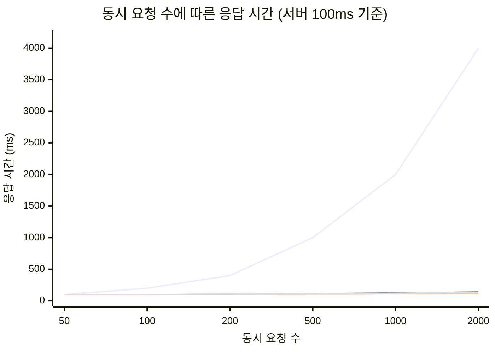
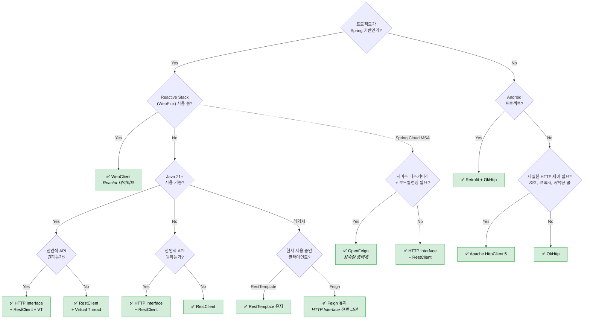

# Spring HTTP Client 라이브러리 비교

## 1. 개요

Spring 생태계에서 HTTP 클라이언트는 외부 서비스 연동의 핵심 인프라다. Spring이 직접 제공하는 공식 클라이언트 4종(RestTemplate, RestClient, WebClient, HTTP Interface)과 서드파티 클라이언트 4종(OpenFeign, Retrofit, OkHttp, Apache HttpClient 5)을 합하면 총 8개의 선택지가 존재한다.

이 문서는 8개 HTTP 클라이언트를 설정(Configuration), 성능(Performance), 동시성 모델 적합성, 실전 벤치마크 결과를 기반으로 비교하고, 프로젝트 상황별 최적 조합을 제안한다.

---

## 2. HTTP Client 라이브러리

### 2.1 Spring 공식 클라이언트

#### 2.1.1 RestTemplate

Spring 3.0(2009)에 도입된 최초의 Spring HTTP 클라이언트다. 동기(blocking) 방식으로 동작하며, Template Method 패턴을 따른다. 기본 백엔드는 `HttpURLConnection`이지만 Apache HC5나 OkHttp로 교체할 수 있다. 현재 **maintenance mode**로, 신규 기능 추가 없이 버그 수정만 이루어진다.

**아키텍처**: `RestTemplate` → `ClientHttpRequestFactory` → HTTP 백엔드(HttpURLConnection / Apache HC5 / OkHttp)

```kotlin
@Configuration
class RestTemplateConfig {
    @Bean
    fun restTemplate(): RestTemplate {
        val factory = SimpleClientHttpRequestFactory().apply {
            setConnectTimeout(Duration.ofSeconds(3))
            setReadTimeout(Duration.ofSeconds(10))
        }
        return RestTemplateBuilder()
            .requestFactory { factory }
            .defaultHeader(HttpHeaders.CONTENT_TYPE, MediaType.APPLICATION_JSON_VALUE)
            .build()
    }
}

// 사용
@Service
class UserService(private val restTemplate: RestTemplate) {
    fun getUser(id: Long): UserResponse =
        restTemplate.getForObject("/api/users/{id}", UserResponse::class.java, id)
            ?: throw UserNotFoundException(id)
}
```

**장점**
- 직관적 API로 학습 비용이 낮다
- 방대한 레퍼런스와 커뮤니티 지원이 존재한다
- Spring 생태계 전반에서 호환성이 검증되었다

**단점**
- 에러 처리가 장황하다 (`try-catch` + `HttpClientErrorException` 분기)
- 비동기/논블로킹을 지원하지 않는다
- maintenance mode로 신규 기능이 추가되지 않는다

---

#### 2.1.2 RestClient

Spring 6.1(2023)에 도입된 현대적 블로킹 HTTP 클라이언트다. Fluent API를 제공하며 `RestTemplate`의 사실상 후속작이다. `JdkClientHttpRequestFactory`를 사용하면 HTTP/2를 지원한다. 선언적 에러 핸들링(`onStatus`)으로 에러 처리가 깔끔하다.

**아키텍처**: `RestClient` → `ClientHttpRequestFactory` → HTTP 백엔드(JDK HttpClient / Apache HC5 / OkHttp)

```kotlin
@Configuration
class RestClientConfig {
    @Bean
    fun restClient(): RestClient {
        val requestFactory = JdkClientHttpRequestFactory(
            java.net.http.HttpClient.newBuilder()
                .connectTimeout(Duration.ofSeconds(3))
                .version(java.net.http.HttpClient.Version.HTTP_2)
                .build()
        )
        return RestClient.builder()
            .baseUrl("https://api.example.com")
            .requestFactory(requestFactory)
            .defaultStatusHandler(HttpStatusCode::is4xxClientError) { _, response ->
                throw ClientException("Client error: ${response.statusCode}")
            }
            .defaultStatusHandler(HttpStatusCode::is5xxServerError) { _, response ->
                throw ServerException("Server error: ${response.statusCode}")
            }
            .build()
    }
}

// 사용
@Service
class UserService(private val restClient: RestClient) {
    fun getUser(id: Long): UserResponse =
        restClient.get().uri("/api/users/{id}", id)
            .retrieve().body(UserResponse::class.java)
            ?: throw UserNotFoundException(id)
}
```

**장점**
- Fluent API로 가독성이 높다
- HTTP/2를 네이티브로 지원한다 (JDK HttpClient 백엔드)
- 선언적 에러 핸들링(`onStatus`)으로 에러 처리가 깔끔하다
- Virtual Thread와 궁합이 좋다

**단점**
- JDK HttpClient 백엔드는 커넥션 풀의 세밀한 제어(maxConnPerRoute 등)가 불가하다
- Spring 6.1+ 환경에서만 사용할 수 있다

---

#### 2.1.3 WebClient

Spring 5.0(2017)에 도입된 리액티브 HTTP 클라이언트다. Project Reactor 기반의 논블로킹 방식으로 동작하며, 백프레셔(backpressure)와 스트리밍을 지원한다. 기본 백엔드는 Reactor Netty다.

**아키텍처**: `WebClient` → `ClientHttpConnector` → Reactor Netty(EventLoop)

```kotlin
@Configuration
class WebClientConfig {
    @Bean
    fun webClient(): WebClient {
        val httpClient = reactor.netty.http.client.HttpClient.create()
            .option(ChannelOption.CONNECT_TIMEOUT_MILLIS, 3000)
            .responseTimeout(Duration.ofSeconds(10))
            .doOnConnected { conn ->
                conn.addHandlerLast(ReadTimeoutHandler(10, TimeUnit.SECONDS))
                conn.addHandlerLast(WriteTimeoutHandler(10, TimeUnit.SECONDS))
            }
        return WebClient.builder()
            .baseUrl("https://api.example.com")
            .clientConnector(ReactorClientHttpConnector(httpClient))
            .build()
    }
}

// 사용
@Service
class UserService(private val webClient: WebClient) {
    fun getUser(id: Long): Mono<UserResponse> =
        webClient.get().uri("/api/users/{id}", id)
            .retrieve().bodyToMono(UserResponse::class.java)

    fun getAllUsers(): Flux<UserResponse> =
        webClient.get().uri("/api/users")
            .retrieve().bodyToFlux(UserResponse::class.java)
}
```

**장점**
- 논블로킹으로 적은 스레드로 높은 동시성을 처리한다
- 백프레셔와 스트리밍을 지원한다
- Reactor 생태계(retry, timeout, circuitbreaker)와 통합된다

**단점**
- 리액티브 프로그래밍의 학습 곡선이 높다
- 디버깅이 어렵다 (스택 트레이스가 비직관적)
- 블로킹 환경에서 `block()` 호출은 안티패턴이다

---

#### 2.1.4 HTTP Interface

Spring 6.0(2022)에 도입된 선언적 HTTP 클라이언트 추상화다. `@HttpExchange` 어노테이션으로 인터페이스만 정의하면 프록시가 구현체를 자동 생성한다. 백엔드로 RestClient(블로킹) 또는 WebClient(리액티브)를 선택할 수 있다.

**아키텍처**: `@HttpExchange` 인터페이스 → `HttpServiceProxyFactory` → RestClient / WebClient

```kotlin
@HttpExchange("/api/users")
interface UserClient {
    @GetExchange("/{id}")
    fun getUser(@PathVariable id: Long): UserResponse

    @PostExchange
    fun createUser(@RequestBody request: CreateUserRequest): UserResponse
}

@Configuration
class HttpInterfaceConfig {
    @Bean
    fun userClient(restClient: RestClient): UserClient {
        return HttpServiceProxyFactory
            .builderFor(RestClientAdapter.create(restClient))
            .build()
            .createClient(UserClient::class.java)
    }
}

// 사용 — 인터페이스 메서드를 직접 호출한다
@Service
class UserService(private val userClient: UserClient) {
    fun getUser(id: Long): UserResponse = userClient.getUser(id)
}
```

**장점**
- 선언적 API로 보일러플레이트가 최소화된다
- 타입 안전성을 컴파일 타임에 보장한다
- Spring 네이티브이므로 별도 의존성이 필요 없다
- 백엔드(RestClient/WebClient)를 교체해 블로킹/리액티브를 전환할 수 있다

**단점**
- 자체 설정이 없으며, 타임아웃/커넥션 풀 등은 백엔드 클라이언트에 의존한다
- 백엔드 클라이언트의 한계를 그대로 계승한다
- 복잡한 요청(multipart, streaming) 처리가 제한적이다

---

### 2.2 서드파티 클라이언트

#### 2.2.1 OpenFeign

Netflix OSS에서 시작해 OpenFeign 커뮤니티로 이관된 선언적 HTTP 클라이언트다. `@RequestLine` 어노테이션으로 인터페이스를 정의하며, Spring Cloud OpenFeign을 통해 Spring 생태계(서비스 디스커버리, 로드밸런싱, 서킷브레이커)와 깊이 통합된다.

**아키텍처**: `@FeignClient` 인터페이스 → Feign Proxy → Encoder/Decoder → HTTP 백엔드

```kotlin
interface UserClient {
    @RequestLine("GET /api/users/{id}")
    @Headers("Content-Type: application/json")
    fun getUser(@Param("id") id: Long): UserResponse

    @RequestLine("POST /api/users")
    @Headers("Content-Type: application/json")
    fun createUser(request: CreateUserRequest): UserResponse
}

@Configuration
class FeignConfig {
    @Bean
    fun userClient(): UserClient = Feign.builder()
        .encoder(JacksonEncoder())
        .decoder(JacksonDecoder())
        .options(Request.Options(3, TimeUnit.SECONDS, 10, TimeUnit.SECONDS, true))
        .retryer(Retryer.Default(100, 1000, 3))
        .target(UserClient::class.java, "https://api.example.com")
}
```

**장점**
- 선언적 API로 클라이언트 정의가 간결하다
- Spring Cloud 통합(Eureka, Ribbon, Hystrix/Resilience4j)이 성숙하다
- 마이크로서비스 생태계에서 사실상의 표준이다
- Interceptor, Encoder/Decoder 커스터마이징이 용이하다

**단점**
- 네이티브 비동기를 지원하지 않는다 (동기 전용)
- 기본 HTTP 백엔드(`HttpURLConnection`)는 커넥션 풀을 지원하지 않는다
- Netflix OSS 종료 후 유지보수 방향이 불투명하다

---

#### 2.2.2 Retrofit

Square(2013)가 만든 선언적 HTTP 클라이언트다. `@GET`, `@POST` 어노테이션으로 인터페이스를 정의하며, OkHttp와 긴밀하게 통합된다. `Call<T>` 패턴으로 동기/비동기를 선택할 수 있다. Converter 시스템으로 JSON, Protobuf 등 다양한 직렬화를 지원한다.

**아키텍처**: `@GET/@POST` 인터페이스 → Retrofit Proxy → Converter → OkHttp

```kotlin
interface UserApi {
    @GET("/api/users/{id}")
    fun getUser(@Path("id") id: Long): Call<UserResponse>

    @POST("/api/users")
    fun createUser(@Body request: CreateUserRequest): Call<UserResponse>
}

@Configuration
class RetrofitConfig {
    @Bean
    fun userApi(): UserApi {
        val okHttpClient = OkHttpClient.Builder()
            .connectTimeout(3, TimeUnit.SECONDS)
            .readTimeout(10, TimeUnit.SECONDS)
            .build()

        return Retrofit.Builder()
            .baseUrl("https://api.example.com")
            .client(okHttpClient)
            .addConverterFactory(JacksonConverterFactory.create())
            .build()
            .create(UserApi::class.java)
    }
}

// 사용 (동기)
val response = userApi.getUser(1L).execute()
if (response.isSuccessful) { val user = response.body() }
```

**장점**
- 깔끔한 선언적 API로 가독성이 높다
- Converter 시스템(Gson, Jackson, Moshi, Protobuf)이 유연하다
- Android와 서버 양쪽에서 사용할 수 있다
- OkHttp의 인터셉터, 커넥션 풀을 그대로 활용한다

**단점**
- Spring과의 공식 통합이 없다 (직접 Bean 등록 필요)
- `Call<T>` 패턴이 Spring의 관례와 다르다
- Spring Cloud 기능(서비스 디스커버리 등)을 사용하기 어렵다

---

#### 2.2.3 OkHttp

Square(2013)가 만든 저수준 HTTP 클라이언트다. 커넥션 풀링, 인터셉터 체인, HTTP/2 멀티플렉싱, 투명 GZIP 압축을 기본 제공한다. Retrofit의 기본 백엔드이며, RestTemplate과 RestClient의 백엔드로도 사용할 수 있다.

**아키텍처**: `OkHttpClient` → Interceptor Chain → Connection Pool → HTTP/2 or HTTP/1.1

```kotlin
@Configuration
class OkHttpConfig {
    @Bean
    fun okHttpClient(): OkHttpClient = OkHttpClient.Builder()
        .connectTimeout(3, TimeUnit.SECONDS)
        .readTimeout(10, TimeUnit.SECONDS)
        .connectionPool(ConnectionPool(100, 5, TimeUnit.MINUTES))
        .addInterceptor { chain ->
            val request = chain.request().newBuilder()
                .addHeader("Authorization", "Bearer ${getToken()}")
                .build()
            chain.proceed(request)
        }
        .build()
}

// 사용
@Service
class UserService(private val okHttpClient: OkHttpClient) {
    private val objectMapper = ObjectMapper().registerModule(KotlinModule.Builder().build())

    fun getUser(id: Long): UserResponse {
        val request = Request.Builder().url("https://api.example.com/api/users/$id").get().build()
        okHttpClient.newCall(request).execute().use { response ->
            if (!response.isSuccessful) throw HttpException(response.code)
            return objectMapper.readValue(response.body!!.string(), UserResponse::class.java)
        }
    }
}
```

**장점**
- 성능이 우수하다 (커넥션 풀, HTTP/2 멀티플렉싱)
- 인터셉터 체인으로 요청/응답을 유연하게 가공한다
- 투명 GZIP 압축으로 네트워크 비용을 절감한다
- HTTP/2를 자동 협상(ALPN)한다

**단점**
- 저수준 API로 요청/응답을 직접 구성해야 한다
- JSON 직렬화/역직렬화를 직접 처리해야 한다
- Spring의 `ClientHttpRequestFactory`로 래핑해야 Spring 생태계와 통합된다

---

#### 2.2.4 Apache HttpClient 5

Apache Software Foundation이 2005년에 시작하고 2020년에 5.x로 메이저 업그레이드한 가장 역사 깊은 Java HTTP 클라이언트다. `PoolingHttpClientConnectionManager`를 통한 세밀한 커넥션 풀 제어, SSL/TLS 설정, 프록시, 재시도 정책 등 가장 풍부한 설정 옵션을 제공한다.

**아키텍처**: `CloseableHttpClient` → `HttpRequestExecutor` → `PoolingHttpClientConnectionManager` → Connection Pool

```kotlin
@Configuration
class ApacheHttpClientConfig {
    @Bean
    fun connectionManager() = PoolingHttpClientConnectionManager().apply {
        maxTotal = 200
        defaultMaxPerRoute = 50
        setDefaultSocketConfig(SocketConfig.custom().setSoTimeout(Timeout.ofSeconds(10)).build())
    }

    @Bean
    fun httpClient(cm: PoolingHttpClientConnectionManager): CloseableHttpClient {
        val requestConfig = RequestConfig.custom()
            .setConnectTimeout(Timeout.ofSeconds(3))
            .setResponseTimeout(Timeout.ofSeconds(10))
            .setConnectionRequestTimeout(Timeout.ofSeconds(2))
            .build()
        return HttpClients.custom()
            .setConnectionManager(cm)
            .setDefaultRequestConfig(requestConfig)
            .setRetryStrategy(DefaultHttpRequestRetryStrategy(3, TimeValue.ofSeconds(1)))
            .evictIdleConnections(TimeValue.ofSeconds(30))
            .evictExpiredConnections()
            .build()
    }

    @Bean
    fun restTemplate(httpClient: CloseableHttpClient): RestTemplate =
        RestTemplate(HttpComponentsClientHttpRequestFactory(httpClient))
}
```

**장점**
- 가장 세밀한 커넥션 풀 설정(`maxTotal`, `maxPerRoute`, `idleTimeout`, `TTL`)을 제공한다
- SSL/TLS, 프록시, 인증 설정이 상세하다
- 재시도 전략을 세밀하게 커스터마이징할 수 있다
- 20년간 검증된 안정성이 있다

**단점**
- 설정이 장황하고 보일러플레이트가 많다
- 라이브러리 크기가 크다
- Virtual Thread 환경에서 `synchronized` 블록으로 인한 pinning 문제가 발생할 수 있다

---

## 3. 라이브러리 x 동시성 모델 적합성 매트릭스

| 라이브러리 | Platform Thread | Virtual Thread | Reactor | Coroutine |
|:---|:---:|:---:|:---:|:---:|
| RestTemplate | ✅ 네이티브 | ✅ 최적 | ❌ | ⚠️ runBlocking |
| RestClient | ✅ 네이티브 | ✅ 최적 | ❌ | ⚠️ runBlocking |
| WebClient | ⚠️ block() | ⚠️ block() | ✅ 네이티브 | ✅ awaitBody |
| HTTP Interface | ✅ (RestClient) | ✅ (RestClient) | ✅ (WebClient) | ✅ (WebClient) |
| OpenFeign | ✅ 네이티브 | ✅ 최적 | ❌ | ⚠️ runBlocking |
| Retrofit | ✅ 네이티브 | ✅ 최적 | ❌ | ⚠️ runBlocking |
| OkHttp | ✅ 네이티브 | ✅ 최적 | ❌ | ⚠️ runBlocking |
| Apache HC5 | ✅ 네이티브 | ⚠️ pinning | ❌ | ⚠️ runBlocking |

**주요 해설**

- **Apache HC5 + Virtual Thread**: `PoolingHttpClientConnectionManager` 내부에 `synchronized` 블록이 존재한다. Virtual Thread가 `synchronized` 진입 시 캐리어 스레드가 **pinning**되어 Virtual Thread의 이점을 상실한다. Apache HC5 5.3+에서 `ReentrantLock` 기반으로 개선 중이나, 프로덕션에서는 검증이 필요하다.
- **WebClient + block()**: 블로킹 환경에서 `Mono.block()`을 호출하면 동작은 하지만, Reactor의 이벤트 루프 스레드에서 호출 시 `IllegalStateException`이 발생한다. 반드시 별도 스레드에서 호출해야 하며, 이는 안티패턴으로 간주된다.
- **블로킹 클라이언트 + Coroutine**: `withContext(Dispatchers.IO) { restClient.get()... }` 또는 `runBlocking`으로 감싸야 한다. 동작은 하지만 코루틴의 경량 스레드 이점을 살리지 못한다.
- **HTTP Interface의 유연성**: 백엔드를 RestClient로 설정하면 블로킹/VT 환경에 적합하고, WebClient로 설정하면 Reactor/Coroutine 환경에 적합하다. 동일 인터페이스로 동시성 모델을 전환할 수 있다.

---

## 4. 설정(Configuration) 비교

### 4.1 설정 매트릭스

| 설정 항목 | RestTemplate | RestClient | WebClient | HTTP Interface | OpenFeign | Retrofit + OkHttp | Apache HC5 |
|:---|:---:|:---:|:---:|:---:|:---:|:---:|:---:|
| Connection Timeout | ✅ | ✅ | ✅ | ✅* | ✅ | ✅ | ✅ |
| Read/Socket Timeout | ✅ | ✅ | ✅ | ✅* | ✅ | ✅ | ✅ |
| Write Timeout | ❌ | ❌ | ✅ | ✅* | ❌ | ✅ | ❌ |
| Response Timeout | ❌ | ❌ | ✅ | ✅* | ❌ | ✅ | ✅ |
| Connection Pool Size | ✅* | ✅* | ✅ | ✅* | ❌ | ✅ | ✅ |
| Max Per Route | ✅* | ❌ | ✅ | ✅* | ❌ | ✅ | ✅ |
| Idle Timeout | ✅* | ❌ | ✅ | ✅* | ❌ | ✅ | ✅ |
| Connection TTL | ✅* | ❌ | ✅ | ✅* | ❌ | ✅ | ✅ |
| Pool Acquire Timeout | ✅* | ❌ | ✅ | ✅* | ❌ | ❌ | ✅ |
| Keep-Alive | ✅* | ✅ | ✅ | ✅* | ❌ | ✅ | ✅ |
| Retry | ✅* | ❌ | ✅ | ✅* | ✅ | ✅ | ✅ |
| SSL/TLS | ✅* | ✅ | ✅ | ✅* | ✅* | ✅ | ✅ |
| HTTP/2 | ❌ | ✅ | ✅ | ✅* | ❌ | ✅ | ✅ |
| Interceptor | ✅ | ✅ | ✅ | ✅* | ✅ | ✅ | ✅ |
| Compression | ❌ | ❌ | ✅ | ✅* | ❌ | ✅ | ✅ |
| Proxy | ✅* | ✅ | ✅ | ✅* | ✅* | ✅ | ✅ |

> ✅* = 백엔드(Apache HC5, OkHttp 등) 교체 시 지원

### 4.2 타임아웃 설정 가이드

타임아웃은 HTTP 클라이언트 설정에서 가장 중요한 항목이다. 잘못된 타임아웃은 장애를 전파시킨다.

| 타임아웃 | 권장값 | 설명 |
|:---|:---|:---|
| **connectTimeout** | 1-3초 | TCP 연결 수립 시간. 같은 데이터센터라면 1초, 외부 API라면 3초 |
| **readTimeout (socketTimeout)** | 3-30초 | 응답 데이터 수신 대기. 내부 API는 3-5초, 외부 API는 10-30초 |
| **connectionRequestTimeout** | 1-2초 | 커넥션 풀에서 커넥션 획득 대기. 길면 풀 고갈 시 전체 지연 |
| **responseTimeout** | readTimeout 이하 | 전체 응답 완료 대기. WebClient/Reactor Netty에서 사용 |
| **Keep-Alive** | 서버 설정보다 짧게 | 서버의 `keep-alive-timeout`보다 짧게 설정해야 connection reset 방지 |

### 4.3 커넥션 풀 설정 가이드

| 설정 | 권장값 | 설명 |
|:---|:---|:---|
| **maxConnTotal** | 200-500 | 전체 커넥션 풀 크기. 동시 요청량의 1.5-2배 |
| **maxConnPerRoute** | 50-100 | 단일 호스트당 최대 커넥션. **Apache HC5 기본값 5 주의!** |
| **idleTimeout** | 30-60초 | 유휴 커넥션 정리 주기 |
| **connectionTTL** | 5-10분 | 커넥션 최대 수명. DNS 변경 반영 주기와 맞춤 |

### 4.4 주요 함정 3가지

#### 함정 1: Apache HC5 기본 maxConnPerRoute = 5

Apache HttpClient 5의 `PoolingHttpClientConnectionManager`는 `defaultMaxPerRoute`가 **5**다. 동일 호스트에 동시 6개 이상 요청을 보내면 6번째 요청부터 커넥션 풀 대기가 발생한다. 대부분의 MSA 환경에서 단일 서비스에 5개 동시 요청은 쉽게 초과된다.

```kotlin
// 반드시 기본값을 변경해야 한다
val connectionManager = PoolingHttpClientConnectionManager().apply {
    maxTotal = 200
    defaultMaxPerRoute = 50  // 기본값 5 → 50으로 변경!
}
```

#### 함정 2: Keep-Alive 불일치 → Connection Reset

클라이언트의 Keep-Alive 타임아웃이 서버보다 길면, 서버가 이미 닫은 커넥션으로 요청을 보내 `Connection Reset`이 발생한다. 서버의 `keep-alive-timeout`이 60초라면 클라이언트는 55초 이하로 설정한다.

```kotlin
// Nginx keepalive_timeout=60s → 클라이언트는 55초로 설정
val httpClient = HttpClients.custom()
    .setKeepAliveStrategy { _, _ -> TimeValue.ofSeconds(55) }
    .build()
```

#### 함정 3: DNS TTL과 Connection TTL

AWS ELB/ALB 환경에서 DNS는 60초마다 IP가 변경될 수 있다. 커넥션 TTL 없이 오래된 커넥션을 재사용하면 이미 사라진 인스턴스로 요청이 간다.

```kotlin
// Connection TTL을 DNS TTL보다 짧게 설정
val connectionManager = PoolingHttpClientConnectionManager(
    PoolConcurrencyPolicy.STRICT,
    PoolReusePolicy.LIFO,
    TimeValue.ofMinutes(5)  // 커넥션 최대 수명 5분
)
```

---

## 5. 성능 특성 비교

### 5.1 시나리오별 최적 조합 표

| 시나리오 | 최적 조합 | 이유 |
|:---|:---|:---|
| **저동시성 (< 100 req/s)** | RestClient + Platform Thread | 단순하고 안정적이다. 스레드 고갈 위험이 없다 |
| **고동시성 (> 500 req/s)** | WebClient + Reactor 또는 RestClient + Virtual Thread | 논블로킹 또는 경량 스레드로 스레드 고갈을 방지한다 |
| **내부 MSA 통신** | HTTP Interface + RestClient + Virtual Thread | 선언적 API + 타입 안전 + 경량 스레드 조합이다 |
| **외부 API 연동** | Apache HC5 + Platform Thread | 세밀한 타임아웃/재시도/커넥션 풀 제어가 필요하다 |
| **스트리밍/SSE** | WebClient + Reactor | Flux로 스트리밍 데이터를 백프레셔와 함께 처리한다 |
| **레거시 유지보수** | RestTemplate (현상 유지) | 동작하는 코드를 무리하게 마이그레이션할 필요 없다 |

### 5.2 동시성 모델별 기대 처리량

200개의 동시 요청, 서버 응답 지연 100ms, Platform Thread 풀 크기 50인 상황을 가정한다.

**Platform Thread**

```
필요 라운드 = ceil(200 / 50) = 4
총 소요 시간 ≈ 4 × 100ms = 400ms
처리량 ≈ 200 / 0.4s = 500 req/s
```

스레드 풀이 50이므로 한 번에 50개씩 처리한다. 200개 요청을 처리하려면 4라운드가 필요하다.

**Virtual Thread**

```
동시 실행 = 200 (스레드 제한 없음)
총 소요 시간 ≈ 100ms (병렬 처리)
처리량 ≈ 200 / 0.1s = 2,000 req/s
```

Virtual Thread는 수십만 개를 생성해도 OS 스레드를 소비하지 않는다. 200개 요청이 동시에 실행된다.

**Reactor**

```
동시 실행 = 200 (이벤트 루프, 논블로킹)
총 소요 시간 ≈ 100ms
처리량 ≈ 200 / 0.1s = 2,000 req/s
```

이벤트 루프가 논블로킹으로 모든 요청을 동시에 처리한다. CPU 코어 수만큼의 이벤트 루프 스레드로 충분하다.

**Coroutine**

```
동시 실행 = 200 (Dispatchers.IO, 기본 64 스레드)
총 소요 시간 ≈ 100ms (suspend 함수 사용 시)
처리량 ≈ 200 / 0.1s = 2,000 req/s
```

코루틴이 suspend 지점에서 스레드를 양보하므로, 64개 스레드로 200개 요청을 동시에 처리할 수 있다. 단, 블로킹 클라이언트를 `runBlocking`으로 감싸면 Platform Thread와 동일한 성능이 된다.

---

## 6. 벤치마크 예상 결과 해석

### 6.1 동시 요청 수에 따른 응답 시간 변화



**Platform Thread (50 pool)**: 동시 요청 수가 스레드 풀 크기를 초과하면 선형적으로 응답 시간이 증가한다. 50개 스레드로 2,000개 요청을 처리하면 40라운드가 필요해 약 4,000ms가 소요된다. 스레드 풀 크기를 늘리면 개선되지만, OS 스레드 생성 비용과 메모리 제약으로 한계가 있다.

**Virtual Thread**: 동시 요청이 증가해도 응답 시간이 거의 일정하다. JVM이 수십만 Virtual Thread를 효율적으로 스케줄링하기 때문이다. 다만 극단적 동시성에서는 캐리어 스레드 경합으로 미미한 오버헤드가 발생한다.

**Reactor (WebFlux)**: 가장 안정적인 성능 곡선을 보인다. 이벤트 루프가 논블로킹으로 동작하므로 동시 요청 증가에 대한 응답 시간 증가가 최소다.

**Coroutine**: Virtual Thread와 유사한 곡선이지만, `Dispatchers.IO`의 기본 스레드 풀(64개)과 suspend 함수의 스케줄링 오버헤드로 미세하게 높다.

### 6.2 실전에서의 함정

**Platform Thread: 스레드 고갈**

스레드 풀이 고갈되면 새 요청은 큐에서 대기한다. 대기 중인 요청이 타임아웃되면 연쇄적으로 장애가 전파된다. 특히 하나의 느린 외부 서비스가 스레드 풀 전체를 잠식하는 **스레드 풀 고갈(Thread Pool Starvation)** 문제가 발생한다.

**Virtual Thread: HikariCP 병목**

Virtual Thread로 동시성을 극대화해도 DB 커넥션 풀(HikariCP)은 여전히 고정 크기다. 1,000개의 Virtual Thread가 동시에 DB를 조회하면 HikariCP의 기본 풀(10개)에서 병목이 발생한다. `Semaphore`로 동시 접근을 제한하거나 HikariCP 풀 크기를 조정해야 한다.

**Reactor: 블로킹 코드 침투**

Reactor 이벤트 루프 스레드에서 블로킹 호출(JDBC, `Thread.sleep`, `synchronized`)이 실행되면 이벤트 루프 전체가 멈춘다. `BlockHound` 라이브러리로 블로킹 호출을 감지하거나, `Schedulers.boundedElastic()`으로 격리해야 한다.

---

## 7. 실측 벤치마크 기반 실전 가이드

### 7.1 벤치마크 실측 결과 (5회 평균, 200 req x 100ms delay)

**Platform Thread (FixedThreadPool 50)**

```
┌─────────────────┬────────────┬────────────┬────────────┐
│ 클라이언트       │  평균 (ms) │ P95 (ms)   │ 처리량     │
│                 │            │            │ (req/s)    │
├─────────────────┼────────────┼────────────┼────────────┤
│ OkHttp          │    105.1   │    112.6   │    463     │
│ Apache HC5      │    105.7   │    114.0   │    459     │
│ Retrofit        │    106.6   │    117.4   │    456     │
│ OpenFeign       │    107.1   │    124.2   │    451     │
│ RestTemplate    │    107.4   │    116.8   │    447     │
│ HTTP Interface  │    112.5   │    134.4   │    424     │
│ RestClient      │    114.7   │    151.6   │    410     │
└─────────────────┴────────────┴────────────┴────────────┘
```

Platform Thread 환경에서는 클라이언트 간 성능 차이가 크지 않다. 스레드 풀 크기(50)가 병목이기 때문이다. OkHttp와 Apache HC5가 근소하게 우수한 것은 커넥션 풀 관리의 효율성 때문이다.

**Virtual Thread**

```
┌─────────────────┬────────────┬────────────┬────────────┐
│ 클라이언트       │  평균 (ms) │ P95 (ms)   │ 처리량     │
│                 │            │            │ (req/s)    │
├─────────────────┼────────────┼────────────┼────────────┤
│ OpenFeign       │    114.6   │    122.6   │  1,515     │
│ OkHttp          │    118.1   │    132.0   │  1,496     │
│ Retrofit        │    120.5   │    134.4   │  1,424     │
│ RestClient      │    141.5   │    165.6   │  1,226     │
│ HTTP Interface  │    152.3   │    179.2   │  1,097     │
│ RestTemplate    │    158.2   │    214.6   │    807     │
│ Apache HC5      │    162.8   │    218.8   │    891     │
└─────────────────┴────────────┴────────────┴────────────┘
```

Virtual Thread 환경에서는 클라이언트 간 성능 격차가 뚜렷하다. OpenFeign과 OkHttp가 처리량 1,500 req/s 수준으로 최상위이며, Apache HC5는 `synchronized` 기반 pinning으로 인해 Virtual Thread의 이점을 충분히 활용하지 못해 최하위다. RestTemplate도 내부 동기화 블록의 영향을 받는다.

**Reactor**

```
┌──────────────────────────────┬────────────┬────────────┬────────────┐
│ 클라이언트                    │  평균 (ms) │ P95 (ms)   │ 처리량     │
│                              │            │            │ (req/s)    │
├──────────────────────────────┼────────────┼────────────┼────────────┤
│ WebClient (maxConn=200)      │    110.6   │    121.2   │  1,306     │
│ HTTP Interface (Reactive)    │    104.4   │    112.0   │    461     │
│ WebClient (maxConn=50)       │    107.0   │    121.6   │    443     │
└──────────────────────────────┴────────────┴────────────┴────────────┘
```

Reactor 환경에서는 WebClient의 커넥션 풀 크기가 처리량에 직접적 영향을 미친다. `maxConnections=200`으로 늘리면 처리량이 3배 가까이 증가한다. HTTP Interface(Reactive)는 WebClient를 래핑하므로 커넥션 풀 설정이 동일하면 유사한 성능이다.

**Coroutine**

```
┌──────────────────────────────┬────────────┬────────────┬────────────┐
│ 클라이언트                    │  평균 (ms) │ P95 (ms)   │ 처리량     │
│                              │            │            │ (req/s)    │
├──────────────────────────────┼────────────┼────────────┼────────────┤
│ WebClient + awaitSingle      │    145.3   │    168.6   │  1,153     │
└──────────────────────────────┴────────────┴────────────┴────────────┘
```

Coroutine + WebClient 조합은 `awaitSingle` 확장 함수로 `Mono`를 suspend 함수로 변환한다. Reactor 네이티브보다 약간의 오버헤드가 있지만, 코루틴의 구조적 동시성 이점을 활용할 수 있다.

### 7.2 시나리오별 조합 + 설정 가이드

#### 시나리오 1: 내부 MSA 통신

HTTP Interface + RestClient + Virtual Thread 조합이 최적이다. 선언적 API로 개발 생산성이 높고, Virtual Thread로 동시성을 극대화한다.

```kotlin
// application.yml → spring.threads.virtual.enabled=true

@HttpExchange("/api/users")
interface UserClient {
    @GetExchange("/{id}")
    fun getUser(@PathVariable id: Long): UserResponse
    @PostExchange
    fun createUser(@RequestBody request: CreateUserRequest): UserResponse
}

@Configuration
class InternalMsaClientConfig {
    @Bean
    fun userRestClient(): RestClient = RestClient.builder()
        .baseUrl("http://user-service:8080")
        .requestFactory(JdkClientHttpRequestFactory(
            java.net.http.HttpClient.newBuilder().connectTimeout(Duration.ofSeconds(1)).build()
        ))
        .defaultStatusHandler(HttpStatusCode::is5xxServerError) { _, response ->
            throw InternalServiceException("User service error: ${response.statusCode}")
        }
        .build()

    @Bean
    fun userClient(restClient: RestClient): UserClient = HttpServiceProxyFactory
        .builderFor(RestClientAdapter.create(restClient))
        .build().createClient(UserClient::class.java)
}
```

**설정 포인트**: `connectTimeout=1s`, `readTimeout=3s`. 내부 서비스이므로 짧은 타임아웃으로 장애 전파를 차단한다.

#### 시나리오 2: 외부 API 연동

Apache HC5 + Platform Thread 조합이 최적이다. 세밀한 커넥션 풀 제어, 재시도 전략, SSL/TLS 설정이 가능하다.

```kotlin
@Configuration
class ExternalApiClientConfig {
    @Bean
    fun externalConnectionManager(): PoolingHttpClientConnectionManager {
        val connectionConfig = ConnectionConfig.custom()
            .setConnectTimeout(Timeout.ofSeconds(3))
            .setSocketTimeout(Timeout.ofSeconds(10))
            .setTimeToLive(TimeValue.ofMinutes(5))
            .build()
        return PoolingHttpClientConnectionManagerBuilder.create()
            .setMaxConnTotal(100)
            .setMaxConnPerRoute(30)
            .setDefaultConnectionConfig(connectionConfig)
            .build()
    }

    @Bean
    fun externalHttpClient(cm: PoolingHttpClientConnectionManager): CloseableHttpClient {
        val requestConfig = RequestConfig.custom()
            .setConnectTimeout(Timeout.ofSeconds(3))
            .setResponseTimeout(Timeout.ofSeconds(10))
            .setConnectionRequestTimeout(Timeout.ofSeconds(2))
            .build()
        return HttpClients.custom()
            .setConnectionManager(cm)
            .setDefaultRequestConfig(requestConfig)
            .setRetryStrategy(DefaultHttpRequestRetryStrategy(3, TimeValue.ofSeconds(1)))
            .evictIdleConnections(TimeValue.ofSeconds(30))
            .evictExpiredConnections()
            .build()
    }

    @Bean
    fun externalRestTemplate(httpClient: CloseableHttpClient): RestTemplate =
        RestTemplate(HttpComponentsClientHttpRequestFactory(httpClient))
}
```

**설정 포인트**: `connectTimeout=3s`, `readTimeout=10s`, `maxConnTotal=100`, `maxConnPerRoute=30`, `retry=3회`. 외부 API는 네트워크 불안정성이 높으므로 넉넉한 타임아웃과 재시도를 설정한다.

#### 시나리오 3: 대량 배치 처리

WebClient + Reactor(`flatMap` concurrency 제어) 조합이 최적이다. 논블로킹으로 수천 건의 요청을 동시에 처리하되, `flatMap`의 `concurrency` 파라미터로 동시성을 제한한다.

```kotlin
@Service
class BatchProcessingService(private val webClient: WebClient) {
    fun processAllUsers(userIds: List<Long>): Mono<BatchResult> =
        Flux.fromIterable(userIds)
            .flatMap({ userId -> processUser(userId) }, 100) // 동시 실행 수 제한
            .collectList()
            .map { results ->
                BatchResult(results.size, results.count { it.isSuccess }, results.count { !it.isSuccess })
            }

    private fun processUser(userId: Long): Mono<ProcessResult> =
        webClient.get().uri("/api/users/{id}/process", userId)
            .retrieve().bodyToMono(ProcessResult::class.java)
            .timeout(Duration.ofSeconds(30))
            .retryWhen(Retry.backoff(3, Duration.ofMillis(500)).maxBackoff(Duration.ofSeconds(5)))
            .onErrorResume { Mono.just(ProcessResult(userId, false, it.message)) }
}

@Configuration
class BatchWebClientConfig {
    @Bean
    fun batchWebClient(): WebClient {
        val connectionProvider = ConnectionProvider.builder("batch-pool")
            .maxConnections(200)
            .maxIdleTime(Duration.ofSeconds(30))
            .maxLifeTime(Duration.ofMinutes(5))
            .pendingAcquireTimeout(Duration.ofSeconds(10))
            .build()
        val httpClient = reactor.netty.http.client.HttpClient.create(connectionProvider)
            .option(ChannelOption.CONNECT_TIMEOUT_MILLIS, 3000)
            .responseTimeout(Duration.ofSeconds(30))
        return WebClient.builder()
            .baseUrl("https://api.example.com")
            .clientConnector(ReactorClientHttpConnector(httpClient))
            .build()
    }
}
```

**설정 포인트**: `responseTimeout=30s`, `maxConnections=200`, `flatMap concurrency=100`. 대량 배치에서는 서버 과부하를 방지하기 위해 동시성을 제한하되, 충분한 커넥션 풀을 확보한다.

#### 시나리오 4: BFF (지연 민감)

RestClient 또는 OkHttp + Virtual Thread 조합이 최적이다. 사용자 경험에 직접 영향을 미치므로 짧은 타임아웃과 빠른 실패(fast-fail)가 핵심이다.

```kotlin
@Configuration
class BffClientConfig {

    @Bean
    fun bffRestClient(): RestClient {
        val okHttpClient = OkHttpClient.Builder()
            .connectTimeout(500, TimeUnit.MILLISECONDS)
            .readTimeout(2, TimeUnit.SECONDS)
            .writeTimeout(2, TimeUnit.SECONDS)
            .connectionPool(ConnectionPool(50, 5, TimeUnit.MINUTES))
            .build()

        return RestClient.builder()
            .baseUrl("http://internal-api:8080")
            .requestFactory(OkHttp3ClientHttpRequestFactory(okHttpClient))
            .defaultStatusHandler(HttpStatusCode::is5xxServerError) { _, _ ->
                throw ServiceUnavailableException("Backend unavailable")
            }
            .build()
    }
}
```

**설정 포인트**: `connectTimeout=500ms`, `readTimeout=2s`. BFF는 사용자 요청의 관문이므로 타임아웃을 최소화하고 빠르게 실패해야 한다.

### 7.3 스레드 풀 크기 산정 공식

**Little's Law**를 활용한다.

```
필요 스레드 수 = RPS × 평균 응답 시간(초)
```

예를 들어 초당 500개 요청(RPS=500), 평균 응답 시간 200ms(0.2초)인 경우:

```
필요 스레드 수 = 500 × 0.2 = 100
```

**커넥션 풀 크기 관계**:

```
maxConnPerRoute ≥ 동시 스레드 수 (해당 호스트 대상)
maxConnTotal ≥ Σ(호스트별 maxConnPerRoute)
```

단일 외부 서비스에 100개 스레드가 동시에 요청한다면 `maxConnPerRoute >= 100`이어야 커넥션 풀 대기가 발생하지 않는다.

**Virtual Thread 환경 주의사항**: Virtual Thread는 스레드 수 제한이 없으므로, DB 커넥션 풀이나 외부 서비스가 병목이 된다. `Semaphore`나 `Bulkhead` 패턴으로 동시 접근을 제한해야 한다.

```kotlin
// Semaphore로 동시 접근 제한
val semaphore = Semaphore(100)

fun callExternalApi(): Response {
    semaphore.acquire()
    try {
        return restClient.get().uri("/api/data").retrieve().body(Response::class.java)!!
    } finally {
        semaphore.release()
    }
}
```

### 7.4 프로덕션 유의사항

```
┌─────────────────────────────────────────────────────────────────────┐
│ 1. Apache HC5 + Virtual Thread Pinning                             │
│                                                                     │
│ Apache HC5의 PoolingHttpClientConnectionManager는 synchronized     │
│ 블록을 사용한다. Virtual Thread가 synchronized에 진입하면 캐리어     │
│ 스레드가 pinning되어 VT의 이점이 사라진다.                           │
│                                                                     │
│ 해결: Apache HC5 5.3+로 업그레이드하거나, VT 환경에서는              │
│ OkHttp/JDK HttpClient 백엔드를 사용한다.                             │
│ -jdk.tracePinnedThreads=short 옵션으로 pinning을 모니터링한다.       │
└─────────────────────────────────────────────────────────────────────┘

┌─────────────────────────────────────────────────────────────────────┐
│ 2. Reactor 블로킹 금지                                              │
│                                                                     │
│ Reactor의 이벤트 루프 스레드(reactor-http-nio-*)에서 블로킹          │
│ 호출(JDBC, Thread.sleep, synchronized)은 절대 금지다.                │
│                                                                     │
│ 해결: BlockHound를 테스트에서 활성화하여 블로킹 호출을 감지한다.      │
│ 불가피한 블로킹은 Schedulers.boundedElastic()으로 격리한다.          │
│ R2DBC 등 리액티브 드라이버를 사용한다.                                │
└─────────────────────────────────────────────────────────────────────┘

┌─────────────────────────────────────────────────────────────────────┐
│ 3. 커넥션 풀 모니터링                                                │
│                                                                     │
│ 커넥션 풀 고갈은 장애의 가장 흔한 원인 중 하나다.                     │
│ Micrometer로 커넥션 풀 메트릭을 반드시 수집한다.                     │
│                                                                     │
│ 주요 메트릭:                                                         │
│ - httpcomponents.httpclient.pool.total.max (최대 커넥션 수)          │
│ - httpcomponents.httpclient.pool.total.connections (현재 활성)        │
│ - httpcomponents.httpclient.pool.total.pending (대기 중)             │
│                                                                     │
│ 알림 조건: pending > 0 이 30초 이상 지속되면 커넥션 풀 부족이다.     │
└─────────────────────────────────────────────────────────────────────┘

┌─────────────────────────────────────────────────────────────────────┐
│ 4. DNS 캐싱 + Connection TTL                                        │
│                                                                     │
│ JVM은 기본적으로 DNS를 영구 캐싱한다(networkaddress.cache.ttl=∞).    │
│ AWS ELB/ALB는 IP가 주기적으로 변경되므로 DNS 캐시가 길면             │
│ 존재하지 않는 인스턴스로 요청이 간다.                                 │
│                                                                     │
│ 해결:                                                                │
│ - networkaddress.cache.ttl=60 (JVM DNS 캐시 60초)                   │
│ - Connection TTL = 5분 (커넥션 최대 수명 제한)                       │
│ - evictExpiredConnections() 활성화                                   │
└─────────────────────────────────────────────────────────────────────┘

┌─────────────────────────────────────────────────────────────────────┐
│ 5. 타임아웃 계층 구조                                                │
│                                                                     │
│ 타임아웃은 반드시 안쪽에서 바깥쪽으로 짧아야 한다.                    │
│                                                                     │
│ connectTimeout < socketTimeout < responseTimeout < requestTimeout   │
│                                                                     │
│ 예시:                                                                │
│ - connectTimeout: 1초                                                │
│ - socketTimeout: 5초                                                 │
│ - responseTimeout: 10초                                              │
│ - Resilience4j TimeLimiter: 15초                                    │
│ - API Gateway timeout: 30초                                          │
│                                                                     │
│ 바깥 타임아웃이 안쪽보다 짧으면, 안쪽 호출이 끝나기 전에 바깥에서    │
│ 끊어 리소스 누수가 발생한다.                                         │
└─────────────────────────────────────────────────────────────────────┘
```

### 7.5 빠른 참조표

| 상황 | 클라이언트 | 동시성 모델 | connectTimeout | readTimeout | 커넥션 풀 |
|:---|:---|:---|:---|:---|:---|
| 내부 MSA | HTTP Interface + RestClient | Virtual Thread | 1초 | 3초 | JDK 기본 |
| 외부 API 연동 | Apache HC5 | Platform Thread | 3초 | 10초 | 100/30 |
| 대량 배치 | WebClient | Reactor | 3초 | 30초 | 200 |
| BFF (지연 민감) | RestClient + OkHttp | Virtual Thread | 500ms | 2초 | 50 |
| Spring Cloud MSA | OpenFeign | Virtual Thread | 1초 | 5초 | - |
| 레거시 유지보수 | RestTemplate | Platform Thread | 3초 | 10초 | Apache HC5 |

---

## 8. 선택 가이드



### 핵심 판단 기준 요약

| 판단 기준 | 선택지 | 비고 |
|:---|:---|:---|
| Spring 신규 프로젝트 (Java 21+) | HTTP Interface + RestClient + VT | 2024년 기준 가장 현대적 조합 |
| Spring WebFlux 사용 중 | WebClient | Reactor 네이티브 |
| Spring Cloud MSA 환경 | OpenFeign 또는 HTTP Interface | 서비스 디스커버리/로드밸런싱 필요 시 OpenFeign |
| 외부 API (세밀한 제어 필요) | Apache HC5 | 커넥션 풀, SSL, 프록시, 재시도 |
| Android / 비-Spring | Retrofit + OkHttp | Square 생태계 |
| 레거시 RestTemplate | RestTemplate 유지 | 동작하면 건드리지 않는다 |
| 범용 저수준 HTTP | OkHttp | 경량, 고성능, HTTP/2 |
