# 코루틴, 버추얼 스레드, 일반 스레드

## 스레드
스레드는 프로세스에서 실행되는 실행 단위입니다.   
하나의 프로세스는 여러 개의 스레드를 실행시킬 수 있고, 이 스레드들은 OS 커널에서의 네이티브 스레드와 1:1로 매핑되는 관계를 가집니다.    
스레드들은 같은 메모리(힙)를 공유하기 때문에 동시 접근 시 동기화가 필요합니다.   

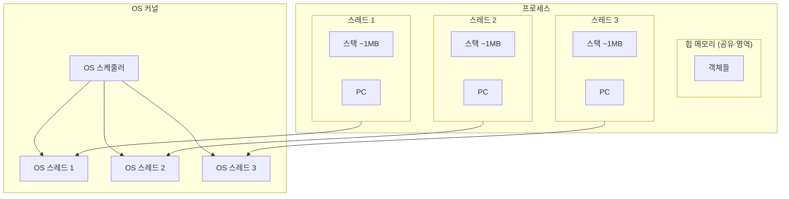
### 생명주기
스레드는 생성 ~ 종료까지 여러 상태를 거칩니다.   
실행 가능 상태가 되면, OS 스케줄러에 의해 CPU를 할당받아 스레드는 실행됩니다.    
I/O, 락 획득 대기 시에는 BLOCKED 혹은 WAITING 상태가 되어 다른 스레드에게 CPU 자원을 양보합니다.

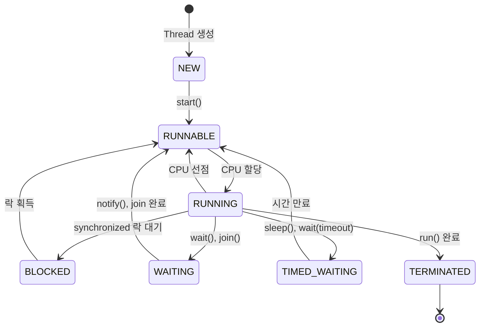

블로킹 상태의 스레드는 CPU를 양보하고, 이 CPU는 다시 다른 스레드에게 자원이 할당되는데 이 과정을 컨텍스트 스위칭이라 칭합니다.    
이 과정에서 CPU는 이전 스레드의 레지스터, 스택 포인터 등을 다음에도 사용하기 위해 메모리에 저장하고, 다음 스레드의 상태를 복원합니다.   
컨텍스트 스위칭은 커널 스레드에 시스템 콜이 발생하고, 자원을 교체하는 과정에서 cpu 캐시 미스등 까지 발생할 수 있기 때문에 레이턴시가 발생할 수 있습니다.   
만약 스레드 숫자가 많아질수록 컨텍스트 스위칭 대상이 많아지니 성능 저하의 원인이 될 수 있습니다.

## 코루틴
코루틴은 실행을 일시 중단하고, 재개할 수 있는 경량의 실행 단위입니다.   
매번 스레드가 블로킹되고, 스위칭되는 것이 아닌 언어 레벨에서 하나의 플랫폼 스레드 위에 여러 코루틴이 실행되는 방식입니다.   
코루틴의 Dispatcher는 코루틴을 플랫폼 스레드에 배정하고, 코루틴이 일시 중단되면 다른 코루틴을 실행할 수 있습니다.   
때문에 컨텍스트 스위칭을 발생시킬 필요없이 코루틴을 번갈아가며 처리하는 방식입니다.   

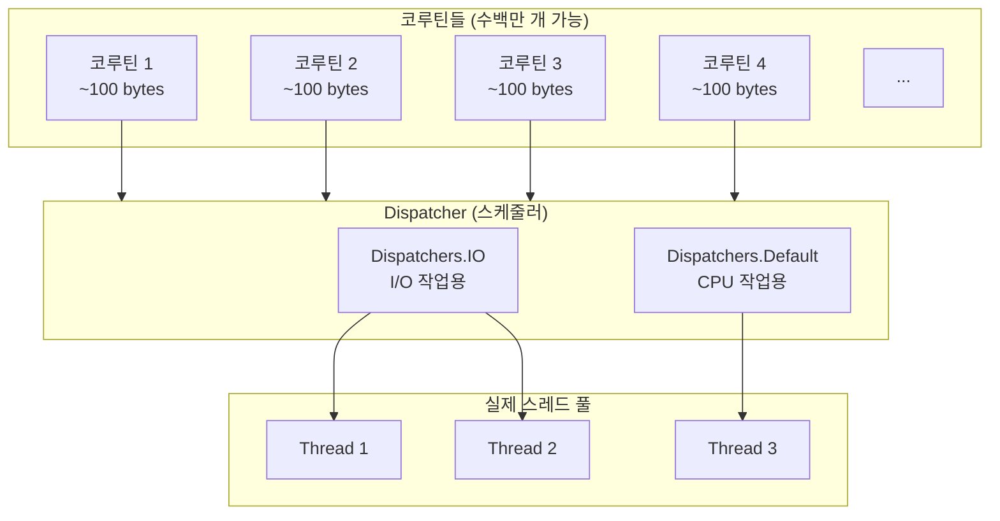

### CPS (Continuation Passing Style)
코틀린 컴파일러는 suspend로 정의된 함수를 상태 머신으로 변환합니다.    
이 변환된 코드에는 Continuation이라는 객체가 존재하고, 이 객체의 label에 어느 부분에서 중단되었고, 재개할 지점이 어딘지를 저장하여 실행 상태를 캡쳐할 수 있습니다.    
* 중단 지점(label): 각 중단 지점마다 고유한 값
* 로컬 변수 저장: 중단 시점 로컬 변수를 클래스 필드로 변환하여 재개 시 복원 가능하도록 함
* 재개 시 호출될 콜백 저장
* 실행 컨텍스트 보관

```kotlin
// 원본 코드
suspend fun example() {
    val a = fetchA()
    val b = fetchB()
    return a + b
}
// 컴파일러가 변환한 개념적 코드
fun example(continuation: Continuation): Any? {
    when (continuation.label) {
        0 -> {
            continuation.label = 1
            return fetchA(continuation)
        }
        1 -> {
            val a = continuation.result
            continuation.label = 2
            return fetchB(continuation)
        }
        2 -> {
            val b = continuation.result
            return a + b
        }
    }
}
```

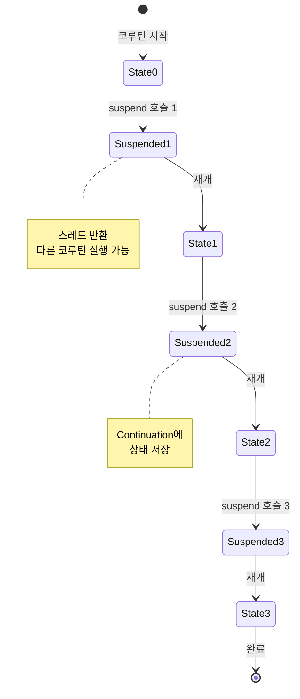

### Dispatcher
Dispatcher는 코루틴이 어떤 스레드에서 실행될지를 결정합니다.   
* Default: CPU 집약 작업에 적합하며, CPU 코어 수만큼 스레드를 사용하여 복잡한 계산이나 데이터 처리에 사용합니다.   
* IO: 기본값 64개의 스레드를 사용하여 파일 I/O, 네트워크 I/O 등에 사용되며, 블로킹이 발생해도 다른 코루틴이 영향받지 않도록 충분한 스레드를 확보합니다.    
* Main: UI 스레드에서 실행합니다.

## 버추얼 스레드
버추얼 스레드는 JVM이 관리하는 가상 스레드로 플랫폼 스레드 위에서 동작합니다.   
코루틴과 유사하게 Continuation, 애플리케이션 레벨에서의 스케줄러에 의한 스위칭 등을 이용합니다.   

### 구조
버추얼 스레드는 플랫폼 스레드 위에서 동작하고, 이 플랫폼 스레드의 기본 스케줄러는 ForkJoinPool입니다.   
즉, 버추얼 스레드는 실행 시 플랫폼 스레드에 마운트되고, ForkJoinPool의 큐에 적재되는 형태입니다.   
블로킹 I/O가 발생하면 플랫폼 스레드에서 언마운트되고, 다른 버추얼 스레드를 실행하고, I/O가 완료되면 다시 마운트하여 실행을 재개합니다.

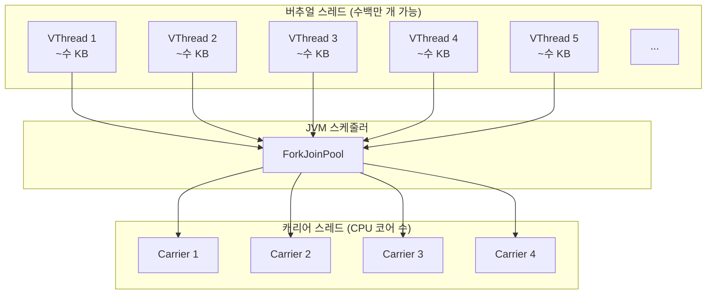

그리고 이 컨텍스트 스위칭 과정에서 버추얼 스레드는 내부에 Continuation 형태의 객체를 멤버 변수로 가지고 있고, 이 곳에 이전 작업 정보를 저장하고 실행해야 할 정보를 불러와 다시 실행할 준비를 마칩니다.    
코루틴의 Continuation 객체와 유사하며, 마찬가지로 언어 레벨에서 이 정보들을 다루기 때문에 커널 스레드까지 시스템 콜이 발생하지 않는다는 면에서 효율적입니다.

### 마운트 / 언마운트
버추얼 스레드는 블로킹 I/O가 발생할 경우 자동으로 플랫 폼스레드에서 언마운트하기 위해 스택을 힙으로 옮긴 후 언마운트됩니다. 

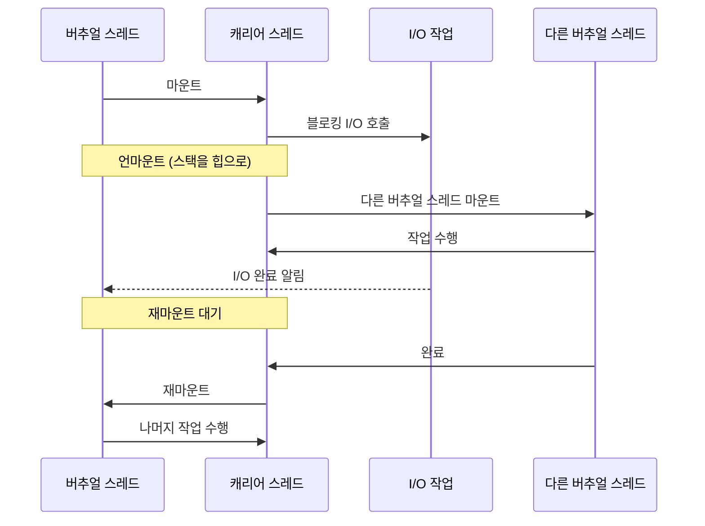

## 스레드, 코루틴, 버추얼 스레드 비교

### 관리 주체와 스케줄링
|구분|스레드|코루틴|버추얼 스레드|
|-|-|-|-|
|관리주체|OS 커널|Kotlin 런타임|JVM|
|스케줄링|선점형(OS가 강제로 전환)|비선점형(자발적 양보)|비선점형(블로킹 시 전환)
|스데르 매핑|1:1(Java:OS)|N:M(코루틴:스레드)|N:M(버추얼:캐리어)

선점형 스케줄링은 OS가 시간별로 강제로 스레드를 전환합니다.     
스레드가 협력하지 않아도 다른 스레드가 실행될 수 있지만 컨텍스트 스위칭 비용이 발생합니다.

비선점형 스케줄링은 자발적으로 제어권을 양보합니다. 
코루틴은 suspend 지점, 버추얼 스레드는 블로킹 지점에서 제어권을 양보하여 오버헤드가 적다는 장점이 존재합니다.

### 블로킹 처리 방식
스레드는 블로킹 호출 시 해당 스레드 전체가 대기 상태가 됩니다. 높은 동시성을 위해서 많은 스레드가 필요하고 이는 메모리와 컨텍스트 스위칭 비용 증가로 이어집니다.   

코루틴은 suspend 함수 호출 시 중단되며, 일반 블로킹 호출(JDBC, Thread.sleep)에는 스레드가 블로킹됩니다.

버추얼 스레드는 블로킹 I/O 발생 시 언마운트되며, 기존 블로킹 코드를 수정 없이 사용할 수 있다는 장점이 존재합니다.

## 스레드, 코루틴, 버추얼 스레드 주의점

### 스레드 주의점
* 스레드 누수: 스레드는 하나의 요청을 처리하기 위한 실행 단위로 최종적으로 종료하지 않으면, 메모리 누수가 발생합니다.   
* 공유 상태 동기화: 동시성 제어 관점에서는 여러 스레드가 공유 자원에 접근할 때 race condition 문제가 발생할 수 있어 synchronzied, Atomic 클래스 등을 통해 방지해야 합니다.   
* 스레드 풀 크기: 스레드 풀 설정 시 max thread가 너무 적다면 처리량이 떨어지고, 너무 많다면 힙 메모리 차지 그리고 컨텍스트 스위칭 비용이 커지므로 상황에 따라 조절해야 합니다.    
* ThreadLocal 정리: 하나의 요청을 처리 후 ThreadLocal과 같은 Thread의 저장소를 초기화해주지 않으면, 이후 요청에서 이전 데이터가 남아있을 수 있기 때문에 반드시 처리되어야 합니다.

### 코루틴 주의점
* 블로킹 호출 금지: 코루틴은 suspend에 의해 컴파일된 메서드만 중단과 재개가 가능하므로 블로킹 API에선 스레드 전체가 블로킹됩니다.
* 취소 처리: 코루틴은 취소되어도 cpu 작업은 자동으로 멈추지 않으므로 isActive, ensureActive와 같은 것으로 취소를 확정해야 합니다.
* 예외 전파: 코루틴의 예외는 부모로 전파, 자식, 형제까지 전파되므로 독립적인 실패처리가 필요한데, supervisorScope 등으로 처리해야 합니다.
* CoroutineScope: GlobalScope와 같이 전역적으로 스코프를 사용하면, 코루틴 누수가 발생하므로 생명주기에 맞는 스코프를 사용해야 합니다.

### 버추얼 스레드 주의점
* Pinning(캐리어 스레드 고정): synchronized, 메서드 내에서 블록 등 블로킹 발생 시 버추얼 스레드는 캐리어 스레드에서 언마운트되지 못하므로 ReentrantLock을 사용해야 합니다.
* ThreadLocal 사용량: 버추얼 스레드는 수많이 생성될 수 있으므로 ThreadLocal에 큰 객체를 저장한다면, 메모리 문제가 발생할 수 있으므로 ScopedValue 사용을 고려해야 합니다.
* 풀링 금지: 버추얼 스레드는 생성 비용이 매우 낮으므로 풀링하지 말고 매번 새로 생성하는 것이 권장됩니다.
* CPU 집약 작업 부적합: 버추얼 스레드는 I/O 대기가 많은 작업에 최적화되어 있으며, CPU 집약 작업에는 플랫폼 스레드가 더 효율적입니다.

## 성능 및 리소스 비교

### 메모리 사용량
|구분|스레드 당 메모리|최대 동시 실행 가능 수|
|-|-|-|
|플랫폼 스레드|~1MB (스택)|수천 개|
|코루틴|~100 bytes|수백만 개|
|버추얼 스레드|~수 KB|수백만 개|

### 컨텍스트 스위칭 비용
|구분|스위칭 비용|스위칭 주체|
|-|-|-|
|플랫폼 스레드|높음 (~1-10μs)|OS 커널|
|코루틴|매우 낮음 (~나노초)|Kotlin 런타임|
|버추얼 스레드|낮음 (~100ns)|JVM|

### 사용 사례별 권장 사항
|시나리오|권장 방식|이유|
|-|-|-|
|I/O 집약적 작업 (DB, API 호출)|버추얼 스레드 또는 코루틴|높은 동시성, 낮은 CPU 사용|
|CPU 집약적 작업 (계산, 암호화)|플랫폼 스레드|CPU 자원 효율적 활용|
|Kotlin 생태계|코루틴|구조화된 동시성, 풍부한 API|
|레거시 Java 코드|버추얼 스레드|기존 코드 수정 최소화|
|Spring WebFlux|코루틴|반응형 프로그래밍과 자연스러운 통합|

## 주요 문제점 및 해결 방안

### 스레드 문제점
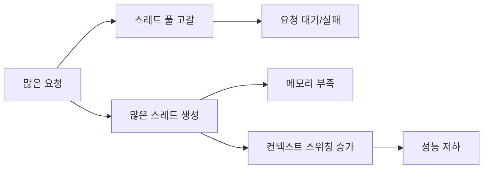

**해결 방안:**
- 적절한 스레드 풀 크기 설정
- 비동기 처리 도입 (코루틴, 버추얼 스레드)
- I/O 작업 최적화

### 코루틴 문제점
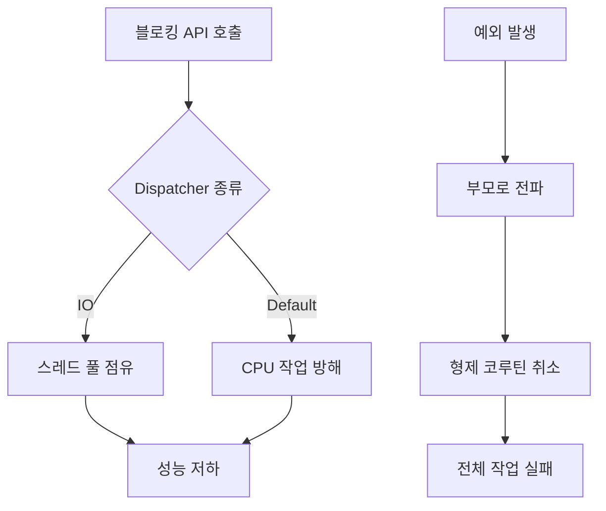

**해결 방안:**
- 블로킹 API는 `withContext(Dispatchers.IO)`로 감싸기
- `supervisorScope` 사용으로 예외 격리
- `CoroutineExceptionHandler`로 예외 처리

### 버추얼 스레드 문제점
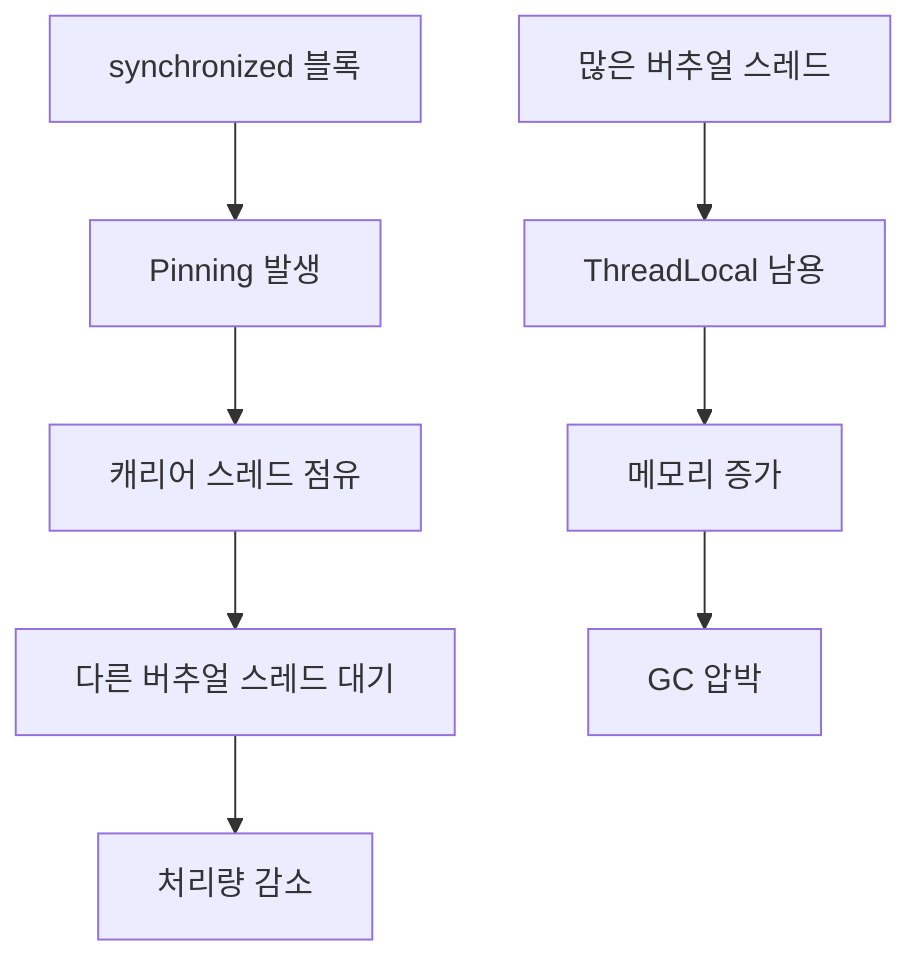

**해결 방안:**
- `synchronized` 대신 `ReentrantLock` 사용
- `ThreadLocal` 대신 `ScopedValue` 사용 (Java 21+)
- Pinning 모니터링: `-Djdk.tracePinnedThreads=full`

## 비동기 처리에서의 트랜잭션

비동기 처리에서 트랜잭션 관리는 스레드 기반 트랜잭션 관리와 다른 접근이 필요합니다.

### 기본 개념

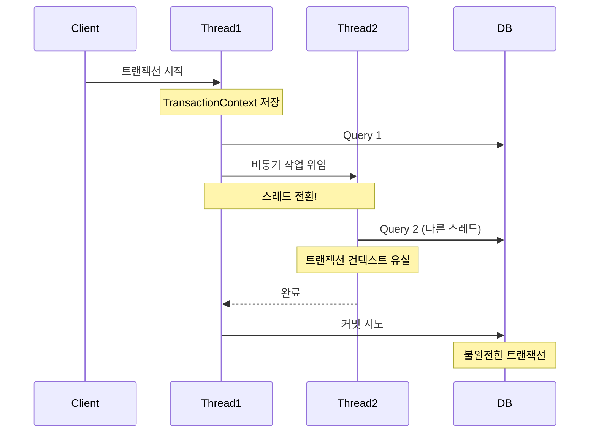

### 문제점
1. **ThreadLocal 의존성**: Spring의 `@Transactional`은 ThreadLocal을 사용하여 트랜잭션 컨텍스트를 저장합니다.
2. **스레드 전환**: 비동기 작업 중 스레드가 변경되면 트랜잭션 컨텍스트가 유실됩니다.
3. **트랜잭션 경계 불명확**: 비동기 작업의 시작과 종료 시점이 명확하지 않아 트랜잭션 범위 설정이 어렵습니다.

### 코루틴에서의 트랜잭션 주의점
* **suspend = 안전 보장 아님**: `suspend` 함수라도 `withContext(Dispatchers.IO)` 등으로 스레드 전환이 발생하면 ThreadLocal 기반 트랜잭션이 깨질 수 있습니다.
* **컨텍스트 전파 필요**: 트랜잭션을 코루틴 컨텍스트로 명시적으로 전파하지 않으면 자식 코루틴에서 트랜잭션을 찾지 못합니다.
* **병렬 분기 금지**: 하나의 트랜잭션에서 `launch/async`로 병렬 분기를 하면 커밋 시점과 실패 전파가 불명확해집니다.
* **경계 불명확**: 코루틴이 비동기로 길게 살아 있으면 롱 트랜잭션이 되기 쉽습니다.

```kotlin
// CoroutineContext로 트랜잭션 전파 (ThreadLocal 의존 최소화)
class TransactionElement(val tx: TransactionContext) : CoroutineContext.Element {
    companion object Key : CoroutineContext.Key<TransactionElement>
    override val key: CoroutineContext.Key<*> = Key
}

suspend fun <T> withTransaction(tx: TransactionContext, block: suspend () -> T): T {
    return withContext(TransactionElement(tx)) { block() }
}
```

### 버추얼 스레드에서의 트랜잭션 주의점
* **ThreadLocal은 스레드 단위**: 부모 버추얼 스레드의 ThreadLocal은 자식 버추얼 스레드에 자동 전파되지 않습니다.
* **분기 시 트랜잭션 분리**: 새로운 버추얼 스레드를 만들면 별도 트랜잭션으로 취급해야 안전합니다.
* **트랜잭션 경계 유지**: 동일 트랜잭션을 유지하려면 같은 버추얼 스레드 내에서 작업을 마무리해야 합니다.
* **Pinning 가능성**: `synchronized` 등으로 캐리어 스레드가 고정되면 동시성이 떨어지고 롱 트랜잭션이 생길 수 있습니다.

### 예제 코드

#### 코루틴 - 잘못된 패턴 (ThreadLocal 유실)
```kotlin
@Transactional
suspend fun updateUserBad(userId: Long) {
    // 스레드 전환으로 ThreadLocal 트랜잭션이 끊길 수 있음
    withContext(Dispatchers.IO) {
        userRepository.updateStatus(userId, "ACTIVE")
    }
}
```

#### 코루틴 - 권장 패턴 (경계 명확화)
```kotlin
@Transactional
suspend fun updateUserGood(userId: Long) = coroutineScope {
    userRepository.updateStatus(userId, "ACTIVE")
    // 트랜잭션 외부 비동기 작업
    launch {
        notificationService.send(userId)
    }
}
```

#### 버추얼 스레드 - 잘못된 패턴 (ThreadLocal 전파 안 됨)
```kotlin
@Transactional
fun updateOrderBad(orderId: Long) {
    Thread.startVirtualThread {
        // 새로운 버추얼 스레드로 분기하면서 트랜잭션 컨텍스트가 없음
        orderRepository.markPaid(orderId)
    }.join()
}
```

#### 버추얼 스레드 - 권장 패턴 (같은 스레드에서 완료)
```kotlin
@Transactional
fun updateOrderGood(orderId: Long) {
    // 트랜잭션 경계 안에서 처리
    orderRepository.markPaid(orderId)
    orderRepository.appendHistory(orderId, "PAID")
}
```

#### 관련 예제/테스트 코드
- 예제: `kotlin-practice/src/main/kotlin/com/biuea/kotlinpractice/async/AsyncTransactionExamples.kt`
- 테스트: `kotlin-practice/src/test/kotlin/com/biuea/kotlinpractice/AsyncTransactionExamplesTest.kt`

### 해결 방안

#### 1. 코루틴 - TransactionContext 전파

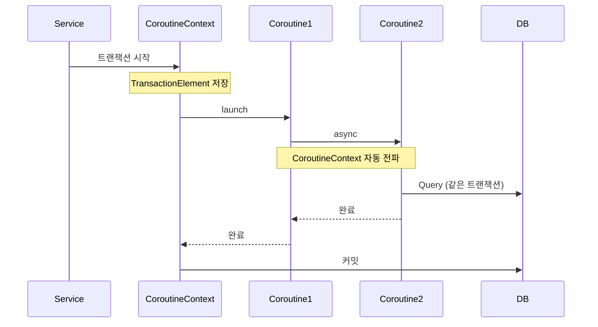

**특징:**
- CoroutineContext를 통해 트랜잭션 전파
- `@Transactional`과 suspend 함수 조합
- 구조화된 동시성으로 트랜잭션 범위 명확화

#### 2. 버추얼 스레드 - ThreadLocal 유지

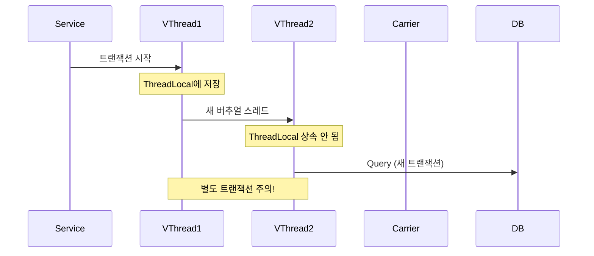

**특징:**
- 버추얼 스레드도 ThreadLocal 지원
- 각 버추얼 스레드는 독립적인 ThreadLocal 보유
- 부모-자식 간 ThreadLocal 자동 전파 안 됨

#### 3. 해결 전략 비교

|전략|적용 대상|장점|단점|
|-|-|-|-|
|트랜잭션 분리|코루틴, 버추얼 스레드|구현 단순, 데이터 일관성 명확|여러 트랜잭션 관리 필요|
|명시적 전파|코루틴|컨텍스트 자동 전파|suspend 함수로 제한|
|동기화 대기|모두|기존 코드 활용|비동기 이점 상실|
|분산 트랜잭션|모두|완전한 ACID 보장|복잡도 증가, 성능 저하|

### 권장 패턴

#### 패턴 1: 트랜잭션 경계 명확화
```kotlin
// 나쁜 예
suspend fun processOrder(orderId: Long) {
    // 트랜잭션 경계 불명확
    launch { updateInventory() }
    launch { sendEmail() }
}

// 좋은 예
suspend fun processOrder(orderId: Long) {
    // 트랜잭션 내 작업
    transactional {
        updateOrderStatus()
        updateInventory()
    }
    // 트랜잭션 외 작업
    sendEmail()
}
```

#### 패턴 2: 읽기와 쓰기 분리
```kotlin
// 읽기는 병렬, 쓰기는 순차
suspend fun processData() = coroutineScope {
    // 병렬 읽기 (트랜잭션 없음)
    val data1 = async { fetchData1() }
    val data2 = async { fetchData2() }

    // 순차 쓰기 (트랜잭션)
    transactional {
        save(data1.await())
        save(data2.await())
    }
}
```
