# 📊 오픈마켓 플로우 다이어그램

> 이 문서는 오픈마켓 프로젝트의 주요 플로우를 Mermaid 다이어그램으로 시각화합니다.

---

## 1. 회원 플로우

### 1.1 구매자 회원가입

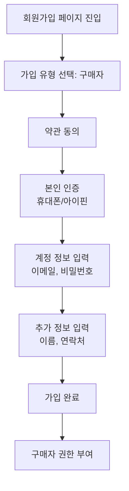
```mermaid
flowchart TD
    A[회원가입 페이지 진입] --> B[가입 유형 선택: 구매자]
    B --> C[약관 동의]
    C --> D[본인 인증<br/>휴대폰/아이핀]
    D --> E[계정 정보 입력<br/>이메일, 비밀번호]
    E --> F[추가 정보 입력<br/>이름, 연락처]
    F --> G[가입 완료]
    G --> H[구매자 권한 부여]
```

### 1.2 셀러 회원가입 & 심사

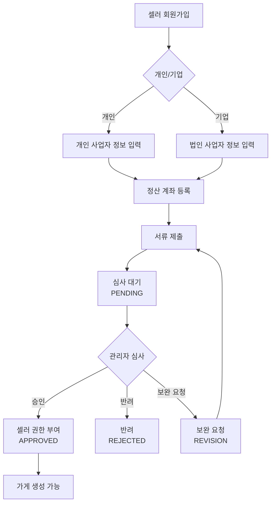
```mermaid
flowchart TD
    A[셀러 회원가입] --> B{개인/기업}
    B -->|개인| C[개인 사업자 정보 입력]
    B -->|기업| D[법인 사업자 정보 입력]
    C --> E[정산 계좌 등록]
    D --> E
    E --> F[서류 제출]
    F --> G[심사 대기<br/>PENDING]
    G --> H{관리자 심사}
    H -->|승인| I[셀러 권한 부여<br/>APPROVED]
    H -->|반려| J[반려<br/>REJECTED]
    H -->|보완 요청| K[보완 요청<br/>REVISION]
    K --> F
    I --> L[가게 생성 가능]
```

---

## 2. 상품 플로우

### 2.1 상품 등록 플로우 (셀러)

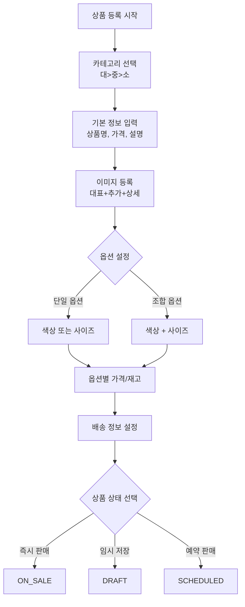
```mermaid
flowchart TD
    A[상품 등록 시작] --> B[카테고리 선택<br/>대>중>소]
    B --> C[기본 정보 입력<br/>상품명, 가격, 설명]
    C --> D[이미지 등록<br/>대표+추가+상세]
    D --> E{옵션 설정}
    E -->|단일 옵션| F[색상 또는 사이즈]
    E -->|조합 옵션| G[색상 + 사이즈]
    F --> H[옵션별 가격/재고]
    G --> H
    H --> I[배송 정보 설정]
    I --> J{상품 상태 선택}
    J -->|즉시 판매| K[ON_SALE]
    J -->|임시 저장| L[DRAFT]
    J -->|예약 판매| M[SCHEDULED]
```

### 2.2 재고 차감 플로우 (동시성 제어)

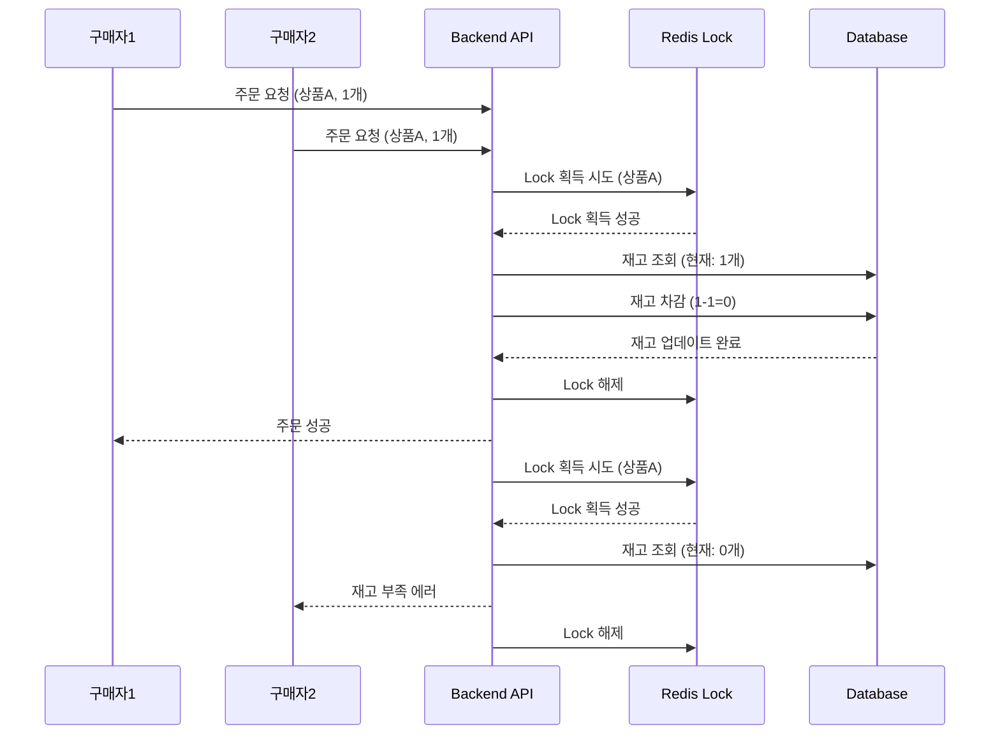
```mermaid
sequenceDiagram
    participant User1 as 구매자1
    participant User2 as 구매자2
    participant API as Backend API
    participant Redis as Redis Lock
    participant DB as Database

    User1->>API: 주문 요청 (상품A, 1개)
    User2->>API: 주문 요청 (상품A, 1개)

    API->>Redis: Lock 획득 시도 (상품A)
    Redis-->>API: Lock 획득 성공

    API->>DB: 재고 조회 (현재: 1개)
    API->>DB: 재고 차감 (1-1=0)
    DB-->>API: 재고 업데이트 완료

    API->>Redis: Lock 해제
    API-->>User1: 주문 성공

    API->>Redis: Lock 획득 시도 (상품A)
    Redis-->>API: Lock 획득 성공
    API->>DB: 재고 조회 (현재: 0개)
    API-->>User2: 재고 부족 에러
    API->>Redis: Lock 해제
```

---

## 3. 주문/결제 플로우

### 3.1 전체 주문 프로세스

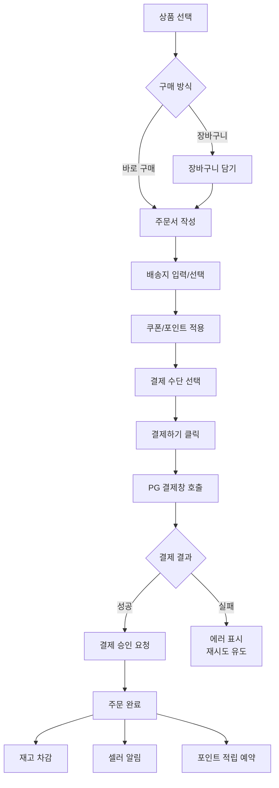
```mermaid
flowchart TD
    A[상품 선택] --> B{구매 방식}
    B -->|장바구니| C[장바구니 담기]
    B -->|바로 구매| D[주문서 작성]
    C --> D
    D --> E[배송지 입력/선택]
    E --> F[쿠폰/포인트 적용]
    F --> G[결제 수단 선택]
    G --> H[결제하기 클릭]
    H --> I[PG 결제창 호출]
    I --> J{결제 결과}
    J -->|성공| K[결제 승인 요청]
    J -->|실패| L[에러 표시<br/>재시도 유도]
    K --> M[주문 완료]
    M --> N[재고 차감]
    M --> O[셀러 알림]
    M --> P[포인트 적립 예약]
```

### 3.2 PG 결제 플로우

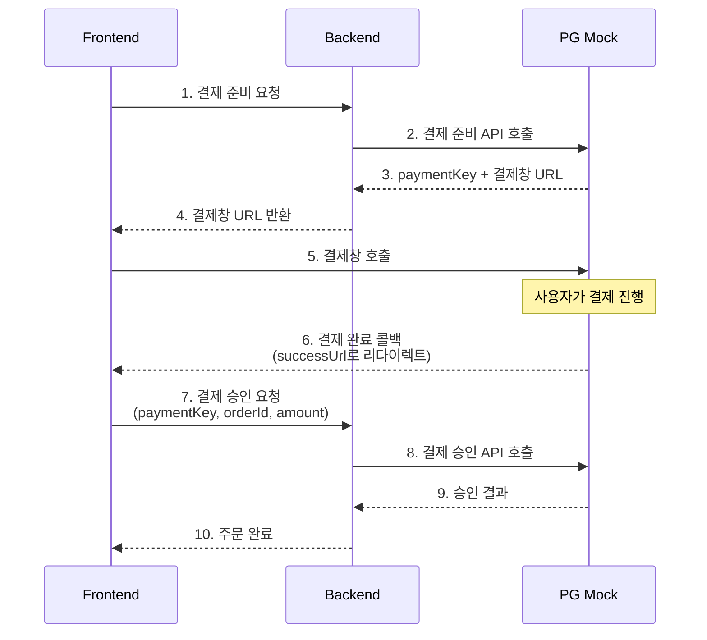
```mermaid
sequenceDiagram
    participant F as Frontend
    participant B as Backend
    participant PG as PG Mock

    F->>B: 1. 결제 준비 요청
    B->>PG: 2. 결제 준비 API 호출
    PG-->>B: 3. paymentKey + 결제창 URL
    B-->>F: 4. 결제창 URL 반환

    F->>PG: 5. 결제창 호출
    Note over PG: 사용자가 결제 진행
    PG-->>F: 6. 결제 완료 콜백<br/>(successUrl로 리다이렉트)

    F->>B: 7. 결제 승인 요청<br/>(paymentKey, orderId, amount)
    B->>PG: 8. 결제 승인 API 호출
    PG-->>B: 9. 승인 결과
    B-->>F: 10. 주문 완료
```

---

## 4. 셀러 주문 처리 플로우

### 4.1 주문 처리 상태 머신

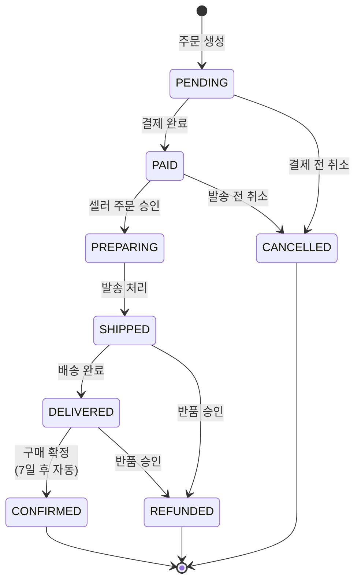
```mermaid
stateDiagram-v2
    [*] --> PENDING: 주문 생성
    PENDING --> PAID: 결제 완료
    PAID --> PREPARING: 셀러 주문 승인
    PREPARING --> SHIPPED: 발송 처리
    SHIPPED --> DELIVERED: 배송 완료
    DELIVERED --> CONFIRMED: 구매 확정<br/>(7일 후 자동)

    PENDING --> CANCELLED: 결제 전 취소
    PAID --> CANCELLED: 발송 전 취소
    SHIPPED --> REFUNDED: 반품 승인
    DELIVERED --> REFUNDED: 반품 승인

    CONFIRMED --> [*]
    CANCELLED --> [*]
    REFUNDED --> [*]
```

### 4.2 반품/교환 처리

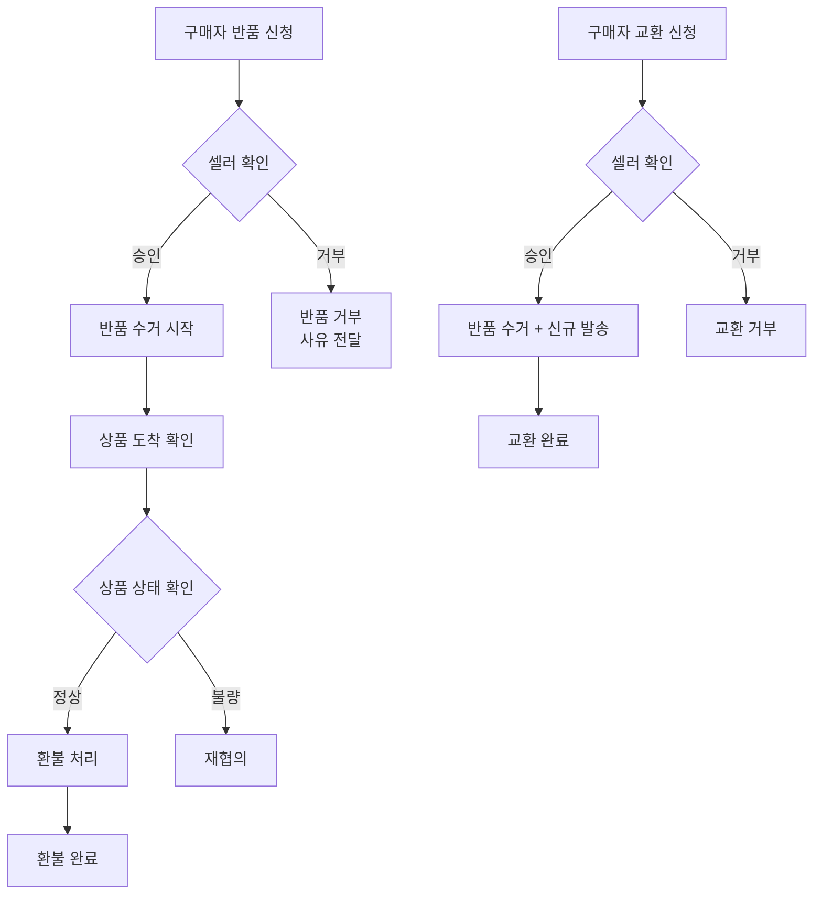
```mermaid
flowchart TD
    A[구매자 반품 신청] --> B{셀러 확인}
    B -->|승인| C[반품 수거 시작]
    B -->|거부| D[반품 거부<br/>사유 전달]
    C --> E[상품 도착 확인]
    E --> F{상품 상태 확인}
    F -->|정상| G[환불 처리]
    F -->|불량| H[재협의]
    G --> I[환불 완료]

    J[구매자 교환 신청] --> K{셀러 확인}
    K -->|승인| L[반품 수거 + 신규 발송]
    K -->|거부| M[교환 거부]
    L --> N[교환 완료]
```

---

## 5. 정산 플로우

### 5.1 정산 프로세스

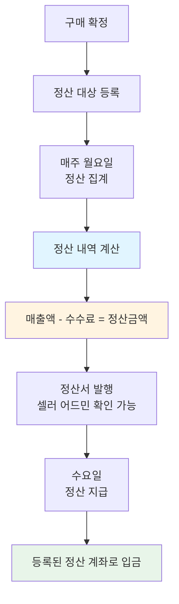
```mermaid
flowchart TD
    A[구매 확정] --> B[정산 대상 등록]
    B --> C[매주 월요일<br/>정산 집계]
    C --> D[정산 내역 계산]
    D --> E[매출액 - 수수료 = 정산금액]
    E --> F[정산서 발행<br/>셀러 어드민 확인 가능]
    F --> G[수요일<br/>정산 지급]
    G --> H[등록된 정산 계좌로 입금]

    style D fill:#e1f5ff
    style E fill:#fff4e1
    style H fill:#e8f5e9
```

### 5.2 정산 금액 계산

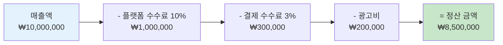
```mermaid
flowchart LR
    A[매출액<br/>₩10,000,000] --> B[- 플랫폼 수수료 10%<br/>₩1,000,000]
    B --> C[- 결제 수수료 3%<br/>₩300,000]
    C --> D[- 광고비<br/>₩200,000]
    D --> E[= 정산 금액<br/>₩8,500,000]

    style A fill:#e3f2fd
    style E fill:#c8e6c9
```

---

## 6. 외부 채널 연동

### 6.1 상품 동기화 플로우

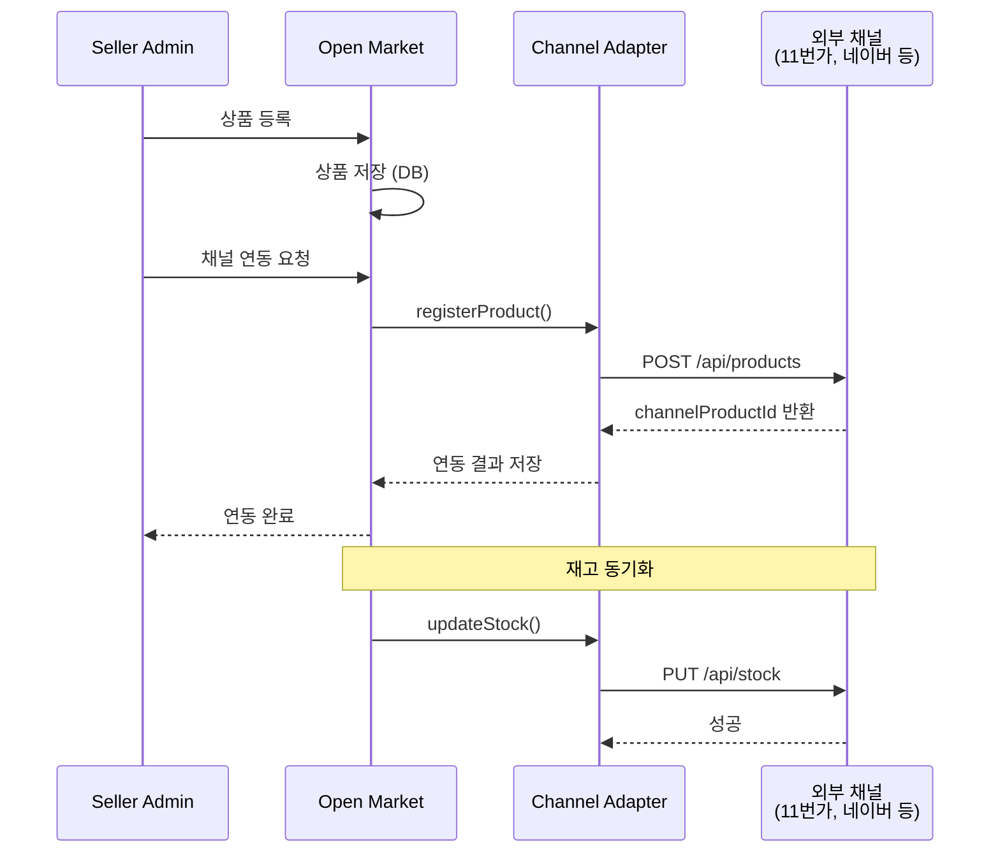
```mermaid
sequenceDiagram
    participant S as Seller Admin
    participant OM as Open Market
    participant Adapter as Channel Adapter
    participant CH as 외부 채널<br/>(11번가, 네이버 등)

    S->>OM: 상품 등록
    OM->>OM: 상품 저장 (DB)
    S->>OM: 채널 연동 요청
    OM->>Adapter: registerProduct()
    Adapter->>CH: POST /api/products
    CH-->>Adapter: channelProductId 반환
    Adapter-->>OM: 연동 결과 저장
    OM-->>S: 연동 완료

    Note over OM,CH: 재고 동기화
    OM->>Adapter: updateStock()
    Adapter->>CH: PUT /api/stock
    CH-->>Adapter: 성공
```

### 6.2 외부 채널 Webhook 수신

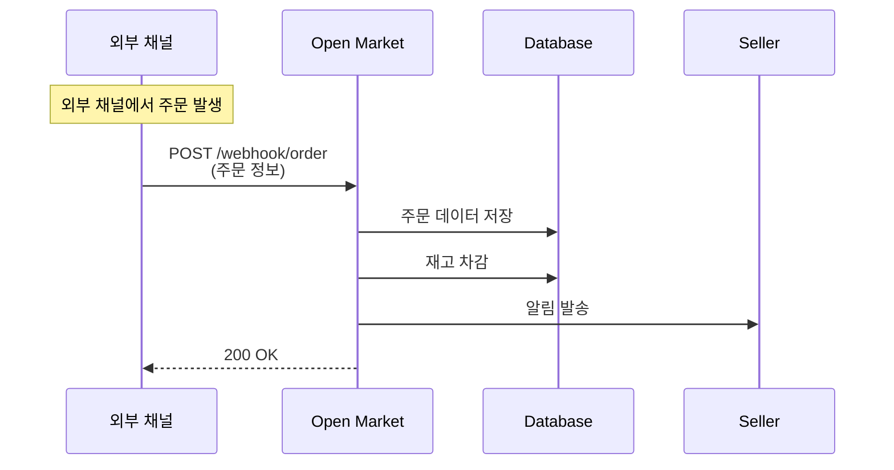
```mermaid
sequenceDiagram
    participant CH as 외부 채널
    participant OM as Open Market
    participant DB as Database
    participant Seller as Seller

    Note over CH: 외부 채널에서 주문 발생
    CH->>OM: POST /webhook/order<br/>(주문 정보)
    OM->>DB: 주문 데이터 저장
    OM->>DB: 재고 차감
    OM->>Seller: 알림 발송
    OM-->>CH: 200 OK
```

---

## 7. 인프라 & 모니터링

### 7.1 CI/CD 파이프라인

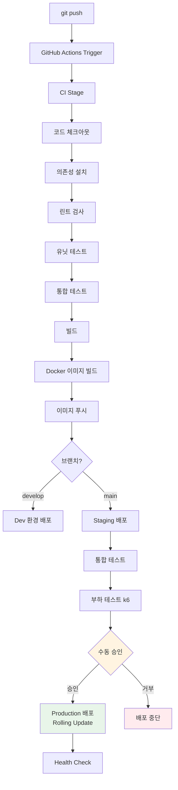
```mermaid
flowchart TD
    A[git push] --> B[GitHub Actions Trigger]
    B --> C[CI Stage]
    C --> D[코드 체크아웃]
    D --> E[의존성 설치]
    E --> F[린트 검사]
    F --> G[유닛 테스트]
    G --> H[통합 테스트]
    H --> I[빌드]
    I --> J[Docker 이미지 빌드]
    J --> K[이미지 푸시]

    K --> L{브랜치?}
    L -->|develop| M[Dev 환경 배포]
    L -->|main| N[Staging 배포]
    N --> O[통합 테스트]
    O --> P[부하 테스트 k6]
    P --> Q{수동 승인}
    Q -->|승인| R[Production 배포<br/>Rolling Update]
    Q -->|거부| S[배포 중단]
    R --> T[Health Check]

    style Q fill:#fff4e1
    style R fill:#e8f5e9
    style S fill:#ffebee
```

### 7.2 Rolling Update 배포

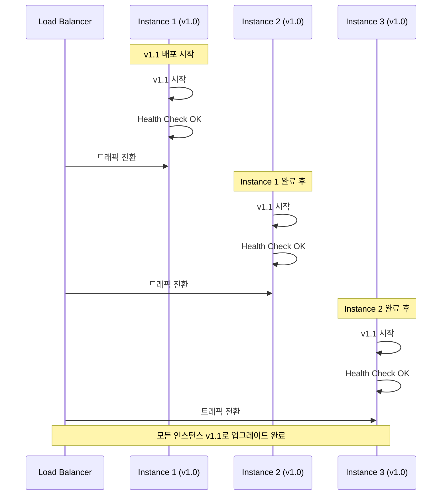
```mermaid
sequenceDiagram
    participant LB as Load Balancer
    participant I1 as Instance 1 (v1.0)
    participant I2 as Instance 2 (v1.0)
    participant I3 as Instance 3 (v1.0)

    Note over I1: v1.1 배포 시작
    I1->>I1: v1.1 시작
    I1->>I1: Health Check OK
    LB->>I1: 트래픽 전환

    Note over I2: Instance 1 완료 후
    I2->>I2: v1.1 시작
    I2->>I2: Health Check OK
    LB->>I2: 트래픽 전환

    Note over I3: Instance 2 완료 후
    I3->>I3: v1.1 시작
    I3->>I3: Health Check OK
    LB->>I3: 트래픽 전환

    Note over LB,I3: 모든 인스턴스 v1.1로 업그레이드 완료
```

### 7.3 Pinpoint 모니터링 흐름

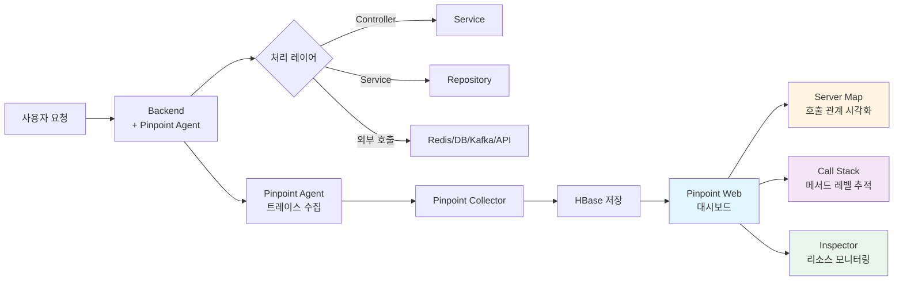
```mermaid
flowchart LR
    A[사용자 요청] --> B[Backend<br/>+ Pinpoint Agent]
    B --> C{처리 레이어}
    C -->|Controller| D[Service]
    C -->|Service| E[Repository]
    C -->|외부 호출| F[Redis/DB/Kafka/API]

    B --> G[Pinpoint Agent<br/>트레이스 수집]
    G --> H[Pinpoint Collector]
    H --> I[HBase 저장]
    I --> J[Pinpoint Web<br/>대시보드]

    J --> K[Server Map<br/>호출 관계 시각화]
    J --> L[Call Stack<br/>메서드 레벨 추적]
    J --> M[Inspector<br/>리소스 모니터링]

    style J fill:#e1f5ff
    style K fill:#fff4e1
    style L fill:#f3e5f5
    style M fill:#e8f5e9
```

---

## 8. 검색 플로우

### 8.1 상품 검색 프로세스

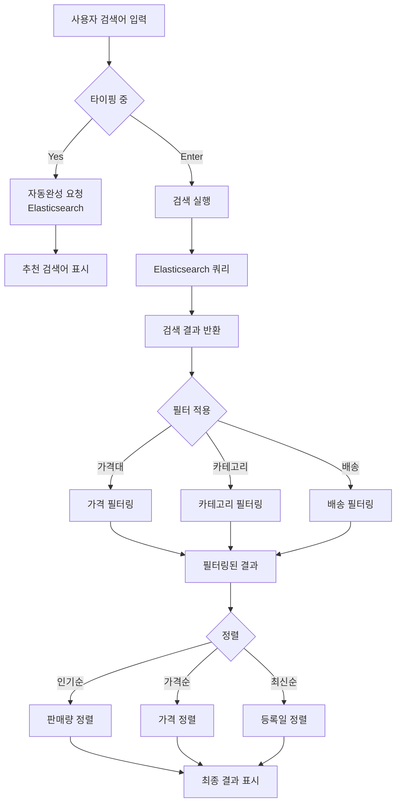
```mermaid
flowchart TD
    A[사용자 검색어 입력] --> B{타이핑 중}
    B -->|Yes| C[자동완성 요청<br/>Elasticsearch]
    C --> D[추천 검색어 표시]

    B -->|Enter| E[검색 실행]
    E --> F[Elasticsearch 쿼리]
    F --> G[검색 결과 반환]
    G --> H{필터 적용}
    H -->|가격대| I[가격 필터링]
    H -->|카테고리| J[카테고리 필터링]
    H -->|배송| K[배송 필터링]
    I --> L[필터링된 결과]
    J --> L
    K --> L
    L --> M{정렬}
    M -->|인기순| N[판매량 정렬]
    M -->|가격순| O[가격 정렬]
    M -->|최신순| P[등록일 정렬]
    N --> Q[최종 결과 표시]
    O --> Q
    P --> Q
```

---

## 9. 이벤트 기반 아키텍처

### 9.1 주요 이벤트 플로우

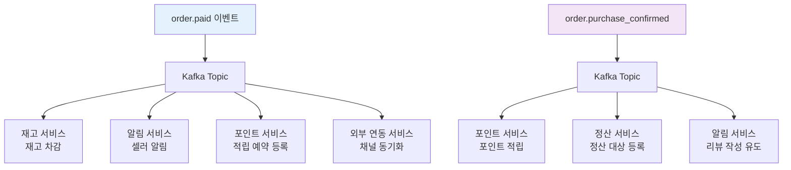
```mermaid
flowchart TD
    A[order.paid 이벤트] --> B[Kafka Topic]
    B --> C[재고 서비스<br/>재고 차감]
    B --> D[알림 서비스<br/>셀러 알림]
    B --> E[포인트 서비스<br/>적립 예약 등록]
    B --> F[외부 연동 서비스<br/>채널 동기화]

    G[order.purchase_confirmed] --> H[Kafka Topic]
    H --> I[포인트 서비스<br/>포인트 적립]
    H --> J[정산 서비스<br/>정산 대상 등록]
    H --> K[알림 서비스<br/>리뷰 작성 유도]

    style A fill:#e3f2fd
    style G fill:#f3e5f5
```

### 9.2 이벤트 구독 패턴

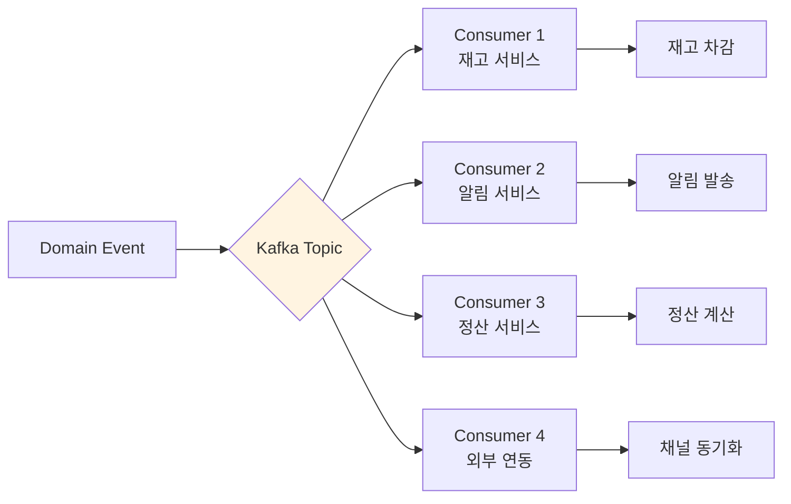
```mermaid
graph LR
    A[Domain Event] --> B{Kafka Topic}
    B --> C[Consumer 1<br/>재고 서비스]
    B --> D[Consumer 2<br/>알림 서비스]
    B --> E[Consumer 3<br/>정산 서비스]
    B --> F[Consumer 4<br/>외부 연동]

    C --> G[재고 차감]
    D --> H[알림 발송]
    E --> I[정산 계산]
    F --> J[채널 동기화]

    style B fill:#fff4e1
```

---

## 10. 프론트엔드 상태 관리

### 10.1 상태 유형별 관리 전략

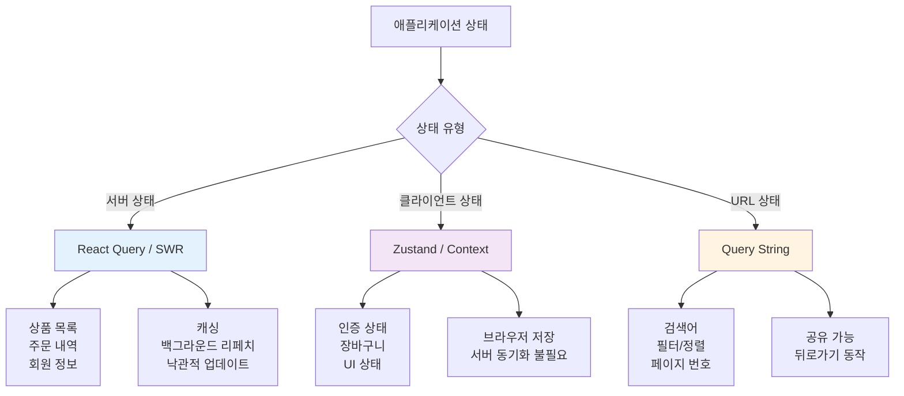
```mermaid
flowchart TD
    A[애플리케이션 상태] --> B{상태 유형}
    B -->|서버 상태| C[React Query / SWR]
    B -->|클라이언트 상태| D[Zustand / Context]
    B -->|URL 상태| E[Query String]

    C --> F[상품 목록<br/>주문 내역<br/>회원 정보]
    C --> G[캐싱<br/>백그라운드 리페치<br/>낙관적 업데이트]

    D --> H[인증 상태<br/>장바구니<br/>UI 상태]
    D --> I[브라우저 저장<br/>서버 동기화 불필요]

    E --> J[검색어<br/>필터/정렬<br/>페이지 번호]
    E --> K[공유 가능<br/>뒤로가기 동작]

    style C fill:#e3f2fd
    style D fill:#f3e5f5
    style E fill:#fff4e1
```

### 10.2 인증 플로우

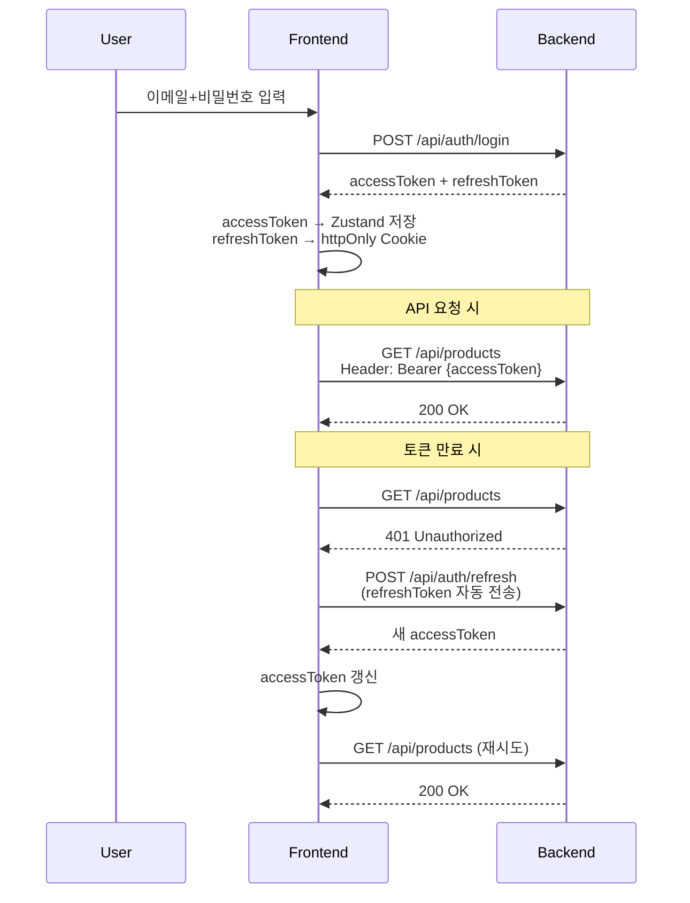
```mermaid
sequenceDiagram
    participant U as User
    participant F as Frontend
    participant B as Backend

    U->>F: 이메일+비밀번호 입력
    F->>B: POST /api/auth/login
    B-->>F: accessToken + refreshToken
    F->>F: accessToken → Zustand 저장<br/>refreshToken → httpOnly Cookie

    Note over F,B: API 요청 시
    F->>B: GET /api/products<br/>Header: Bearer {accessToken}
    B-->>F: 200 OK

    Note over F,B: 토큰 만료 시
    F->>B: GET /api/products
    B-->>F: 401 Unauthorized
    F->>B: POST /api/auth/refresh<br/>(refreshToken 자동 전송)
    B-->>F: 새 accessToken
    F->>F: accessToken 갱신
    F->>B: GET /api/products (재시도)
    B-->>F: 200 OK
```

---

## 11. 부하 테스트 시나리오 (k6)

### 11.1 Load Test 단계

```mermaid
graph LR
    A[0 VU] --> B[Ramp Up<br/>0 → 100 VU<br/>5분]
    B --> C[Steady State<br/>100 VU<br/>10분]
    C --> D[Ramp Down<br/>100 → 0 VU<br/>5분]

    style A fill:#e8f5e9
    style B fill:#fff4e1
    style C fill:#ffebee
    style D fill:#e1f5ff
```

### 11.2 Spike Test 패턴

```mermaid
graph LR
    A[10 VU] --> B[급증<br/>10 → 500 VU<br/>1분]
    B --> C[Peak<br/>500 VU<br/>2분]
    C --> D[급감<br/>500 → 10 VU<br/>1분]
    D --> E[Recovery<br/>10 VU<br/>2분]

    style B fill:#ffebee
    style C fill:#f44336,color:#fff
    style D fill:#fff4e1
```

---

## 12. 전체 시스템 아키텍처

```mermaid
graph TB
    subgraph Frontend
        A[Next.js App]
        B[구매자 앱]
        C[셀러 어드민]
        D[플랫폼 어드민]
    end

    subgraph Load Balancer
        E[Nginx]
    end

    subgraph Backend Instances
        F[Backend #1<br/>Spring Boot]
        G[Backend #2<br/>Spring Boot]
        H[Backend #3<br/>Spring Boot]
    end

    subgraph Shared Infrastructure
        I[MySQL<br/>Primary]
        J[Redis<br/>Cluster]
        K[Kafka<br/>Cluster]
        L[Elasticsearch]
    end

    subgraph Monitoring
        M[Pinpoint<br/>Collector]
        N[Pinpoint<br/>Web]
    end

    subgraph External
        O[PG Mock<br/>결제]
        P[Channel Mock<br/>외부채널]
    end

    A --> E
    B --> E
    C --> E
    D --> E

    E --> F
    E --> G
    E --> H

    F --> I
    F --> J
    F --> K
    F --> L
    G --> I
    G --> J
    G --> K
    G --> L
    H --> I
    H --> J
    H --> K
    H --> L

    F --> M
    G --> M
    H --> M
    M --> N

    F --> O
    F --> P
    G --> O
    G --> P
    H --> O
    H --> P

    style Frontend fill:#e3f2fd
    style Backend Instances fill:#f3e5f5
    style Shared Infrastructure fill:#fff4e1
    style Monitoring fill:#e8f5e9
    style External fill:#ffebee
```

---

## 범례

```mermaid
graph LR
    A[시작/종료] --> B{조건 분기}
    B --> C[처리 과정]
    C --> D[(데이터베이스)]
    C --> E[/입출력/]

    style A fill:#e8f5e9
    style B fill:#fff4e1
    style C fill:#e3f2fd
    style D fill:#f3e5f5
    style E fill:#ffebee
```

- 🟢 초록: 시작/완료/성공
- 🟡 노랑: 조건 분기/대기
- 🔵 파랑: 일반 처리
- 🟣 보라: 데이터 저장/조회
- 🔴 빨강: 에러/취소/실패
