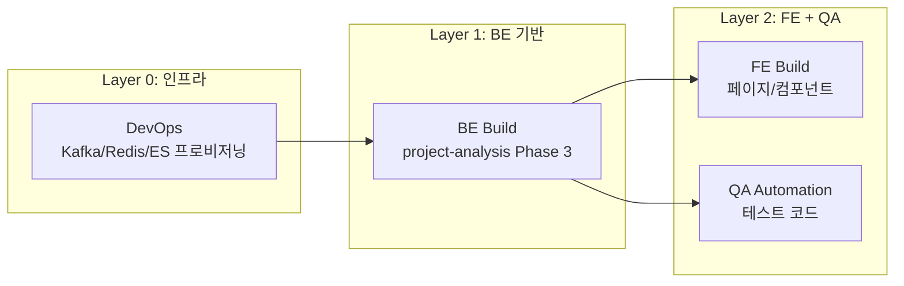
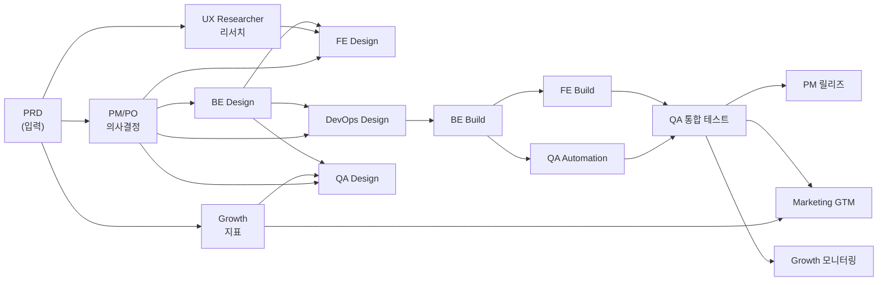

# 제품 개발 파이프라인 (Product Development)

**전 직군 협업** 기반 제품 개발 사이클을 수행한다: Discovery → Design → Build → Release.

> BE 중심 구현은 `project-analysis` 파이프라인을 사용한다. → `../project-analysis/CLAUDE.md`
> 이 파이프라인은 전 직군이 **동시에** 참여하는 제품 개발 전체 사이클을 관리한다.

## 공통 가이드 참조

- [문체/용어 규칙](../common/output-style.md)
- [Mermaid 다이어그램](../common/mermaid.md)
- [티켓 작성법](../common/ticket-guide.md)
- [문서 싱크 체계](../common/document-sync.md)

## 실행 원칙

- Phase 1(Discovery) → Phase 2(Design) → Phase 3(Build) → Phase 4(Release) 순서.
- **Phase 내 직군은 최대한 병렬** 실행한다. 직군 간 의존이 있으면 명시한다.
- 각 Phase 종료 시 **리뷰 게이트**를 통과해야 다음 Phase 진입 가능.
- 추측 금지. 관련 코드/문서를 읽고 분석한다.
- **BE 구현 설계는 project-analysis 파이프라인에 위임**한다. 이 파이프라인에서는 BE 설계 결과를 입력으로 받는다.

## 전체 구조

```mermaid
flowchart LR
    subgraph Phase1["Phase 1: Discovery"]
        PM["PM/PO"]
        UXR["UX Researcher"]
        GROWTH["Growth Analyst"]
    end

    subgraph Gate1["Review Gate 1"]
        RG1["Discovery 완전성 검증"]
    end

    subgraph Phase2["Phase 2: Design"]
        BE_D["BE Design\n(project-analysis 위임)"]
        FE_D["FE Design"]
        DEVOPS_D["DevOps Design"]
        QA_D["QA Design"]
    end

    subgraph Gate2["Review Gate 2"]
        RG2["Design 정합성 검증"]
    end

    subgraph Phase3["Phase 3: Build"]
        BE_B["BE Build\n(project-analysis 위임)"]
        FE_B["FE Build"]
        DEVOPS_B["DevOps Build"]
        QA_B["QA Automation"]
    end

    subgraph Gate3["Review Gate 3"]
        RG3["Build 품질 검증"]
    end

    subgraph Phase4["Phase 4: Release"]
        QA_R["QA 통합 테스트"]
        PM_R["PM 릴리즈"]
        MKT["Marketing GTM"]
        GR_R["Growth 모니터링"]
    end

    Phase1 --> Gate1 --> Phase2 --> Gate2 --> Phase3 --> Gate3 --> Phase4
```



---

## 에이전트 역할 정의

각 단계에서 직군별 전문가 에이전트를 스폰한다. 에이전트명은 `{phase}-{role}` 형식.

### Phase 1: Discovery 에이전트

| 에이전트 | 역할 | 산출물 | 실행 모드 |
|---------|------|--------|----------|
| [`pm-po`](../agents/pm-po.md) | PRD 정제, 우선순위 확정, 스프린트 계획 | `pm_decisions.md`, `release_plan.md`, `kpi_definition.md` | foreground |
| [`ux-researcher`](../agents/ux-researcher.md) | 페르소나, 여정 지도, 경쟁사 UX | `ux_research.md` | background |
| [`growth-analyst`](../agents/growth-analyst.md) | 지표 체계, 퍼널 정의, A/B 테스트 계획 | `growth_metrics.md`, `funnel_analysis.md` | background |

### Phase 2: Design 에이전트

| 에이전트 | 역할 | 산출물 | 실행 모드 |
|---------|------|--------|----------|
| **BE Design** | `project-analysis` 파이프라인 Phase 2 실행 | `be/` 디렉토리 전체 | background |
| [`fe-lead`](../agents/fe-lead.md) | 페이지 설계, 컴포넌트 트리, API 연동 | `fe_design.md` | background |
| [`devops-engineer`](../agents/devops-engineer.md) | 인프라 설계, CI/CD, 모니터링 | `infra_design.md` | background |
| [`qa-lead`](../agents/qa-lead.md) | 테스트 전략, 테스트 케이스 설계 | `qa_test_plan.md`, `qa_test_cases.md` | background |

### Phase 2 페르소나 에이전트 (선택적 병행)

| 에이전트 | 관점 | 병행 시점 |
|---------|------|----------|
| [`be-tech-lead`](../agents/be-tech-lead.md) | 아키텍처 일관성, 서비스 간 영향 | Phase 2 BE Design 리뷰 |
| [`be-senior`](../agents/be-senior.md) | 프로덕션 안전성, 엣지 케이스 | Phase 2 BE Design 리뷰 |

### Phase 3: Build 에이전트

| 에이전트 | 역할 | 산출물 | 실행 모드 |
|---------|------|--------|----------|
| **BE Build** | `project-analysis` 파이프라인 Phase 3 실행 | BE 소스 코드 | background (티켓 단위) |
| [`fe-developer`](../agents/fe-developer.md) | FE 컴포넌트/페이지 구현 | FE 소스 코드 | background (티켓 단위) |
| [`devops-engineer`](../agents/devops-engineer.md) | 인프라 프로비저닝, 파이프라인 구축 | docker-compose, CI/CD | background |
| [`qa-tester`](../agents/qa-tester.md) | 자동화 테스트 작성 | 테스트 코드 | background |

### Phase 4: Release 에이전트

| 에이전트 | 역할 | 산출물 | 실행 모드 |
|---------|------|--------|----------|
| [`qa-tester`](../agents/qa-tester.md) | 통합/회귀 테스트 실행 | `qa_execution_report.md` | foreground |
| [`pm-po`](../agents/pm-po.md) | 릴리즈 노트, Feature Flag 오픈 | `release_notes.md` | foreground |
| [`marketer`](../agents/marketer.md) | GTM 실행, 사용자 공지 | `gtm_strategy.md`, `user_communication.md` | background |
| [`growth-analyst`](../agents/growth-analyst.md) | 대시보드 세팅, 지표 모니터링 | `growth_dashboard.md` | background |

---

## 에이전트 스폰 규칙

1. **Phase 내 직군은 최대한 병렬** 스폰한다.
2. **리뷰 게이트는 foreground**로 실행한다.
3. **BE Design/Build는 project-analysis 파이프라인에 위임**한다. 결과만 수신.
4. **FE Build는 BE API가 확정된 후** 스폰한다 (BE Design 완료 후).
5. **DevOps Build는 BE/FE Design 완료 후** 스폰한다 (인프라 요구사항 확정).
6. **QA Automation은 BE/FE Build와 병렬** 스폰한다 (테스트 케이스 기반).
7. **Phase 4는 Phase 3 Build 완료 후** 순차 실행한다.

---

## 출력 경로

```
.analysis/product-development/results/{날짜}_{기능명}/
│
├── discovery/                              # Phase 1
│   ├── pm_decisions.md                     # PM 의사결정
│   ├── release_plan.md                     # 릴리즈 계획
│   ├── kpi_definition.md                   # KPI 정의
│   ├── ux_research.md                      # UX 리서치
│   ├── growth_metrics.md                   # 성장 지표
│   └── funnel_analysis.md                  # 퍼널 분석
│
├── design/                                 # Phase 2
│   ├── be/                                 # BE (project-analysis 산출물 참조)
│   │   └── → ../../../project-analysis/results/{날짜}_{기능명}/be/
│   ├── fe_design.md                        # FE 설계
│   ├── infra_design.md                     # 인프라 설계
│   ├── qa_test_plan.md                     # 테스트 전략
│   └── qa_test_cases.md                    # 테스트 케이스
│
├── build/                                  # Phase 3 (코드는 각 모듈에)
│   ├── be/ → 코드는 closet-{service}/ 에 직접 구현
│   ├── fe/ → 코드는 closet-{fe-app}/ 에 직접 구현
│   ├── devops/ → docker-compose, CI/CD 설정
│   └── qa_automation_report.md             # 자동화 테스트 커버리지
│
├── release/                                # Phase 4
│   ├── qa_execution_report.md              # 통합 테스트 결과
│   ├── release_notes.md                    # 릴리즈 노트
│   ├── gtm_strategy.md                     # GTM 전략
│   ├── user_communication.md               # 사용자 공지
│   └── growth_dashboard.md                 # 대시보드 설계
│
└── README.md                               # 산출물 인덱스
```

---

# Phase 1: Discovery

## 1-1. 사전 준비 (팀장)

1. PRD 내용 추출 (project-analysis Phase 1 산출물 활용)
2. 기존 제품 상태 파악 (코드, 인프라, 데이터)
3. 직군별 컨텍스트 정리

## 1-2. 병렬 실행 (에이전트)

| 에이전트 | 트리거 조건 | 입력 | 산출물 |
|---------|-----------|------|--------|
| [`pm-po`](../agents/pm-po.md) | 항상 | PRD + 모호성 분석 결과 | `pm_decisions.md`, `release_plan.md`, `kpi_definition.md` |
| [`ux-researcher`](../agents/ux-researcher.md) | 항상 | PRD + 경쟁사 목록 | `ux_research.md` |
| [`growth-analyst`](../agents/growth-analyst.md) | 항상 | PRD + KPI 초안 | `growth_metrics.md`, `funnel_analysis.md` |

### PM/PO 상세

PM은 project-analysis의 모호성 분석 결과(`*_모호성.md`)를 입력으로 받아:
1. 모든 모호성 항목에 대해 **의사결정을 확정**한다.
2. **우선순위를 조정**한다 (기술 리스크 + 비즈니스 가치 매트릭스).
3. **스프린트 계획**을 수립한다 (직군별 작업량 밸런싱).
4. **릴리즈 계획**을 수립한다 (Feature Flag, Canary, 단계적 오픈).

### UX Researcher 상세

1. **타깃 페르소나** 3개 이상 정의 (인구통계, 행동 패턴, 페인포인트).
2. **사용자 여정 지도**: 핵심 시나리오별 감정 곡선 + 터치포인트.
3. **경쟁사 UX 벤치마킹**: 3개 이상 제품의 UI/UX 패턴 비교.
4. **정보 구조(IA)**: 카테고리, 네비게이션, 검색 패턴 제안.

### Growth Analyst 상세

1. **AARRR 지표 체계**: 각 단계별 핵심 지표 + 목표 수치.
2. **이벤트 택소노미**: 추적할 사용자 이벤트 전수 정의.
3. **퍼널**: 핵심 전환 퍼널 정의 + 이탈 포인트 가설.
4. **A/B 테스트 계획**: 가설, 대조군/실험군, 표본 크기, 기간.

## 1-2.5. 리뷰 게이트

| 체크 항목 | 통과 기준 |
|----------|----------|
| PM 의사결정 완전성 | 모호성 항목 전수 해소, 우선순위 확정 |
| UX 리서치 | 페르소나 3개+, 여정 지도 핵심 시나리오 커버 |
| Growth 지표 | AARRR 전 단계 지표 정의, 이벤트 택소노미 완성 |
| 직군 간 정합성 | PM 결정과 UX/Growth 제안이 상충하지 않는지 |

---

# Phase 2: Design

## 2-1. 병렬 설계

Phase 1 산출물 + project-analysis Phase 1 산출물을 입력으로 직군별 설계를 **동시에** 수행한다.

### BE Design (project-analysis 위임)

project-analysis 파이프라인의 Phase 2(기술 분석 → TDD → 티켓)를 실행한다.
산출물은 `project-analysis/results/{날짜}_{기능명}/be/`에 생성된다.

### FE Design

| 에이전트 | 입력 | 산출물 |
|---------|------|--------|
| [`fe-lead`](../agents/fe-lead.md) | PRD + UX 리서치 + BE API 목록 | `fe_design.md` |

**`fe_design.md` 구조**:
```
# {기능명} FE 설계

## 페이지/라우트 구조
| 페이지 | URL | 설명 | 권한 |

## 컴포넌트 트리
### {페이지명}
{Mermaid flowchart — 컴포넌트 계층 구조}

## 상태 관리
| 상태 | 스코프 | 관리 방식 | 설명 |

## API 연동
| BFF API | 호출 페이지 | 요청 타입 | 응답 타입 | 에러 처리 |

## 사용자 흐름 (Sequence)
{Mermaid sequenceDiagram — 핵심 User Journey}

## 반응형/접근성
## FE 티켓 목록
| # | 티켓 | 페이지 | 의존성 | 크기 |
```

### DevOps Design

| 에이전트 | 입력 | 산출물 |
|---------|------|--------|
| [`devops-engineer`](../agents/devops-engineer.md) | BE/FE 서비스 목록 + 인프라 요구사항 | `infra_design.md` |

**`infra_design.md` 구조**:
```
# {기능명} 인프라 설계

## 서비스 토폴로지
{Mermaid flowchart — 서비스 간 네트워크 구조}

## 신규 인프라 컴포넌트
| 컴포넌트 | 용도 | 스펙 | 비고 |

## CI/CD 파이프라인
{Mermaid flowchart — 빌드→테스트→배포 단계}

## 모니터링/알림
| 메트릭 | 임계값 | 알림 채널 | 대응 방법 |

## 배포 전략
## Kafka 토픽 설계
| 토픽 | 파티션 | Producer | Consumer | 키 |

## Redis 키 설계
| 키 패턴 | 용도 | TTL | 데이터 타입 |

## DevOps 티켓 목록
| # | 티켓 | 카테고리 | 의존성 | 크기 |
```

### QA Design

| 에이전트 | 입력 | 산출물 |
|---------|------|--------|
| [`qa-lead`](../agents/qa-lead.md) | PRD + BE/FE 설계 + PM 결정 | `qa_test_plan.md`, `qa_test_cases.md` |

**`qa_test_plan.md` 구조**:
```
# {기능명} 테스트 전략

## 테스트 범위
| 도메인 | 기능 | 우선순위 | 자동화 여부 |

## 테스트 유형별 전략
| 유형 | 비율 | 도구 | 실행 환경 |

## 환경 구성
## 성능 테스트 시나리오
| 시나리오 | 목표 TPS | 동시 사용자 | 기대 응답시간 |

## 회귀 테스트 범위
## 테스트 일정
```

**`qa_test_cases.md` 구조**:
```
# {기능명} 테스트 케이스

## {도메인}
### 정상
| ID | 테스트명 | 전제 조건 | 실행 | 기대 결과 | 우선순위 |

### 예외/엣지
| ID | 테스트명 | 전제 조건 | 실행 | 기대 결과 | 우선순위 |

### 크로스 도메인
| ID | 테스트명 | 관련 도메인 | 시나리오 | 기대 결과 |
```

## 2-2.5. 리뷰 게이트

| 체크 항목 | 통과 기준 |
|----------|----------|
| BE Design | TDD + 티켓 완성 (project-analysis 리뷰 게이트 통과) |
| FE Design | 모든 페이지 컴포넌트 트리 + API 연동 매핑 완성 |
| DevOps | 서비스 토폴로지 + CI/CD + 모니터링 메트릭 정의 |
| QA | 테스트 케이스가 PRD AC 100% 커버 |
| **직군 간 정합성** | BE API ↔ FE 연동, DevOps 인프라 ↔ BE 요구사항 일치 |

---

# Phase 3: Build

## 3-1. 병렬 구현 (티켓 단위)

### 의존 관계



### 구현 사이클 (모든 직군 공통)

```
1. 티켓 선택 → 브랜치 생성
2. 테스트 작성 (RED)
3. 구현 (GREEN)
4. 자체 리뷰
5. 검증 (린트/테스트/빌드)
6. 커밋 → PR
7. 코드 리뷰
8. 머지
```

### FE Build 규칙

- BE API가 확정된 후 시작 (BE Design 완료 시점)
- BE 구현 미완료 시 Mock API로 개발 가능 (MSW 등)
- 컴포넌트 단위 스토리북 작성 권장

### DevOps Build 규칙

- BE/FE Design 완료 후 인프라 프로비저닝
- docker-compose 신규 서비스 추가, Kafka 토픽 생성, ES 인덱스 매핑 등
- CI/CD 파이프라인에 신규 서비스 추가

### QA Automation 규칙

- 테스트 케이스 기반으로 자동화 테스트 작성 (BE/FE Build와 병렬)
- P0 테스트 케이스 자동화 우선
- TestContainers 기반 통합 테스트

## 3-2.5. 리뷰 게이트

| 체크 항목 | 통과 기준 |
|----------|----------|
| BE | 전체 테스트 통과 + detekt 통과 + PRD AC 100% |
| FE | 빌드 성공 + 스토리북 + 핵심 페이지 동작 확인 |
| DevOps | 인프라 프로비저닝 완료 + 서비스 헬스체크 통과 |
| QA | P0 자동화 테스트 100% 작성 |
| **통합** | BE ↔ FE 연동 테스트, 전체 서비스 docker-compose up 정상 |

---

# Phase 4: Release

## 4-1. QA 통합 테스트 (foreground)

| 에이전트 | 역할 | 산출물 |
|---------|------|--------|
| [`qa-tester`](../agents/qa-tester.md) | 통합/회귀 테스트 실행 | `qa_execution_report.md` |

- 전체 서비스 기동 후 E2E 테스트 실행
- Phase 1 회귀 테스트 실행
- 성능 테스트 실행 (목표 TPS 달성 확인)
- 통과 시 릴리즈 승인

## 4-2. 릴리즈 (병렬)

| 에이전트 | 역할 | 산출물 |
|---------|------|--------|
| [`pm-po`](../agents/pm-po.md) | 릴리즈 노트, Feature Flag 오픈 계획 | `release_notes.md` |
| [`marketer`](../agents/marketer.md) | GTM 실행, 사용자 공지 | `gtm_strategy.md`, `user_communication.md` |
| [`growth-analyst`](../agents/growth-analyst.md) | 대시보드 세팅, 지표 모니터링 | `growth_dashboard.md` |

### PM 릴리즈 상세

```
# 릴리즈 노트
## 변경 사항 요약
## Feature Flag 오픈 계획
| Flag | 대상 | 단계 | 일정 |
## 롤백 시나리오
## 모니터링 항목
```

### Marketing GTM 상세

```
# GTM 전략
## 타깃 세그먼트
## 채널별 메시지
| 채널 | 메시지 | 발송 시점 | 대상 |
## 론칭 프로모션
## 콘텐츠 일정
```

### Growth 모니터링 상세

```
# Growth 대시보드
## 핵심 지표 대시보드 설계
| 지표 | 데이터 소스 | 갱신 주기 | 시각화 |
## A/B 테스트 모니터링
## 론칭 후 7일 리뷰 체크리스트
```

## 4-3. 론칭 후 모니터링

릴리즈 후 7일간 아래 항목을 모니터링한다:

| 항목 | 담당 | 주기 | 알림 조건 |
|------|------|------|----------|
| 에러율 | DevOps | 실시간 | 5xx > 1% |
| 응답 시간 | DevOps | 실시간 | P95 > 목표값 200% |
| 전환율 | Growth | 일 1회 | 전일 대비 20% 하락 |
| 고객 문의 | PM | 일 1회 | 신규 문의 급증 |
| Feature Flag | PM | 일 1회 | 단계별 오픈 진행 |

---

## 직군 간 의존 관계 요약



## 직군별 산출물 체크리스트

| 직군 | Phase 1 | Phase 2 | Phase 3 | Phase 4 |
|------|---------|---------|---------|---------|
| PM/PO | pm_decisions, release_plan, kpi_definition | - | - | release_notes |
| UX Researcher | ux_research | - | - | usability_report (선택) |
| Growth | growth_metrics, funnel_analysis | - | - | growth_dashboard |
| BE | (project-analysis Phase 1) | TDD, tickets | 소스 코드 | - |
| FE | - | fe_design | 소스 코드 | - |
| DevOps | - | infra_design | 인프라 코드 | 모니터링 |
| QA | - | qa_test_plan, qa_test_cases | 테스트 코드 | qa_execution_report |
| Marketing | - | - | - | gtm_strategy, user_communication |
