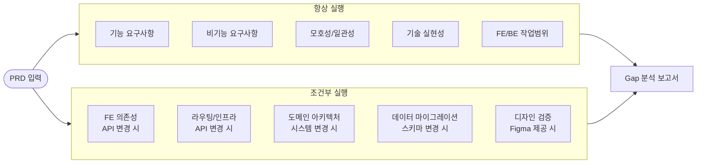
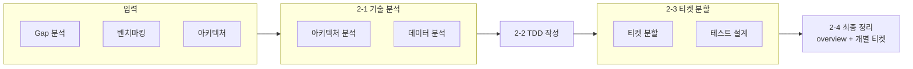
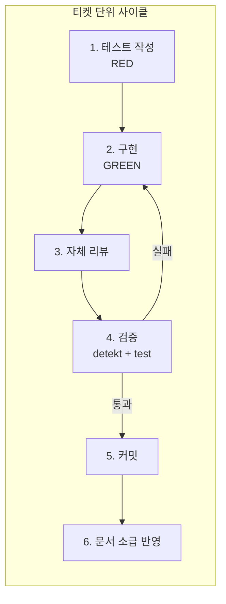
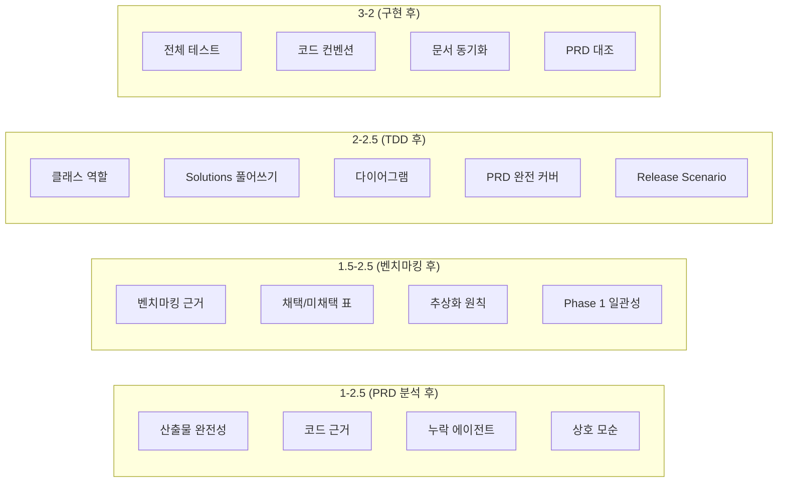
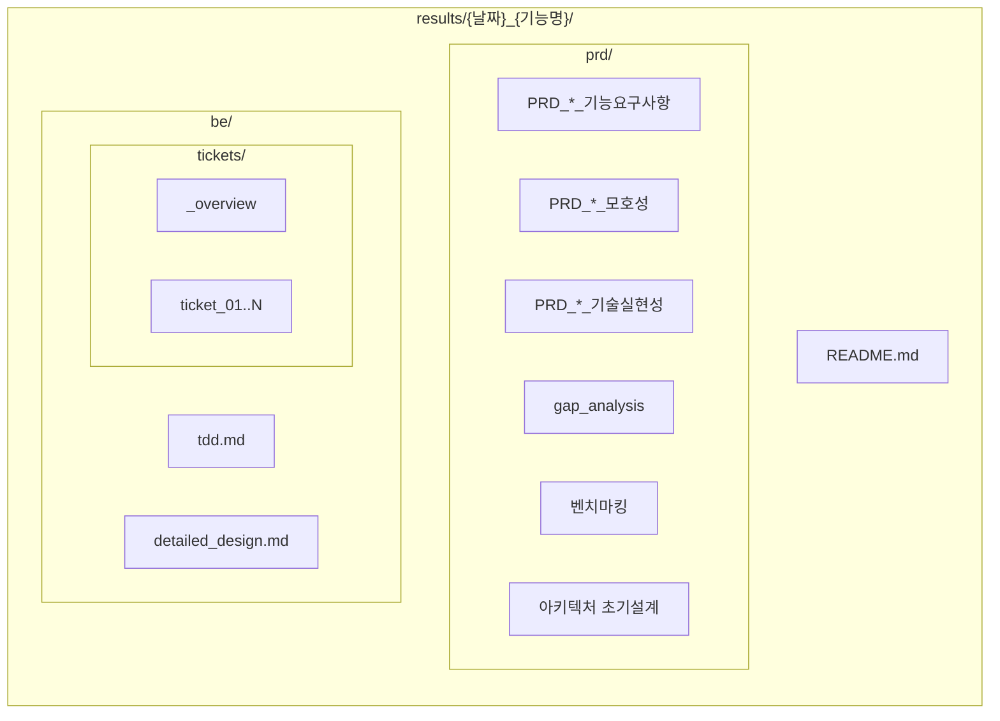
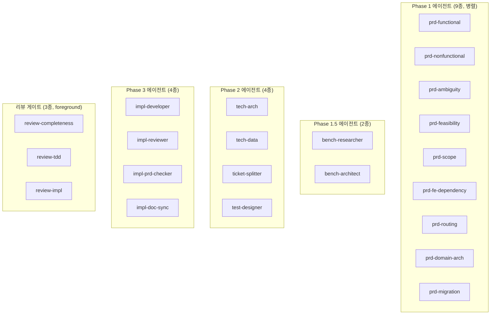

# Project Analysis 파이프라인 시각화

> 상세: [CLAUDE.md](CLAUDE.md)

---

## 전체 흐름

```mermaid
flowchart TB
    START([PRD 입력])

    subgraph Phase1["Phase 1: PRD 분석"]
        direction TB
        P1_1[1-1. 사전 준비]
        P1_2[1-2. 병렬 분석<br/>에이전트 9종]
        P1_GATE{1-2.5<br/>리뷰 게이트}
        P1_3[1-3. Gap 분석 보고서]

        P1_1 --> P1_2 --> P1_GATE
        P1_GATE -->|통과| P1_3
        P1_GATE -->|미통과| P1_2
    end

    subgraph Phase15["Phase 1.5: 벤치마킹"]
        direction TB
        P15_1[1.5-1. 벤치마킹 수행]
        P15_2[1.5-2. 아키텍처 설계]
        P15_GATE{1.5-2.5<br/>리뷰 게이트}
        P15_3[1.5-3. Phase 1 소급 업데이트]

        P15_1 --> P15_2 --> P15_GATE
        P15_GATE -->|통과| P15_3
        P15_GATE -->|미통과| P15_2
    end

    subgraph Phase2["Phase 2: BE 구현 설계"]
        direction TB
        P2_0[2-0. 코드베이스 최신화]
        P2_1[2-1. 기술 스택 분석<br/>에이전트 2종]
        P2_2[2-2. TDD 작성]
        P2_GATE{2-2.5<br/>리뷰 게이트}
        P2_3[2-3. 구현 티켓 작성<br/>에이전트 2종]
        P2_4[2-4. 최종 정리]

        P2_0 --> P2_1 --> P2_2 --> P2_GATE
        P2_GATE -->|통과| P2_3 --> P2_4
        P2_GATE -->|미통과| P2_2
    end

    subgraph Phase3["Phase 3: 구현"]
        direction TB
        P3_0[3-0. 코드베이스 최신화]
        P3_1[3-1. 티켓 단위<br/>TDD 사이클]
        P3_GATE{3-2<br/>리뷰 게이트}
        P3_3[3-3. PR 체크리스트]

        P3_0 --> P3_1 --> P3_GATE
        P3_GATE -->|통과| P3_3
        P3_GATE -->|미통과| P3_1
    end

    START --> Phase1 --> Phase15 --> Phase2 --> Phase3
    Phase3 --> DONE([PR 제출])
```

---

## Phase 1: PRD 분석 에이전트

---

## Phase 2: BE 설계 흐름

---

## Phase 3: 구현 사이클 (티켓마다 반복)

---

## 리뷰 게이트 체크 항목

---

## 산출물 구조

---

## 에이전트 역할 맵

