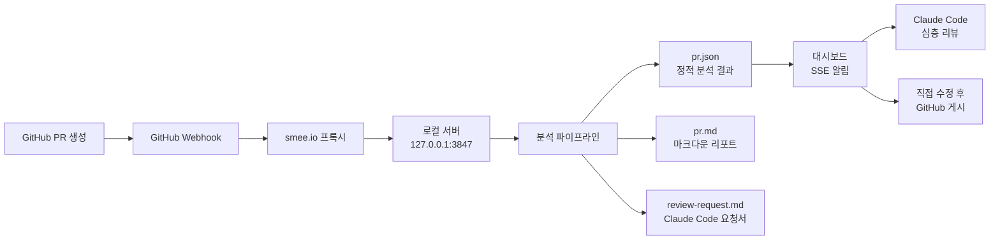
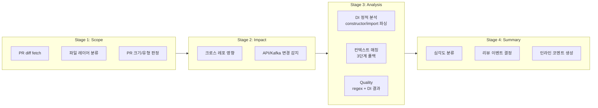
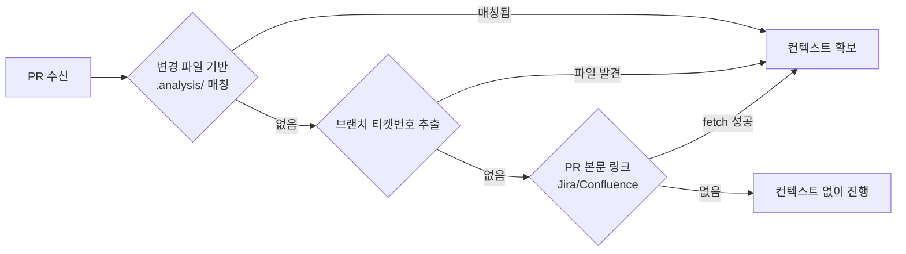
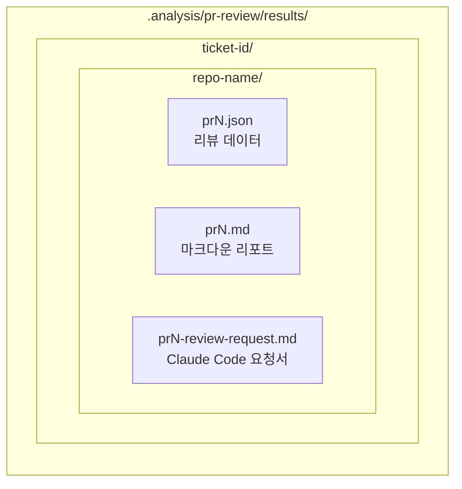
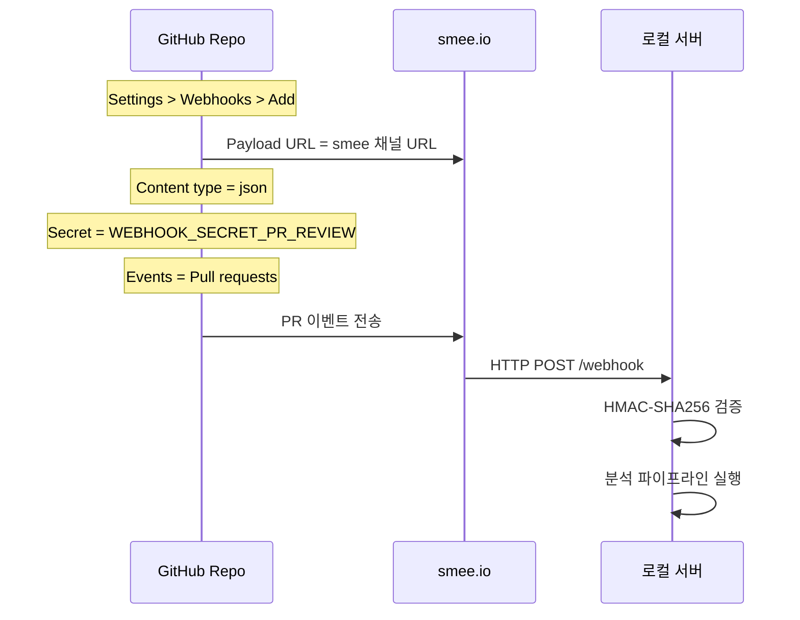
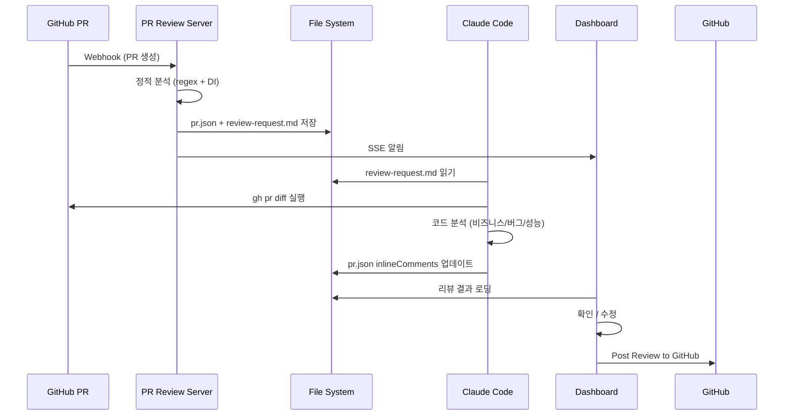

# PR Review Server

PR이 올라오면 자동으로 정적 분석을 수행하고, 로컬 대시보드에서 검증한 후 GitHub에 리뷰를 게시하는 로컬 서버.

## 목적

- PR이 생성되면 **자동으로** 코드를 분석하고 리뷰 초안을 생성
- 비즈니스 로직 위반, 버그 우려, 성능 문제 등을 **사전에** 감지
- `.analysis/` 디렉토리의 PRD/TDD/티켓 문서를 **자동 매칭**하여 비즈니스 컨텍스트 기반 리뷰
- 로컬 대시보드에서 리뷰를 **확인/수정** 후 GitHub에 게시

## 전체 흐름



## 분석 파이프라인



### Stage 1: Scope
PR의 변경 범위를 파악합니다.
- 변경 파일을 레이어별로 분류 (presentation, application, domain, adaptor, test, config)
- PR 크기 판정 (XS ~ XL)
- PR 유형 분류 (feature, bugfix, refactor, config, docs 등)

### Stage 2: Impact
변경이 다른 곳에 미치는 영향을 분석합니다.
- `review.config.json`의 crossRepo 설정 기반 크로스 레포 영향 감지
- Controller/API 변경 시 연관 레포의 FeignClient 확인 필요 알림
- Kafka 메시지 변경 시 Producer/Consumer 호환성 경고

### Stage 3a: DI 정적 분석
Kotlin 파일의 constructor, import를 파싱하여 의존 관계를 분석합니다.
- Bounded Context 자동 식별 (패키지 구조 기반)
- Cross-BC 의존성 감지 (다른 도메인의 Repository를 직접 주입하는 경우)
- 레이어 위반 감지 (Controller → Service 직접 주입, Facade에서 Repository 사용 등)

### Stage 3b: 컨텍스트 매칭



| 순위 | 방법 | 설명 |
|------|------|------|
| 1순위 | 변경 파일 매칭 | PR diff의 클래스명 ↔ .analysis/ 문서에 언급된 클래스명 |
| 2순위 | 브랜치 티켓번호 | `fix/{ticket-id}` → 티켓번호로 .analysis/ 티켓 파일 탐색 |
| 3순위 | PR 본문 링크 | Jira/Confluence URL → API로 내용 fetch |

### Stage 3c: Quality
설계 원칙 기반 코드 품질 검사 (regex + DI 분석 결과).

| 카테고리 | 검출 항목 |
|---------|----------|
| 버그 | 빈 catch, 리소스 미해제, associateBy 덮어쓰기, 공유 가변 상태 |
| 성능 | N+1 쿼리, findAll 페이지네이션 없음, 인덱스 누락 |
| 보안 | SQL 문자열 연결, 시크릿 하드코딩, 권한 체크 누락 |
| 비즈니스 | Cross-BC 의존, 트랜잭션 내 외부 호출, 외부 호출 에러 처리 없음 |

### Stage 4: Summary
분석 결과를 종합하여 심각도별로 분류하고, GitHub 리뷰 이벤트를 결정합니다.
- P1-P2 존재 → `REQUEST_CHANGES`
- P3만 → `COMMENT`
- P4-P5만 → `APPROVE`

## 심각도 기준

| 심각도 | 기준 | 액션 |
|--------|------|------|
| **P1** | 런타임 에러, 데이터 손상/유실, 보안 취약점 | 즉시 수정 |
| **P2** | 성능 저하, 동시성 이슈, 외부 장애 전파 | 반드시 수정 |
| **P3** | 에러 핸들링 부족, 엣지 케이스 누락 | 수정 권장 |
| **P4** | 코드 스타일, 네이밍, 리팩토링 제안 | 개선 제안 |
| **P5** | 포매팅, import 정리, 사소한 개선 | 참고 |
| **ASK** | 비즈니스 의도 확인 필요 | 질문 |

## 리뷰 기준

### 중점적으로 보는 것
- 비즈니스 로직: PRD/TDD AC 충족 여부, 빠진 엣지 케이스, 상태 전이 누락
- 버그: 동시성, 리소스 누수, 에러 삼킴, 데이터 유실
- 성능: N+1, 페이지네이션, 트랜잭션 내 외부 호출
- 보안: SQL Injection, 권한 누락, 시크릿 노출

### 가볍게 보는 것 (P4-P5)
- 코드 스타일, 네이밍, 포매팅
- 단순 리팩토링 제안
- 테스트 프레임워크 선택

### 테스트 코드
- 정상적인 시나리오인지, 효율적인 테스트 케이스인지만 판단
- 프레임워크/네이밍/코드 스타일은 지적하지 않음
- `!!`은 논리적으로 타당하면 무시

## 저장 구조



- PR 머지 시 `.md` 파일 자동 삭제 (`.json`은 히스토리로 보관)
- 같은 PR이 재분석되면 기존 파일 덮어쓰기 (중복 방지)

## 대시보드 기능

- GitHub 스타일 dark theme
- 좌측: PR 리뷰 목록 (심각도 배지, 상태)
- 우측: 리뷰 상세 (심각도별 요약 → 클릭 시 해당 코멘트로 스크롤)
- Diff 뷰어: 파일별 변경 코드 + 인라인 코멘트
- 라인 드래그로 멀티라인 코멘트 작성
- 코멘트 수정/삭제 (자동 생성 코멘트도 수정 가능)
- Review Body/Event 수정
- GitHub에 리뷰 게시 (one-click)
- SSE 실시간 알림

## 설치 및 실행

```bash
cd pr-review-server
npm run setup
```

`setup.sh`가 자동으로:
1. Node.js 확인
2. `npm install`
3. `.env` 없으면 `.env.example` 복사 + 편집 안내
4. 환경변수 검증
5. smee 프록시 시작 (SMEE_URL 있으면)
6. 서버 시작

### 환경변수 (.env)

```bash
# 필수
GITHUB_TOKEN=ghp_...
WEBHOOK_SECRET_PR_REVIEW=...    # openssl rand -hex 32

# 선택
PORT=3847
SMEE_URL=https://smee.io/...    # https://smee.io/new 에서 생성
ATLASSIAN_EMAIL=...              # Jira/Confluence 연동
ATLASSIAN_API_TOKEN=...
```

### GitHub Webhook 등록



### 수동 테스트

```bash
npx tsx src/test-pr.ts {owner} {repo} {pr_number}
```

## 프로젝트 구조

```
pr-review-server/
├── setup.sh                        # 원클릭 설치/실행
├── review.config.json              # 프로젝트별 설정 (크로스레포, 아키텍처)
├── src/
│   ├── index.ts                    # Express 진입점
│   ├── config.ts                   # 환경변수
│   ├── webhook/
│   │   ├── handler.ts              # HMAC-SHA256 서명 검증 + 이벤트 필터
│   │   └── parser.ts               # PR 정보 추출
│   ├── github/
│   │   ├── client.ts               # Octokit 싱글턴
│   │   ├── diff.ts                 # PR diff fetch (페이지네이션)
│   │   └── reviewer.ts             # GitHub review 게시
│   ├── review/
│   │   ├── types.ts                # 타입 정의
│   │   ├── store.ts                # 파일 기반 저장소 (ticket/repo 구조)
│   │   ├── config.ts               # review.config.json 로더
│   │   ├── classifier.ts           # PR 유형 분류 + 분석기 할당
│   │   ├── generator.ts            # 5단계 파이프라인
│   │   ├── di-analyzer.ts          # DI/import 정적 분석
│   │   ├── llm-analyzer.ts         # LLM 분석 (현재 비활성)
│   │   └── context/
│   │       ├── pipeline-loader.ts  # .analysis/ 파이프라인 MD 로딩
│   │       ├── design-principles.ts # 설계 원칙 규칙 (13개)
│   │       ├── file-matcher.ts     # 변경 파일 <-> 문서 자동 매칭
│   │       └── link-resolver.ts    # PR 본문 링크 -> Jira/Confluence fetch
│   ├── ui/
│   │   ├── routes.ts               # REST API + SSE
│   │   └── static/                 # 대시보드 (HTML + CSS + JS)
│   └── test-pr.ts                  # 수동 테스트 스크립트
└── .env.example
```

## Claude Code 연동

서버는 정적 분석만 수행합니다. 심층 리뷰는 Claude Code에서 직접 수행합니다.



## Webhook 지원 이벤트

| 액션 | 처리 |
|------|------|
| `opened` | 리뷰 생성 |
| `synchronize` | 리뷰 재생성 (force push 등) |
| `reopened` | 리뷰 재생성 |
| `ready_for_review` | 리뷰 생성 (draft → ready) |
| `edited` | 리뷰 재생성 (제목/본문 수정) |
| `closed` + `merged` | `.md` 파일 삭제 |
