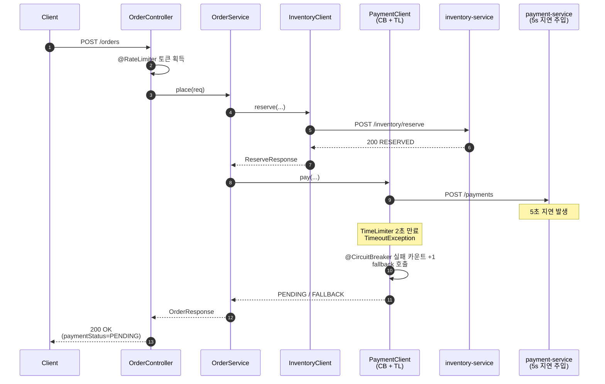

# [Spring] Resilience4j — Circuit Breaker, Timeout, Bulkhead, Rate Limiter

## 회복 탄력성(Resilience)
분산 시스템에서 한 서비스의 장애는 다른 서비스로 전파될 수 있다. 만약 주문 -> 결제 -> 외부 PG 구조에서 PG가 특정 시간동안 응답하지 않으면 결제 서비스의 스레드는 그동안 대기한다. 주문 서비스도 마찬가지로 결제 응답을 기다리며 스레드가 대기 상태에 빠진다. 즉, 가장 말단의 한 서비스가 느려지면 호출 체인 전체가 함께 마비되고, 모든 요청이 실패하는 현상을 맞이할 수 있다.


```
Client ──► [order-service:8080] ──► [payment-service:8081]
                  │
                  └─────────────────► [inventory-service:8082]
```

`order-service`는 주문 진입점이고, `payment-service`와 `inventory-service`는 의도적으로 느려지거나 실패하여 테스트해보도록 한다.

---
## 각 서비스 간의 격리와 장애 전파 차단

주문이 결제를 동기 호출하는 코드를 그대로 두면, 결제가 5초 지연될 때 주문 톰캣 스레드도 5초 동안 묶인다. 동시 요청이 200개 들어오면, 톰캣 워커 풀(기본 200)이 고갈되고, 다음 요청은 큐에 쌓이거나 거절된다. 결제의 지연이 주문 서비스의 장애로 전파하게 된다.

### 1. 응답 시간 제한(@TimeLimiter)

TimeLimiter는 비동기 호출(`CompletableFuture`/`Mono`)에 시간 상한을 걸어, 정해진 시간 안에 끝나지 않으면 강제로 `TimeoutException`을 던지는 데코레이터 패턴이다.

1. **선언적 적용** — 메서드에 `@TimeLimiter`만 붙이면 모든 호출 경로에 일관되게 적용된다.
2. **CircuitBreaker / Retry / Bulkhead와의 조합** — Resilience4j는 TimeLimiter를 다른 패턴들과 같은 데코레이터 체인 위에 올려둔다. 타임아웃으로 인한 실패를 CircuitBreaker가 자동으로 실패로 카운트하고, Retry가 재시도 대상으로 인식한다.
3. **메트릭/관측** — `resilience4j_timelimiter_calls_seconds` 같은 메트릭이 자동으로 노출된다. 어떤 호출이 얼마나 자주 타임아웃으로 끊기는지 대시보드에서 바로 볼 수 있다.

#### 적용 방법

`order-service`의 `application.yml`

```yaml
resilience4j:
  timelimiter:
    instances:
      paymentTl:
        timeoutDuration: 2s          # 호출 응답을 최대 2초까지 대기, 초과 시 TimeoutException
        cancelRunningFuture: true    # 타임아웃 발생 시 진행 중인 Future를 cancel() 호출(WebClient 요청도 끊김)
```

그리고 `PaymentClient.pay()`에 `@TimeLimiter(name = "paymentTl", fallbackMethod = "fallback")`를 붙인다.  2초 안에 완료되지 않으면 `TimeoutException`을 던지고 `fallback`을 호출한다.

> 주의: `@TimeLimiter`는 반드시 비동기 반환 타입(`CompletableFuture`, `Mono`)에 붙여야 동작한다. 동기 메서드에 붙이면 컴파일은 되지만 타임아웃은 발생하지 않는다. 그래서 이 프로젝트의 `PaymentClient.pay()`는 `WebClient.toFuture()`를 거쳐 `CompletableFuture`를 반환한다.

그리고 `fallback` 메서드를 이용해 해당 케이스에서의 fallback 응답을 제공할 수 있다.

하지만 간헐적으로 시스템이 느려지는 것이 아니라 다운스트림이 완전히 죽어 있다면, 매번 2초씩 기다리는 것도 낭비다.

### 서킷 브레이커(@CircuitBreaker)

타임아웃이 있어도 매 호출마다 2초씩 잡아먹는 것은 비효율적이다. 결제 서비스가 죽어 있다면, 굳이 또 호출해서 2초를 더 낭비할 필요가 없다.

`@CircuitBreaker`는 다운스트림 서비스의 상태를 감지해서, 일정 실패율 이상이면 호출 자체를 차단하는 패턴이다. 결제 서비스가 10번 중 5번 이상 실패하면, 그 다음 호출부터는 아예 결제 서비스로 가지 않고 즉시 fallback을 반환한다. 일정 시간 후에 다시 시도해서 회복되었으면 정상 호출로 보내고, 여전히 실패하면 다시 차단한다.

```yaml
resilience4j:
  circuitbreaker:
    configs:
      default:
        slidingWindowSize: 10                          # 실패율 계산 기준이 되는 최근 호출 윈도우 크기 (10건)
        minimumNumberOfCalls: 5                        # 윈도우에 최소 N건이 쌓여야 실패율 평가 시작 (그 전엔 무조건 CLOSED 유지)
        failureRateThreshold: 50                       # 실패율(%) 임계치. 50% 이상 실패하면 OPEN으로 전이
        waitDurationInOpenState: 5s                    # OPEN 상태로 머무는 시간. 5초 후 HALF_OPEN으로 전이 시도
        permittedNumberOfCallsInHalfOpenState: 3       # HALF_OPEN에서 허용할 시험 호출 수. 이 결과로 CLOSED/OPEN 결정
        automaticTransitionFromOpenToHalfOpenEnabled: true  # 시간 만료 시 자동으로 HALF_OPEN 전이(false면 다음 호출 시점까지 대기)
    instances:
      paymentCb:
        baseConfig: default                            # 위 default 설정을 상속받아 사용
```

서킷 브레이커는 세 상태를 갖는다.

- **CLOSED** — 모든 호출이 다운스트림 서비스로 흘러가고, 결과(성공/실패)를 슬라이딩 윈도우에 기록한다.
- **OPEN** — 최근 10건 중 50% 이상이 실패하면 전이된다. 이 상태에서는 `fallback`이 실행되고, 다운스트림 서비스를 호출하지 않는다.
- **HALF_OPEN** — `waitDurationInOpenState`(5초)가 지나면 자동으로 전이된다. 제한된 수(3건)의 테스트로 호출하고, 회복되었으면 CLOSED로, 여전히 실패하면 다시 OPEN으로 보낸다.

> `slidingWindowType`은 `COUNT_BASED`(횟수)와 `TIME_BASED`(시간)이 있다. 트래픽이 적은 서비스에서는 `TIME_BASED`로 두고 슬라이딩 윈도우를 윈도우(예: 60초)로 잡는 편이 안정적이다. 이 프로젝트는 학습용이라 호출이 빠르게 누적되는 `COUNT_BASED`를 썼다.

---

### 동시 호출 격리(@Bulkhead)

서킷 브레이커는 다운스트림이 죽었을 때 호출을 차단해 주지만, 간헐적으로 느려지는 상황에선 완벽하지 못하다. 결제는 정상이고 재고만 6초씩 늘어지는 상황을 생각해보자. WebClient의 커넥션 풀이 공유되어 있다면 재고 호출로 인해 풀의 커넥션을 전부 점유하여 결제 호출까지 새 커넥션을 못 잡는다. `block()` 호출이 동시에 몰리면 호출 스레드 풀 자체가 고갈된다. 한 다운스트림의 슬로우가 다른 다운스트림의 정상 호출까지 끌고 들어간다.

`@Bulkhead`는 특정 호출이 사용할 수 있는 동시 실행 수를 제한해(세마포어), 한 다운스트림에 묶인 자원이 다른 호출 경로의 자원까지 갉아먹지 않도록 격리하는 패턴이다.

#### 적용 방법

```yaml
resilience4j:
  bulkhead:
    configs:
      default:
        maxConcurrentCalls: 10        # 동시에 진입 가능한 호출 수(세마포어 카운트)
        maxWaitDuration: 50ms         # 슬롯이 가득 찼을 때 호출자가 대기할 최대 시간. 초과 시 BulkheadFullException
    instances:
      inventoryBh:
        baseConfig: default           # 위 default 설정 상속
```

`InventoryClient.reserve()`에 `@Bulkhead(name = "inventoryBh", type = SEMAPHORE)`를 붙이면, 이 메서드를 동시에 실행할 수 있는 스레드 수가 10개로 제한된다. 11번째 호출은 50ms 대기하다 `BulkheadFullException`으로 떨어지고 fallback으로 간다. 결제 호출과 재고 호출이 서로 다른 Bulkhead 인스턴스를 쓰면, 재고가 슬로우되어도 결제 호출 자원은 보호된다.

타입은 두 가지가 있다.

- `SEMAPHORE` — 세마포어 카운트만 증감. 호출은 호출자 스레드에서 실행된다. 가볍다.
- `THREADPOOL` — 별도 스레드 풀에서 실행. 호출자 스레드를 즉시 반환할 수 있다. 단, `@TimeLimiter`와 함께 쓸 때는 `THREADPOOL`이 권장되지 않는다(중복 비동기 위임).

여기까지의 세 패턴(TimeLimiter / CircuitBreaker / Bulkhead)은 모두 **다운스트림을 호출하는 시점**의 문제를 막는다. 반대로 자기 자신에 대한 트래픽이 몰리는 경우엔 다른 해결방법으로 문제를 해결할 수 있따.

---

## 진입 트래픽 제어

### 요청량 제한(@RateLimiter)

order-service가 들어오는 요청량을 제한하지 않으면, 모든 트래픽이 그대로 결제/재고 서비스로 전달된다. 결제 서비스의 서킷이 OPEN되더라도 그 사이에 요청 큐에 쌓인 요청들은 전부 장애로 이어진다.

`@RateLimiter`는 토큰 버킷 알고리즘 기반의 패턴이다. 일정 주기마다 정해진 수의 토큰을 채워두고, 요청이 들어올 때마다 토큰을 하나씩 소모한다. 토큰이 없으면 호출 자체를 차단한다.

#### 적용 방법

```yaml
resilience4j:
  ratelimiter:
    configs:
      default:
        limitForPeriod: 10           # 한 주기 동안 허용되는 호출 수 (토큰 버킷 최대 토큰 수)
        limitRefreshPeriod: 1s       # 토큰을 다시 채우는 주기. 1초마다 limitForPeriod만큼 리필
        timeoutDuration: 0           # 토큰이 없을 때 호출자가 대기할 시간. 0이면 즉시 RequestNotPermitted
    instances:
      orderRl:
        baseConfig: default          # 위 default 설정 상속
```

`OrderController.place()`에 `@RateLimiter(name = "orderRl")`를 붙이면, 1초당 10건까지만 통과시키고 그 이상은 `RequestNotPermitted` 예외를 던진다. 컨트롤러에 `@ExceptionHandler`를 두어 이 예외를 HTTP 429(Too Many Requests)로 매핑해 사용자에게 응답한다.

> 주의: 이 RateLimiter는 인스턴스 로컬이다. 인스턴스가 N대로 스케일아웃되면 실제 허용량은 `10 × N`이 된다. 그래서 클러스터 단위로 카운트를 공유하려면 별도 저장소가 필요하다.

### 분산 환경에서의 글로벌 RateLimiter (Redis 기반)

`@RateLimiter`는 토큰을 JVM 메모리에서 관리하기 때문에, order-service를 3대로 늘리면 1초당 30건이 통과한다. 결제/재고가 감당할 수 있는 총량은 그대로인데 진입 한계가 인스턴스 수에 비례해 늘어나는 셈이다.

해결 방법은 카운터를 외부 저장소에 두는 것이다. 모든 인스턴스가 같은 카운터를 공유하면, 인스턴스가 몇 대든 클러스터 전체의 허용량을 일정하게 유지할 수 있다. Redis가 가장 흔한 선택지다 — INCR/EXPIRE가 원자적이고, 1ms 미만의 응답으로 호출 경로에 끼워 넣어도 부담이 적다.

#### 구현: Lua 스크립트 + Fixed Window 카운터

`RedisRateLimiter.tryAcquire(name)`는 다음 Lua 스크립트를 실행한다.

```lua
local current = redis.call('INCR', KEYS[1])      -- 현재 윈도우 키의 카운터를 1 증가
if current == 1 then                             -- 첫 INCR이면 (방금 만들어진 키) TTL 설정
  redis.call('EXPIRE', KEYS[1], ARGV[1])
end
return current
```

키는 `rl:orders:{epochSecond}` 형태로 1초 단위 버킷이다. 윈도우가 바뀌면 키 자체가 달라지므로 자연스럽게 카운터가 리셋된다. TTL은 `windowSeconds + 1`로 두어 만료된 버킷이 자동 정리된다.

INCR/EXPIRE를 별도 명령으로 보내면 race condition이 생긴다(INCR 이후 EXPIRE 직전에 노드가 죽으면 키가 영원히 남는다). Lua 스크립트로 묶으면 Redis 단일 스레드 모델 안에서 원자적으로 실행된다.

#### 적용 방법

```yaml
spring:
  data:
    redis:
      host: ${REDIS_HOST:localhost}      # Redis 호스트
      port: ${REDIS_PORT:6379}
      timeout: 1s                        # 한도 체크가 느려지면 응답 자체가 늦으니 짧게

ratelimit:
  redis:
    limit-per-second: 20                 # 클러스터 전체 1초당 허용 호출 수
    window-seconds: 1                    # 카운터 윈도우 길이
```

`GlobalOrderController`는 `POST /orders/global` 진입 직후 `RedisRateLimiter.tryAcquire("orders")`를 호출하고, `false`면 즉시 429를 반환한다.

```kotlin
@PostMapping
fun place(@RequestBody req: PlaceOrderRequest): ResponseEntity<Any> {
    if (!redisRateLimiter.tryAcquire("orders")) {
        return ResponseEntity.status(HttpStatus.TOO_MANY_REQUESTS).body(...)
    }
    return ResponseEntity.ok(orderService.place(req))
}
```

#### Fixed Window의 한계

Fixed window 카운터는 윈도우 경계에서 burst가 발생할 수 있다. `12:00:00.999`에 limit만큼, `12:00:01.001`에 또 limit만큼 호출이 들어오면 약 2ms 사이에 `2 × limit`이 통과한다. 정밀한 burst 차단이 필요하면 다음 알고리즘을 고려한다.

- **Sliding Window Log** — 호출마다 timestamp를 ZSET에 저장하고 윈도우 밖은 제거. 정확하지만 메모리 사용 큼.
- **Sliding Window Counter** — 이전 윈도우와 현재 윈도우 카운트를 비율로 합산. 메모리 적고 정확도 양호.
- **Token Bucket / Leaky Bucket** — 라이브러리(예: Bucket4j + Lettuce backend) 활용.

#### Resilience4j 로컬 vs Redis 글로벌 비교

| 항목 | `@RateLimiter` (Resilience4j) | `RedisRateLimiter` |
|------|-----------------------------|--------------------|
| 카운터 저장소 | JVM 메모리 | Redis |
| 인스턴스 N대 스케일아웃 시 총 허용량 | `limit × N` | `limit` (고정) |
| 호출 비용 | 메모리 카운터 (μs 단위) | Redis 왕복 (ms 단위) |
| 장애 시 | 영향 없음 | Redis 다운 시 정책 결정 필요 (fail-open vs fail-closed) |
| 적합한 곳 | 단일 인스턴스 보호, 노이즈성 트래픽 차단 | 클러스터 전체 limit, 외부 SLA 준수 |

운영에서는 두 계층을 함께 쓰는 패턴도 흔하다. 인스턴스 단위로 폭주를 빠르게 거르고(`@RateLimiter`), 클러스터 단위로 정확한 limit을 강제(`RedisRateLimiter`)하는 식이다.

---

## 패턴 적용 순서

지금까지 본 4개 패턴을 한 호출 흐름에 같이 붙일 때 순서는 어떻게 정해질까. 임의로 붙여도 될 것 같지만, Resilience4j는 어노테이션 적용 순서가 미리 정해져 있다.

```
RateLimiter → Bulkhead → TimeLimiter → CircuitBreaker → Retry → fallback
```

호출은 먼저 RateLimiter를 통과해야 하고, 그 다음 Bulkhead 슬롯을 잡고, TimeLimiter 윈도우 안에서 실행되며, CircuitBreaker가 결과를 기록한다.

### fallback의 위치

같은 메서드에 `@TimeLimiter`와 `@CircuitBreaker`를 함께 붙이면서 양쪽에 `fallbackMethod`를 두면, 안쪽(TimeLimiter)이 예외를 먼저 흡수해 CircuitBreaker는 모든 호출을 성공으로 기록해버린다. 결과적으로 CB가 OPEN으로 전이되지 않는다.

이 프로젝트에서는 외곽의 `@CircuitBreaker`에만 `fallbackMethod`를 두고, `@TimeLimiter`는 timeout만 던지도록 했다. 그래야 시간 초과/예외가 위로 올라오면서 CircuitBreaker가 실패로 카운트하고, 그 다음 fallback이 호출된다.

---

## 언제 적용해야할까

### 1. 외부 PG 응답 지연

이커머스 결제 흐름에서 외부 PG가 평소 200ms 응답하던 호출이 갑자기 평균 8초로 늘어졌다. 결제 서비스는 PG 응답을 기다리느라 톰캣 스레드(기본 200)를 모두 점유했고, 결제를 동기 호출하던 주문 서비스도 같은 식으로 스레드가 고갈된다. 결국 결제와 무관한 주문 서비스까지 장애가 전파된다.

- **TimeLimiter** — PG 호출에 2초 상한을 두고, 스레드가 최대 2초까지만 기다리도록 한다. 넘었을 경우 사용자에게는 "결제 확인 중" fallback을 응답하고 호출자 스레드를 즉시 풀어준다.
- **CircuitBreaker** — PG 장애가 지속되면, 매번 2초씩 기다릴 필요가 없기에 일정 실패율을 넘으면 호출 자체를 차단할 수 있다.
- **Bulkhead** — PG 호출과 다른 외부 호출(쿠폰, 포인트 등)이 같은 스레드풀을 공유하면 하나의 다운스트림 서비스로 인해 다른 다운 스트림 서비스 호출에 문제가 생기기 때문에 호출별로 동시 실행 수를 격리한다.

### 2. 이벤트로 인한 트래픽 증가

특가 이벤트 오픈 직후, 평소 분당 100건 수준이던 주문 트래픽이 분당 5만 건으로 튀었다. 주문 서비스가 받은 요청을 그대로 결제로 전달했고, 결제 서비스는 커넥션 풀과 DB 락을 모두 소진해 응답에서 오류가 발생한다. 결제가 멈추자 주문 서비스의 CircuitBreaker가 OPEN으로 전이됐지만, 그 사이에 이미 큐에 쌓인 요청들이 모두 fallback으로 떨어지면서 사용자에게는 "주문 실패"로 응답된다.

- **RateLimiter (인스턴스 로컬)** — 주문 진입점에서 인스턴스당 초당 호출 수를 제한해, 다운스트림에 보낼 양을 사전에 줄인다.
- **RedisRateLimiter (글로벌)** — 인스턴스를 N대로 스케일아웃해도 클러스터 전체 허용량은 일정해야 한다. 결제 서비스가 감당할 수 있는 총량은 인스턴스 수와 무관하기 때문이다.


---

## 프로젝트 예제

### 1. 컴포넌트 다이어그램

```mermaid
flowchart LR
    Client([Client])

    subgraph order["order-service:8080"]
        OC[OrderController<br/>@RateLimiter]
        GOC[GlobalOrderController<br/>RedisRateLimiter]
        OS[OrderService]
        PC[PaymentClient<br/>@CircuitBreaker<br/>@TimeLimiter]
        IC[InventoryClient<br/>@Bulkhead<br/>@CircuitBreaker]
    end

    subgraph payment["payment-service:8081"]
        PCtrl[PaymentController]
        PFI[FaultInjector<br/>delay/fail]
    end

    subgraph inventory["inventory-service:8082"]
        ICtrl[InventoryController]
        IFI[FaultInjector<br/>delay/fail]
    end

    Redis[(Redis<br/>rl:orders:&#123;sec&#125;)]

    Client -->|POST /orders| OC
    Client -->|POST /orders/global| GOC
    GOC -->|tryAcquire| Redis
    OC --> OS
    GOC --> OS
    OS --> PC
    OS --> IC
    PC -->|HTTP| PCtrl
    IC -->|HTTP| ICtrl
    PCtrl --> PFI
    ICtrl --> IFI
```

### 2. 시퀀스 다이어그램 — 결제 타임아웃 시나리오



연속 실패가 누적되면 다음 호출부터 CircuitBreaker가 OPEN으로 전이되어 `payment-service`로의 호출 자체가 일어나지 않고 즉시 fallback이 호출된다.

---

## 정리

| 패턴 | 막는 것 | 어디에 |
|-----|--------|------|
| TimeLimiter | 느린 다운스트림이 호출자 스레드를 점유 | 외부 호출 메서드 |
| CircuitBreaker | 죽은 다운스트림에 매번 비싼 호출 시도 | 외부 호출 메서드 |
| Bulkhead | 한 다운스트림 슬로우가 다른 호출까지 마비 | 외부 호출 메서드 |
| RateLimiter (로컬) | 인스턴스 단위 폭주 트래픽 차단 | 진입 컨트롤러 |
| RedisRateLimiter (글로벌) | 클러스터 전체 허용량 통제 | 진입 컨트롤러 |

Resilience4j 패턴은 모두 한 곳의 장애가 다른 곳으로 번지지 않게 격리한다. 다운스트림 호출 시점의 문제(Time/CB/Bulkhead)와 진입 트래픽의 양적 통제(RateLimiter), 그리고 분산 환경에서의 일관성 보장(Redis)을 이용해 장애 전파를 막고, 회복 탄력성을 높일 수 있다.
