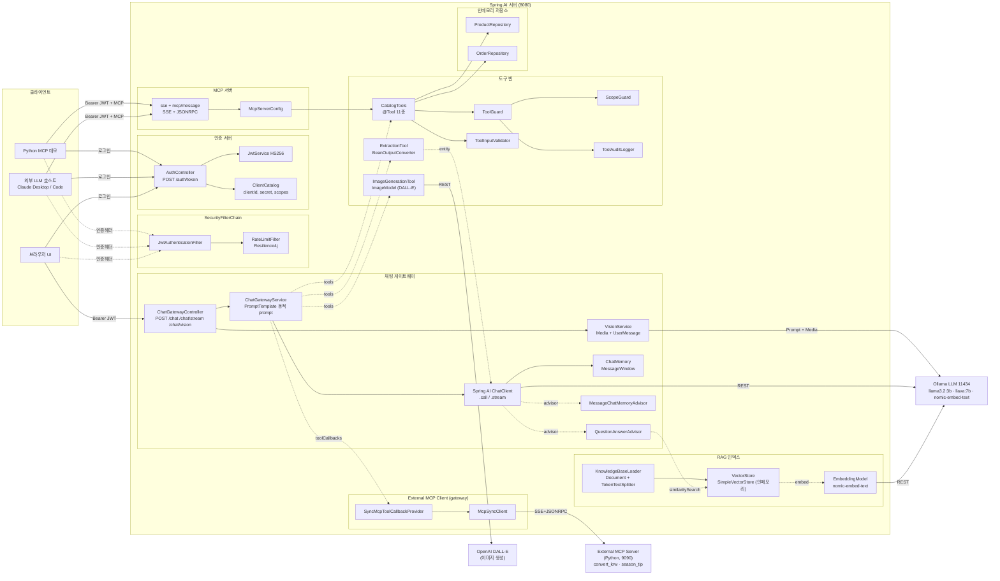
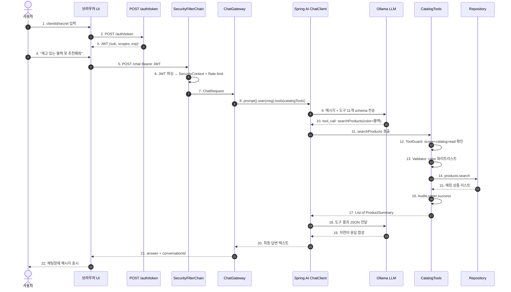
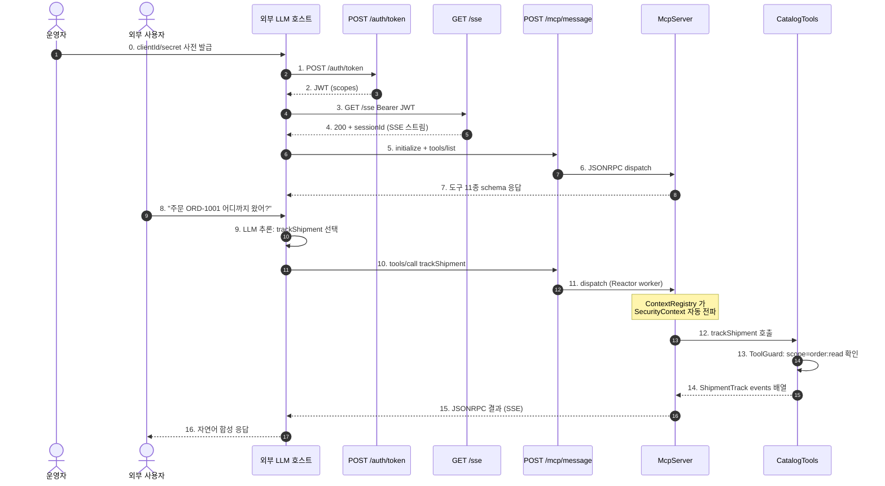

# 아키텍처 — 컴포넌트 + 시퀀스 다이어그램

## 1. Ollama 가 뭐예요

**[Ollama](https://ollama.com/)** 는 **로컬 PC 에서 LLM 을 띄워주는 무료 OSS 런타임**입니다. OpenAI API 처럼 HTTP 로 호출할 수 있고, 모델 가중치(`.safetensors` 등)와 추론 엔진(llama.cpp 기반)을 묶어 한 줄 명령으로 실행합니다.

| 비교 | OpenAI / Anthropic | Ollama |
|---|---|---|
| 실행 위치 | 회사 클라우드 | **내 노트북/서버** |
| 비용 | API 호출당 과금 | 무료 (전기·디스크 비용만) |
| 인터넷 | 필수 | **없어도 동작** |
| 모델 | gpt-4o / claude-sonnet 등 폐쇄형 | llama3.2 / qwen / mistral 등 오픈 가중치 |
| 데이터 외부 유출 | 발생 | **0** |

본 PoC 가 Ollama 를 기본으로 쓰는 이유:

1. **API 키 없이 전체 흐름을 학습**할 수 있습니다 (인증·도구·MCP 모두 키 없음).
2. 도구 콜링(Tool Calling) 능력을 가진 작은 모델(`llama3.2:3b`, 약 2GB)로도 데모가 충분합니다.
3. Spring AI 의 `spring-ai-starter-model-ollama` 가 `http://localhost:11434` 의 Ollama REST 를 자동 호출하도록 추상화돼 있어 우리 코드는 LLM 제공자가 누구인지 신경 쓰지 않습니다.

```bash
# 설치 + 실행
brew install ollama
ollama serve &              # 11434 포트로 LLM 서버 가동
ollama pull llama3.2:3b     # 모델 가중치 한 번만 다운로드

# 동작 확인
curl -s http://localhost:11434/api/generate \
  -d '{"model":"llama3.2:3b","prompt":"say hi","stream":false}' | jq .response
```

OpenAI 키만 있으면 `application.yml` 의 `spring.ai.model.chat` 을 `openai` 로 바꾸기만 하면 동일한 코드가 GPT 로 동작합니다. 즉 Ollama 는 **로컬에서 GPT 자리를 채워주는 대체재**입니다.

---

## 2. 컴포넌트 다이어그램



레이어 책임:

| 레이어 | 컴포넌트 | 책임 |
|---|---|---|
| 입구 | SecurityFilterChain | JWT 파싱 → SecurityContext, Rate limit |
| 인증 서버 | AuthController + JwtService + ClientCatalog | clientId/secret 검증 → 단기 JWT 발급 |
| 채팅 게이트웨이 | ChatGatewayController + Service + ChatClient | 자연어 → LLM 추론 → 도구 동적 호출 |
| MCP 서버 | McpEndpoint + McpServerConfig | 외부 LLM 호스트용 SSE/JSONRPC |
| 도구 | CatalogTools + ToolGuard + ScopeGuard + Validator + AuditLogger | 도구 11종 + 스코프 + 감사 + 입력 검증 |
| 저장소 | ProductRepository + OrderRepository | 인메모리 시드 + 갱신 |

---

## 3. 시퀀스 다이어그램 — UI 채팅 흐름 (Ollama 기반 LLM)



핵심 포인트:

- **9단계** — Spring AI 가 `@Tool` 메타데이터(이름·description·`@ToolParam`)를 JSON Schema 로 변환해 Ollama 에 함께 전송합니다. LLM 은 사용자 질문 + 도구 목록을 보고 **어떤 도구를 어떤 인자로 부를지 스스로 결정**합니다.
- **12~16단계** — 도구 진입부의 `ToolGuard.invoke()` 가 스코프·입력·감사 로그를 한 묶음으로 처리합니다. 스코프 부족 시 `AccessDeniedException` 을 던지면 19단계에서 LLM 이 그 사실을 자연어로 합성합니다.
- **18단계** — Spring AI 가 도구 결과를 다시 LLM 에 보내 "결과 기반 응답"을 만듭니다 (Function Calling 의 2-shot 패턴).

---

## 4. 시퀀스 다이어그램 — 외부 LLM(MCP) 흐름



핵심 차이:

- **0단계** — 우리는 외부 LLM 호스트 운영자에게 clientId/secret 을 **사전 발급**합니다. 그 후 외부 호스트가 자체적으로 토큰을 갱신합니다.
- **4단계** — SSE 연결은 **세션 유지**됩니다. 후속 메시지는 `sessionId` 로 묶이지만 매 요청마다 JWT 도 함께 옵니다 (stateless).
- **11단계** — MCP 메시지 dispatch 는 Reactor `boundedElastic` worker 에서 일어납니다. ThreadLocal SecurityContext 가 자동 전파되도록 [SpringAiPracticeApplication.kt](../src/main/kotlin/com/biuea/springai/SpringAiPracticeApplication.kt) 에서 `Hooks.enableAutomaticContextPropagation()` 을 켭니다.

---

## 5. 도구 11종 — LLM 이 동적으로 선택·호출

| # | 도구 | 분류 | 스코프 | 인자 | 반환 |
|---|---|---|---|---|---|
| 1 | `searchProducts` | 조회 | catalog:read | keyword? / category? / color? / maxPrice? | `List<ProductSummary>` |
| 2 | `getProductDetails` | 조회 | catalog:read | productId | 사이즈별 재고·소재·시즌 |
| 3 | `listCategories` | 조회 | catalog:read | - | 카테고리·색상 목록 |
| 4 | `checkInventory` | 조회 | catalog:read | productId, size | 보유 수량 |
| 5 | `listOrders` | 조회 | order:read | status? | 주문 목록 |
| 6 | `getOrderStatus` | 조회 | order:read | orderId | 현재 상태 + 운송장 |
| 7 | `trackShipment` | 조회 | order:read | orderId | 배송 단계 타임라인 |
| 8 | **`placeOrder`** | 쓰기 | **order:write** | productId, size, quantity | 신규 주문 + 잔여 재고 |
| 9 | **`cancelOrder`** | 쓰기 | **order:write** | orderId | 취소된 주문 |
| 10 | **`addTrackingEvent`** | 쓰기 | **shipment:write** | orderId, status, location | 갱신된 ShipmentTrack |
| 11 | **`restockProduct`** | 쓰기 | **catalog:write** | productId, size, delta | 재고 변경 결과 (before/after) |

### 클라이언트별 스코프 매트릭스

| 클라이언트 | catalog:read | catalog:write | order:read | order:write | shipment:write |
|---|:-:|:-:|:-:|:-:|:-:|
| `shopper-llm` | ✅ | ❌ | ✅ | ✅ | ❌ |
| `catalog-only-llm` | ✅ | ❌ | ❌ | ❌ | ❌ |
| `ops-llm` | ✅ | ✅ | ✅ | ✅ | ✅ |

### 자연어 질문 예시

| 질문 | LLM 이 선택할 가능성 높은 도구 |
|---|---|
| "재고 있는 블랙 옷 추천해줘" | `searchProducts(color="블랙")` |
| "P-1001 사이즈별 재고 알려줘" | `getProductDetails(productId="P-1001")` |
| "어떤 카테고리가 있어?" | `listCategories()` |
| "주문 ORD-1001 어디까지 왔어?" | `trackShipment(orderId="ORD-1001")` |
| "P-1001 M 사이즈 2개 주문해줘" | `placeOrder(productId="P-1001", size="M", quantity=2)` |
| "ORD-1003 취소해줘" | `cancelOrder(orderId="ORD-1003")` |
| "ORD-1005 발송 처리해줘 (성남 풀필먼트)" | `addTrackingEvent(orderId="ORD-1005", status="발송", location="성남 풀필먼트 센터")` |
| "P-1001 S 사이즈 10개 입고" | `restockProduct(productId="P-1001", size="S", delta=10)` |

권한 부족 시 (예: `shopper-llm` 이 `restockProduct` 호출) 도구가 `AccessDeniedException` 을 던지고 LLM 이 자연어로 안내합니다.
